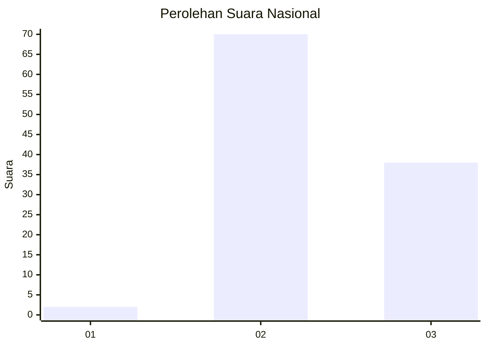
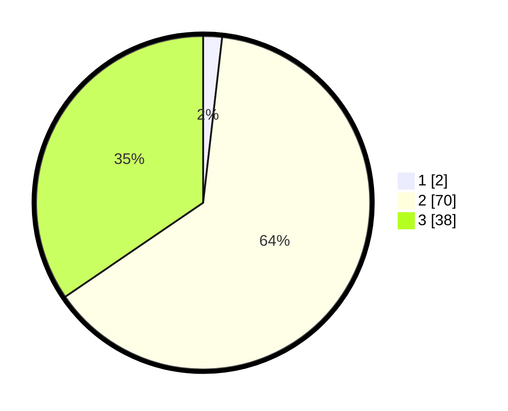

# Hasil

## Grafik

## Tabel

| No. | Nama Paslon    | Suara | Suara (raw) | Persentase |
|:--- |:-------------- | -----:| -----------:| ----------:|
| 1   | ANIES MUHAIMIN | 2     | [2][p-1]    | 1,82       |
| 2   | PRABOWO GIBRAN | 70    | [70][p-2]   | 63,64      |
| 3   | GANJAR MAHFUD  | 38    | [38][p-3]   | 34,55      |

[p-1]: https://github.com/gigit-pemilu/pemilu-2024/blob/main/pilpres/hitung-suara/sub/61-kalimantan-barat/sub/04-ketapang/sub/08-simpang-hulu/sub/2001-balai-pinang/sub/001-tps/sub/paslon-1.txt
[p-2]: https://github.com/gigit-pemilu/pemilu-2024/blob/main/pilpres/hitung-suara/sub/61-kalimantan-barat/sub/04-ketapang/sub/08-simpang-hulu/sub/2001-balai-pinang/sub/001-tps/sub/paslon-2.txt
[p-3]: https://github.com/gigit-pemilu/pemilu-2024/blob/main/pilpres/hitung-suara/sub/61-kalimantan-barat/sub/04-ketapang/sub/08-simpang-hulu/sub/2001-balai-pinang/sub/001-tps/sub/paslon-3.txt

## Foto C Plano

https://sirekap-obj-formc.kpu.go.id/48e7/pemilu/ppwp/61/04/08/20/01/6104082001001-20240214-223221--a15273fe-7ee6-4a13-822d-2aaf05747dd0.jpg

https://sirekap-obj-formc.kpu.go.id/48e7/pemilu/ppwp/61/04/08/20/01/6104082001001-20240214-223429--9f94a999-5529-41eb-ad3b-a06213b41192.jpg

https://sirekap-obj-formc.kpu.go.id/48e7/pemilu/ppwp/61/04/08/20/01/6104082001001-20240214-223723--ae856298-95c8-429b-8528-212a70fcd2f0.jpg

## Metadata

| Key        | Value               |
| ---------- | ------------------- |
| Time Stamp | 2024-02-22 13:00:00 |

