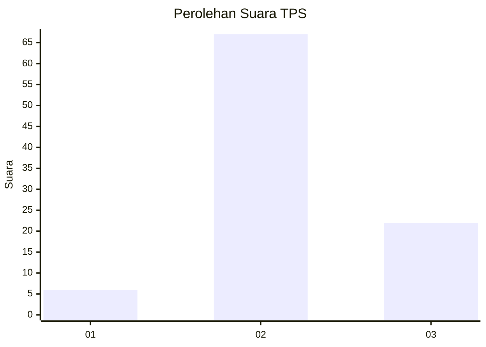
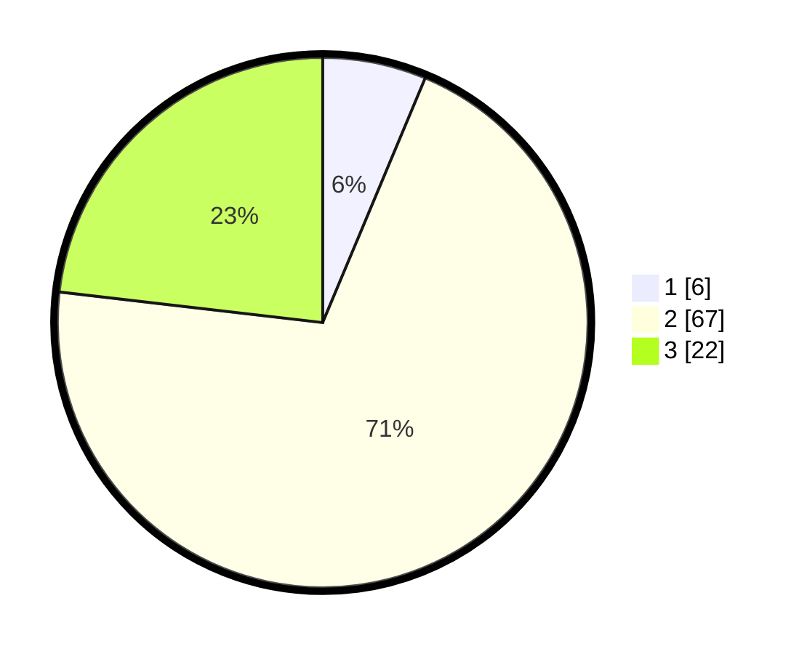

# Hasil

## Grafik

## Tabel

| No. | Nama Paslon    | Suara | Suara (raw) | Persentase |
|:--- |:-------------- | -----:| -----------:| ----------:|
| 1   | ANIES MUHAIMIN | 6     | [6][p-1]    | 6,32       |
| 2   | PRABOWO GIBRAN | 67    | [67][p-2]   | 70,53      |
| 3   | GANJAR MAHFUD  | 22    | [22][p-3]   | 23,16      |

[p-1]: https://github.com/gigit-pemilu/pemilu-2024-61-kalimantan-barat/blob/main/pilpres/hitung-suara/sub/61-kalimantan-barat/sub/04-ketapang/sub/08-simpang-hulu/sub/2001-balai-pinang/sub/005-tps/sub/paslon-1.txt
[p-2]: https://github.com/gigit-pemilu/pemilu-2024-61-kalimantan-barat/blob/main/pilpres/hitung-suara/sub/61-kalimantan-barat/sub/04-ketapang/sub/08-simpang-hulu/sub/2001-balai-pinang/sub/005-tps/sub/paslon-2.txt
[p-3]: https://github.com/gigit-pemilu/pemilu-2024-61-kalimantan-barat/blob/main/pilpres/hitung-suara/sub/61-kalimantan-barat/sub/04-ketapang/sub/08-simpang-hulu/sub/2001-balai-pinang/sub/005-tps/sub/paslon-3.txt

## Foto C Plano

https://sirekap-obj-formc.kpu.go.id/2d40/pemilu/ppwp/61/04/08/20/01/6104082001005-20240215-073111--457a55a5-b896-418f-a97c-86d7e509b27a.jpg

https://sirekap-obj-formc.kpu.go.id/2d40/pemilu/ppwp/61/04/08/20/01/6104082001005-20240215-073227--de0193de-b3f9-462a-9a37-f34e4b396b11.jpg

https://sirekap-obj-formc.kpu.go.id/2d40/pemilu/ppwp/61/04/08/20/01/6104082001005-20240215-073333--2363de76-2fe8-47e2-abec-b9a4bcf9ffe6.jpg

## Metadata

| Key        | Value               |
| ---------- | ------------------- |
| Time Stamp | 2024-02-22 13:00:00 |

