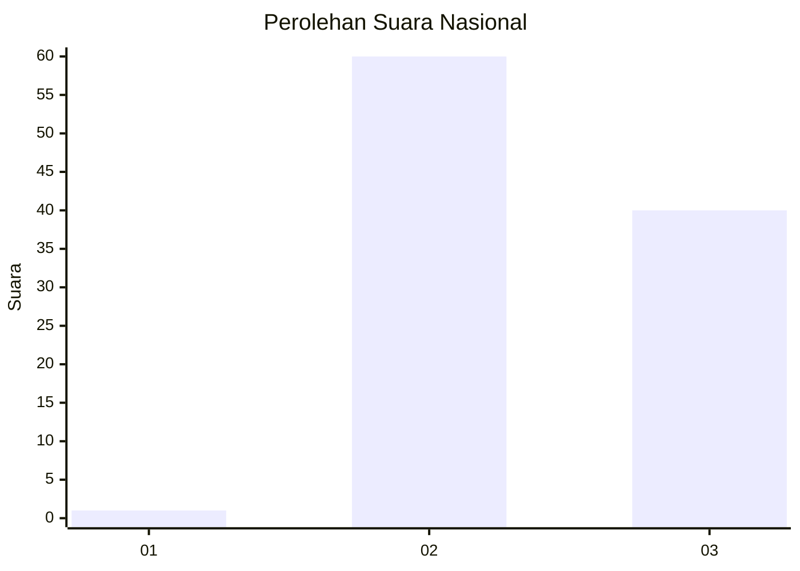
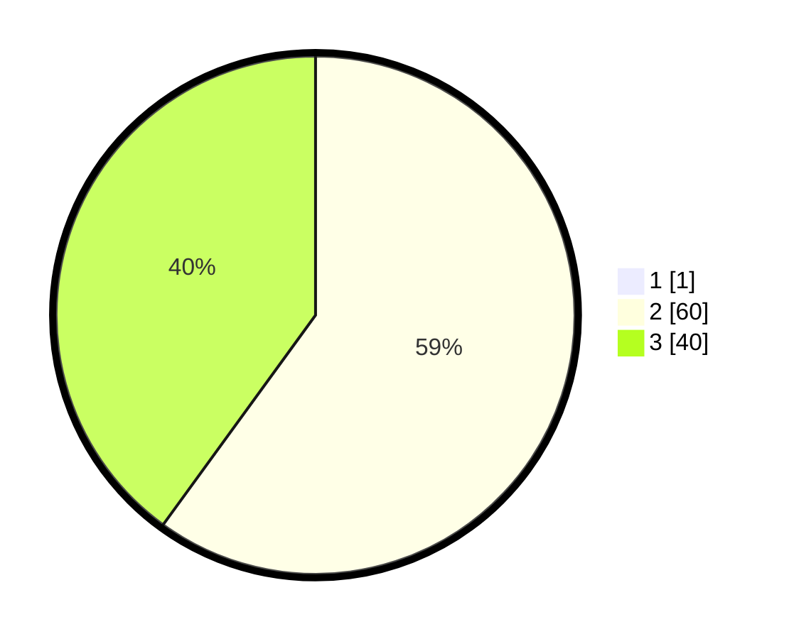

# Hasil

## Grafik

## Tabel

| No. | Nama Paslon    | Suara | Suara (raw) | Persentase |
|:--- |:-------------- | -----:| -----------:| ----------:|
| 1   | ANIES MUHAIMIN | 1     | [1][p-1]    | 0,99       |
| 2   | PRABOWO GIBRAN | 60    | [60][p-2]   | 59,41      |
| 3   | GANJAR MAHFUD  | 40    | [40][p-3]   | 39,60      |

[p-1]: https://github.com/gigit-pemilu/pemilu-2024/blob/main/pilpres/hitung-suara/sub/61-kalimantan-barat/sub/04-ketapang/sub/08-simpang-hulu/sub/2001-balai-pinang/sub/015-tps/sub/paslon-1.txt
[p-2]: https://github.com/gigit-pemilu/pemilu-2024/blob/main/pilpres/hitung-suara/sub/61-kalimantan-barat/sub/04-ketapang/sub/08-simpang-hulu/sub/2001-balai-pinang/sub/015-tps/sub/paslon-2.txt
[p-3]: https://github.com/gigit-pemilu/pemilu-2024/blob/main/pilpres/hitung-suara/sub/61-kalimantan-barat/sub/04-ketapang/sub/08-simpang-hulu/sub/2001-balai-pinang/sub/015-tps/sub/paslon-3.txt

## Foto C Plano

https://sirekap-obj-formc.kpu.go.id/e319/pemilu/ppwp/61/04/08/20/01/6104082001015-20240218-142534--433b5d7c-a7a3-4a1b-a367-5ceb32b30ea2.jpg

https://sirekap-obj-formc.kpu.go.id/e319/pemilu/ppwp/61/04/08/20/01/6104082001015-20240218-142605--a9539a0a-5879-4e11-bf46-364a58796117.jpg

https://sirekap-obj-formc.kpu.go.id/e319/pemilu/ppwp/61/04/08/20/01/6104082001015-20240218-142641--346ddf18-21d6-4eba-8300-d33e6bd2b916.jpg

## Metadata

| Key        | Value               |
| ---------- | ------------------- |
| Time Stamp | 2024-02-22 13:00:00 |

