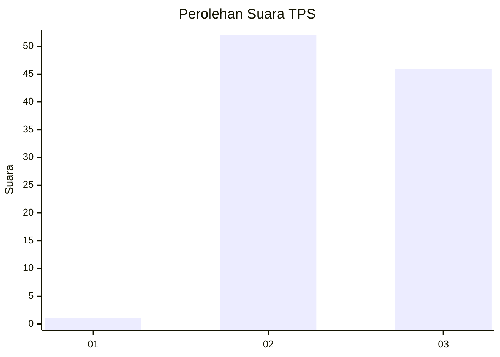
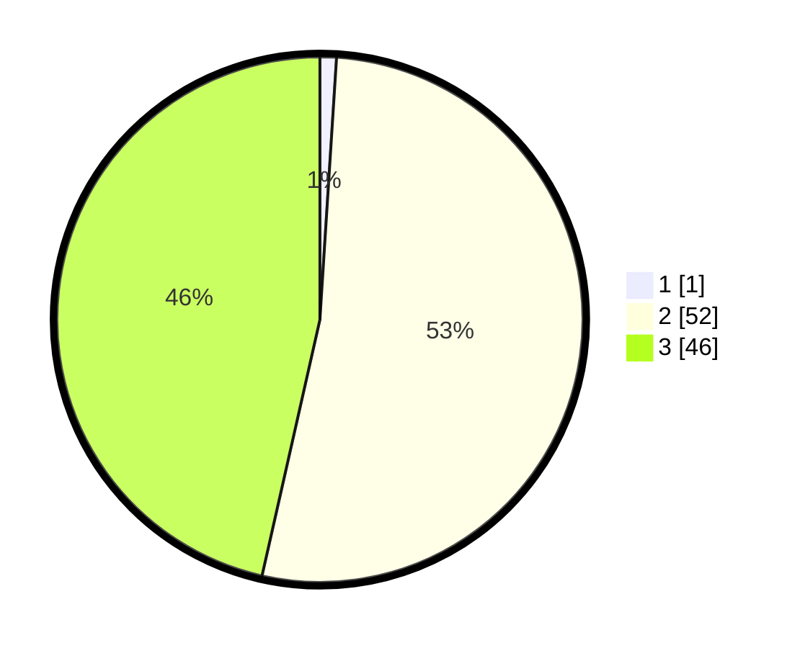

# Hasil

## Grafik

## Tabel

| No. | Nama Paslon    | Suara | Suara (raw) | Persentase |
|:--- |:-------------- | -----:| -----------:| ----------:|
| 1   | ANIES MUHAIMIN | 1     | [1][p-1]    | 1,01       |
| 2   | PRABOWO GIBRAN | 52    | [52][p-2]   | 52,53      |
| 3   | GANJAR MAHFUD  | 46    | [46][p-3]   | 46,46      |

[p-1]: https://github.com/gigit-pemilu/pemilu-2024-61-kalimantan-barat/blob/main/pilpres/hitung-suara/sub/61-kalimantan-barat/sub/04-ketapang/sub/08-simpang-hulu/sub/2006-merawa/sub/003-tps/sub/paslon-1.txt
[p-2]: https://github.com/gigit-pemilu/pemilu-2024-61-kalimantan-barat/blob/main/pilpres/hitung-suara/sub/61-kalimantan-barat/sub/04-ketapang/sub/08-simpang-hulu/sub/2006-merawa/sub/003-tps/sub/paslon-2.txt
[p-3]: https://github.com/gigit-pemilu/pemilu-2024-61-kalimantan-barat/blob/main/pilpres/hitung-suara/sub/61-kalimantan-barat/sub/04-ketapang/sub/08-simpang-hulu/sub/2006-merawa/sub/003-tps/sub/paslon-3.txt

## Foto C Plano

https://sirekap-obj-formc.kpu.go.id/b7a2/pemilu/ppwp/61/04/08/20/06/6104082006003-20240219-004233--4f1e9d8a-1168-4f77-ba51-0a9ccbc9bd79.jpg

https://sirekap-obj-formc.kpu.go.id/b7a2/pemilu/ppwp/61/04/08/20/06/6104082006003-20240219-004318--1c842d3b-420c-4e95-a257-1f9e5f0d13bf.jpg

https://sirekap-obj-formc.kpu.go.id/b7a2/pemilu/ppwp/61/04/08/20/06/6104082006003-20240219-004404--5b2bae7a-23f5-46af-bbcd-b7fa354ada5b.jpg

## Metadata

| Key        | Value               |
| ---------- | ------------------- |
| Time Stamp | 2024-02-22 13:00:00 |

