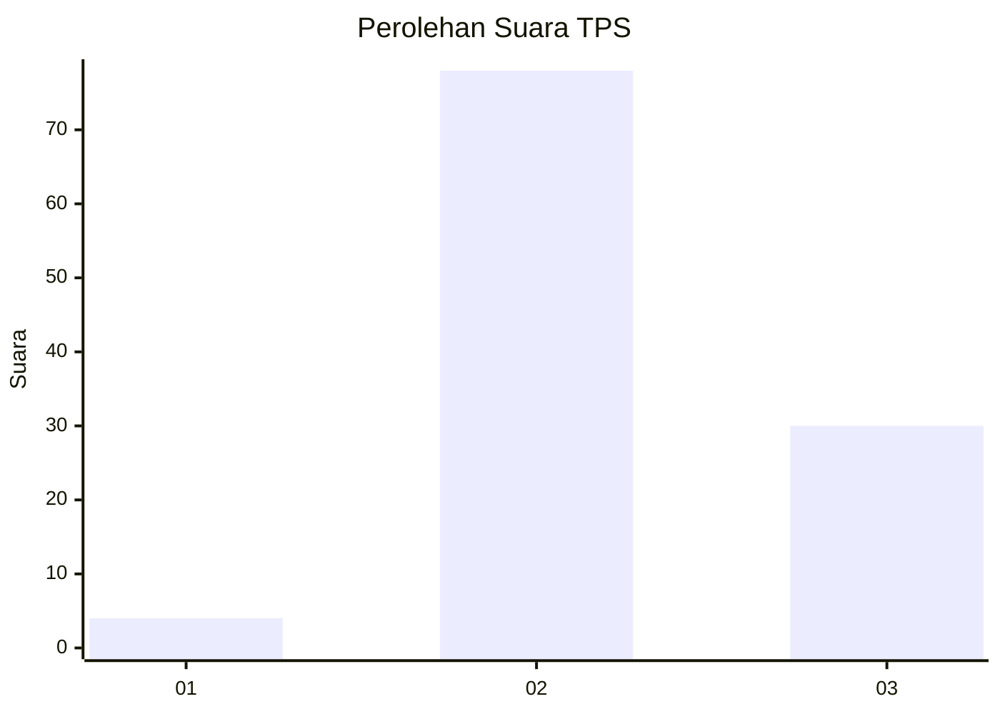
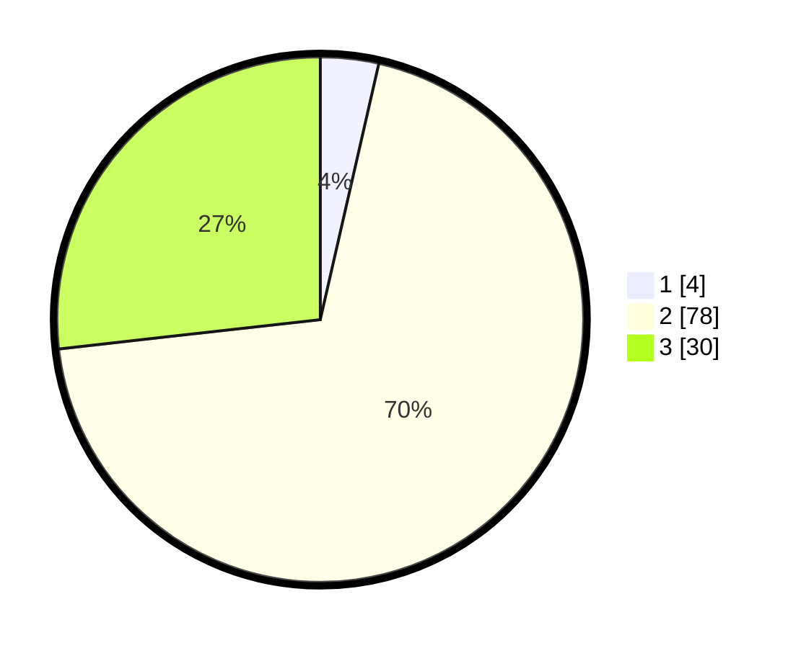

# Hasil

## Grafik

## Tabel

| No. | Nama Paslon    | Suara | Suara (raw) | Persentase |
|:--- |:-------------- | -----:| -----------:| ----------:|
| 1   | ANIES MUHAIMIN | 4     | [4][p-1]    | 3,57       |
| 2   | PRABOWO GIBRAN | 78    | [78][p-2]   | 69,64      |
| 3   | GANJAR MAHFUD  | 30    | [30][p-3]   | 26,79      |

[p-1]: https://github.com/gigit-pemilu/pemilu-2024-61-kalimantan-barat/blob/main/pilpres/hitung-suara/sub/61-kalimantan-barat/sub/04-ketapang/sub/08-simpang-hulu/sub/2006-merawa/sub/008-tps/sub/paslon-1.txt
[p-2]: https://github.com/gigit-pemilu/pemilu-2024-61-kalimantan-barat/blob/main/pilpres/hitung-suara/sub/61-kalimantan-barat/sub/04-ketapang/sub/08-simpang-hulu/sub/2006-merawa/sub/008-tps/sub/paslon-2.txt
[p-3]: https://github.com/gigit-pemilu/pemilu-2024-61-kalimantan-barat/blob/main/pilpres/hitung-suara/sub/61-kalimantan-barat/sub/04-ketapang/sub/08-simpang-hulu/sub/2006-merawa/sub/008-tps/sub/paslon-3.txt

## Foto C Plano

https://sirekap-obj-formc.kpu.go.id/f9f1/pemilu/ppwp/61/04/08/20/06/6104082006008-20240219-011601--727a5dc7-c4e7-4e69-bba0-f99bf556f47b.jpg

https://sirekap-obj-formc.kpu.go.id/f9f1/pemilu/ppwp/61/04/08/20/06/6104082006008-20240219-011640--11577873-7c56-4da2-ba20-767f694f8bb1.jpg

https://sirekap-obj-formc.kpu.go.id/f9f1/pemilu/ppwp/61/04/08/20/06/6104082006008-20240219-011753--b703772b-9b52-42b1-b24e-e3cc964397d4.jpg

## Metadata

| Key        | Value               |
| ---------- | ------------------- |
| Time Stamp | 2024-02-22 13:00:00 |

