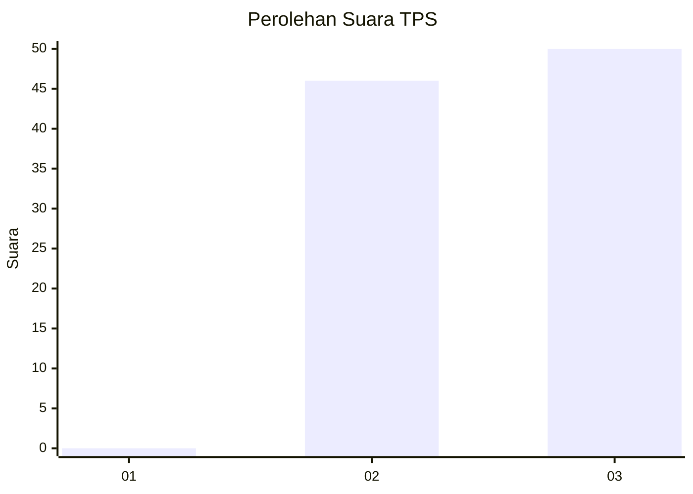
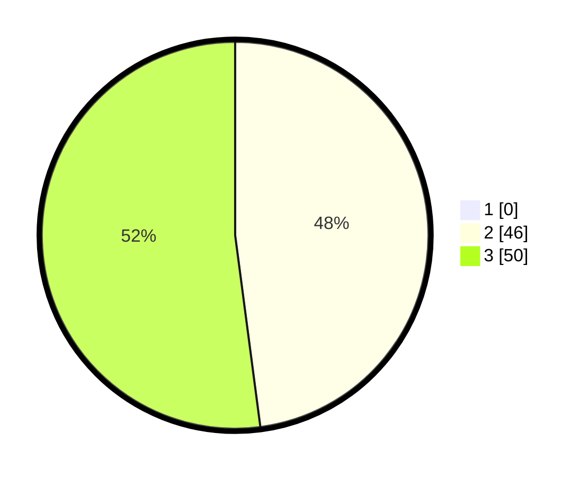

# Hasil

## Grafik

## Tabel

| No. | Nama Paslon    | Suara | Suara (raw) | Persentase |
|:--- |:-------------- | -----:| -----------:| ----------:|
| 1   | ANIES MUHAIMIN | 0     | [0][p-1]    | 0,00       |
| 2   | PRABOWO GIBRAN | 46    | [46][p-2]   | 47,92      |
| 3   | GANJAR MAHFUD  | 50    | [50][p-3]   | 52,08      |

[p-1]: https://github.com/gigit-pemilu/pemilu-2024-61-kalimantan-barat/blob/main/pilpres/hitung-suara/sub/61-kalimantan-barat/sub/04-ketapang/sub/08-simpang-hulu/sub/2009-kualan-tengah/sub/005-tps/sub/paslon-1.txt
[p-2]: https://github.com/gigit-pemilu/pemilu-2024-61-kalimantan-barat/blob/main/pilpres/hitung-suara/sub/61-kalimantan-barat/sub/04-ketapang/sub/08-simpang-hulu/sub/2009-kualan-tengah/sub/005-tps/sub/paslon-2.txt
[p-3]: https://github.com/gigit-pemilu/pemilu-2024-61-kalimantan-barat/blob/main/pilpres/hitung-suara/sub/61-kalimantan-barat/sub/04-ketapang/sub/08-simpang-hulu/sub/2009-kualan-tengah/sub/005-tps/sub/paslon-3.txt

## Foto C Plano

https://sirekap-obj-formc.kpu.go.id/eaca/pemilu/ppwp/61/04/08/20/09/6104082009005-20240218-224439--29006e02-550c-40c4-9341-1f1d3d03398b.jpg

https://sirekap-obj-formc.kpu.go.id/eaca/pemilu/ppwp/61/04/08/20/09/6104082009005-20240218-224600--b8bf8226-5f7b-49d5-b8f1-dbb9bc0627a0.jpg

https://sirekap-obj-formc.kpu.go.id/eaca/pemilu/ppwp/61/04/08/20/09/6104082009005-20240218-224648--d08f8c45-4140-4304-8e2a-b367ecae9b4d.jpg

## Metadata

| Key        | Value               |
| ---------- | ------------------- |
| Time Stamp | 2024-02-22 13:00:00 |

