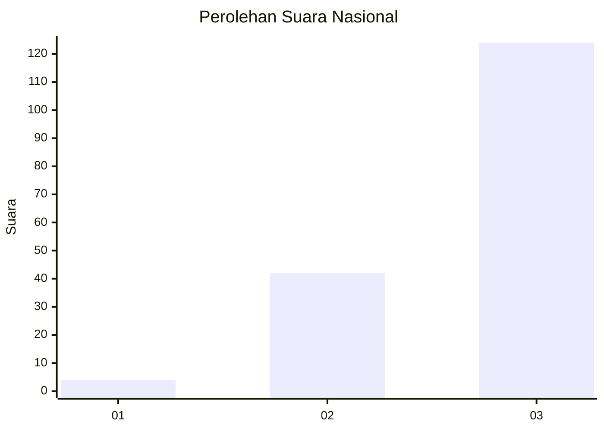
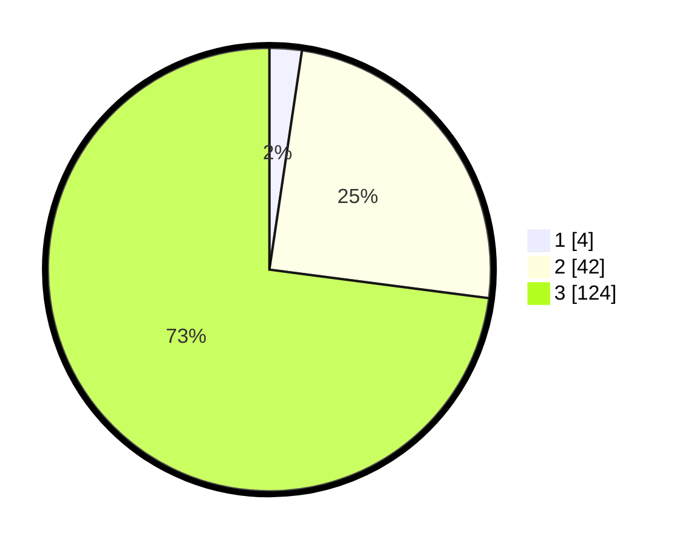

# Hasil

## Grafik

## Tabel

| No. | Nama Paslon    | Suara | Suara (raw) | Persentase |
|:--- |:-------------- | -----:| -----------:| ----------:|
| 1   | ANIES MUHAIMIN | 4     | [4][p-1]    | 2,35       |
| 2   | PRABOWO GIBRAN | 42    | [42][p-2]   | 24,71      |
| 3   | GANJAR MAHFUD  | 124   | [124][p-3]  | 72,94      |

[p-1]: https://github.com/gigit-pemilu/pemilu-2024/blob/main/pilpres/hitung-suara/sub/61-kalimantan-barat/sub/04-ketapang/sub/08-simpang-hulu/sub/2009-kualan-tengah/sub/010-tps/sub/paslon-1.txt
[p-2]: https://github.com/gigit-pemilu/pemilu-2024/blob/main/pilpres/hitung-suara/sub/61-kalimantan-barat/sub/04-ketapang/sub/08-simpang-hulu/sub/2009-kualan-tengah/sub/010-tps/sub/paslon-2.txt
[p-3]: https://github.com/gigit-pemilu/pemilu-2024/blob/main/pilpres/hitung-suara/sub/61-kalimantan-barat/sub/04-ketapang/sub/08-simpang-hulu/sub/2009-kualan-tengah/sub/010-tps/sub/paslon-3.txt

## Foto C Plano

https://sirekap-obj-formc.kpu.go.id/e9f8/pemilu/ppwp/61/04/08/20/09/6104082009010-20240218-234710--95f5e626-b010-4f8a-b36b-c0d8f86832e4.jpg

https://sirekap-obj-formc.kpu.go.id/e9f8/pemilu/ppwp/61/04/08/20/09/6104082009010-20240218-234754--05741a2f-3046-4a57-9d39-4c2a00ff33d7.jpg

https://sirekap-obj-formc.kpu.go.id/e9f8/pemilu/ppwp/61/04/08/20/09/6104082009010-20240218-234915--0e9a2ca2-b7e6-4512-bde4-d360c6a5ce36.jpg

## Metadata

| Key        | Value               |
| ---------- | ------------------- |
| Time Stamp | 2024-02-22 13:00:00 |

