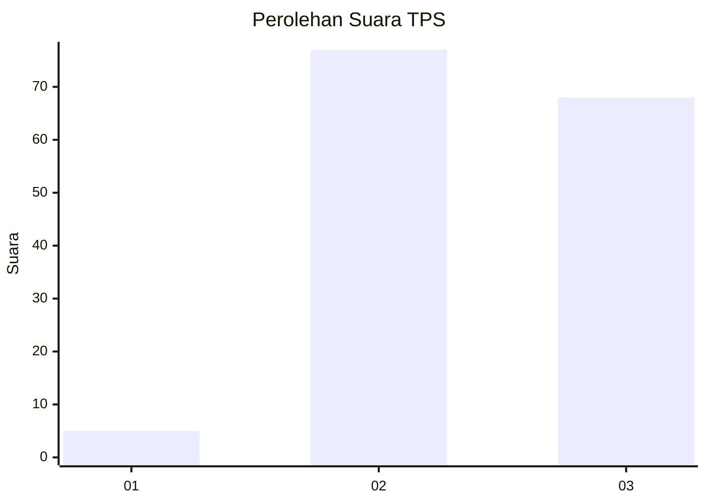
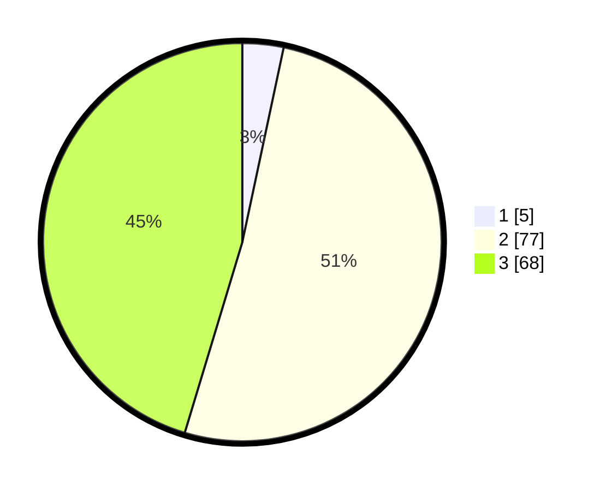

# Hasil

## Grafik

## Tabel

| No. | Nama Paslon    | Suara | Suara (raw) | Persentase |
|:--- |:-------------- | -----:| -----------:| ----------:|
| 1   | ANIES MUHAIMIN | 5     | [5][p-1]    | 3,33       |
| 2   | PRABOWO GIBRAN | 77    | [77][p-2]   | 51,33      |
| 3   | GANJAR MAHFUD  | 68    | [68][p-3]   | 45,33      |

[p-1]: https://github.com/gigit-pemilu/pemilu-2024-61-kalimantan-barat/blob/main/pilpres/hitung-suara/sub/61-kalimantan-barat/sub/04-ketapang/sub/08-simpang-hulu/sub/2011-sekucing-labai/sub/004-tps/sub/paslon-1.txt
[p-2]: https://github.com/gigit-pemilu/pemilu-2024-61-kalimantan-barat/blob/main/pilpres/hitung-suara/sub/61-kalimantan-barat/sub/04-ketapang/sub/08-simpang-hulu/sub/2011-sekucing-labai/sub/004-tps/sub/paslon-2.txt
[p-3]: https://github.com/gigit-pemilu/pemilu-2024-61-kalimantan-barat/blob/main/pilpres/hitung-suara/sub/61-kalimantan-barat/sub/04-ketapang/sub/08-simpang-hulu/sub/2011-sekucing-labai/sub/004-tps/sub/paslon-3.txt

## Foto C Plano

https://sirekap-obj-formc.kpu.go.id/122e/pemilu/ppwp/61/04/08/20/11/6104082011004-20240219-114047--4bf32784-467f-47c0-b472-a7e7af1bcb9c.jpg

https://sirekap-obj-formc.kpu.go.id/122e/pemilu/ppwp/61/04/08/20/11/6104082011004-20240219-114122--b17ea004-c614-4eeb-86b1-175321cb8bd1.jpg

https://sirekap-obj-formc.kpu.go.id/122e/pemilu/ppwp/61/04/08/20/11/6104082011004-20240219-114222--6b82a2b1-ce51-474b-9d5c-dbf5ef4c2e26.jpg

## Metadata

| Key        | Value               |
| ---------- | ------------------- |
| Time Stamp | 2024-02-22 13:00:00 |

