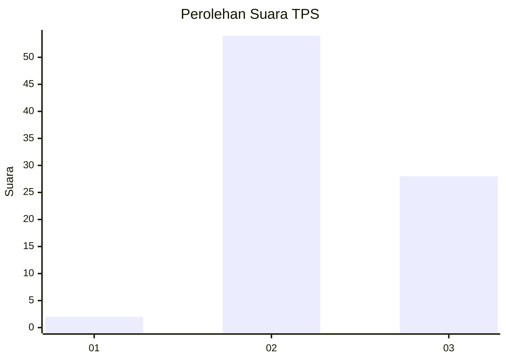
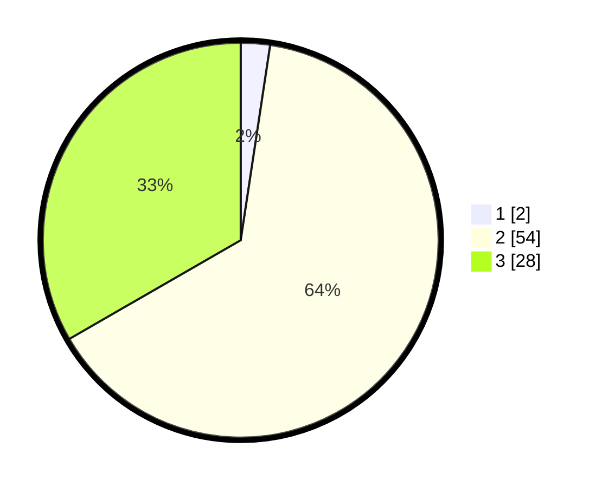

# Hasil

## Grafik

## Tabel

| No. | Nama Paslon    | Suara | Suara (raw) | Persentase |
|:--- |:-------------- | -----:| -----------:| ----------:|
| 1   | ANIES MUHAIMIN | 2     | [2][p-1]    | 2,38       |
| 2   | PRABOWO GIBRAN | 54    | [54][p-2]   | 64,29      |
| 3   | GANJAR MAHFUD  | 28    | [28][p-3]   | 33,33      |

[p-1]: https://github.com/gigit-pemilu/pemilu-2024-61-kalimantan-barat/blob/main/pilpres/hitung-suara/sub/61-kalimantan-barat/sub/04-ketapang/sub/08-simpang-hulu/sub/2014-kenanga/sub/006-tps/sub/paslon-1.txt
[p-2]: https://github.com/gigit-pemilu/pemilu-2024-61-kalimantan-barat/blob/main/pilpres/hitung-suara/sub/61-kalimantan-barat/sub/04-ketapang/sub/08-simpang-hulu/sub/2014-kenanga/sub/006-tps/sub/paslon-2.txt
[p-3]: https://github.com/gigit-pemilu/pemilu-2024-61-kalimantan-barat/blob/main/pilpres/hitung-suara/sub/61-kalimantan-barat/sub/04-ketapang/sub/08-simpang-hulu/sub/2014-kenanga/sub/006-tps/sub/paslon-3.txt

## Foto C Plano

https://sirekap-obj-formc.kpu.go.id/b3e5/pemilu/ppwp/61/04/08/20/14/6104082014006-20240218-181247--c147bc5e-927a-4e52-8145-5093c2327e03.jpg

https://sirekap-obj-formc.kpu.go.id/b3e5/pemilu/ppwp/61/04/08/20/14/6104082014006-20240218-181343--7f74f3a1-4019-4ee2-8c40-4ad0608ac86a.jpg

https://sirekap-obj-formc.kpu.go.id/b3e5/pemilu/ppwp/61/04/08/20/14/6104082014006-20240218-181505--fe56d47e-5e3b-416c-b11c-3de6b4c17480.jpg

## Metadata

| Key        | Value               |
| ---------- | ------------------- |
| Time Stamp | 2024-02-22 13:00:00 |

