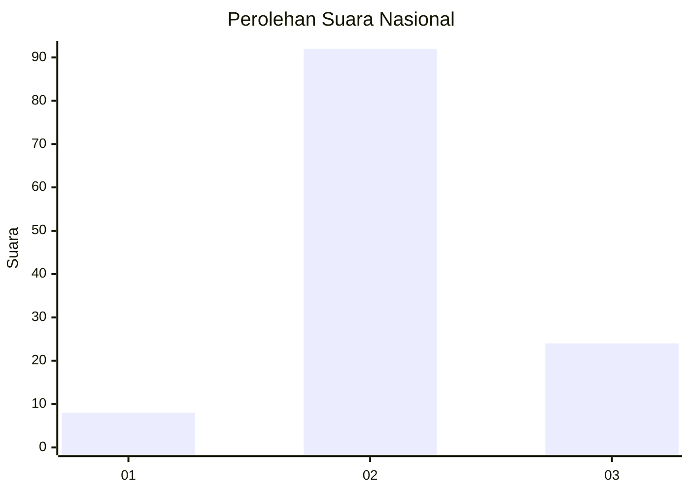
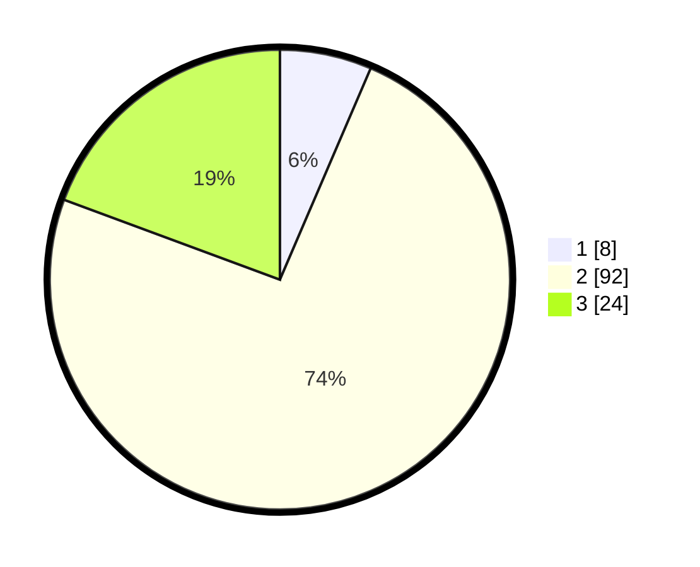

# Hasil

## Grafik

## Tabel

| No. | Nama Paslon    | Suara | Suara (raw) | Persentase |
|:--- |:-------------- | -----:| -----------:| ----------:|
| 1   | ANIES MUHAIMIN | 8     | [8][p-1]    | 6,45       |
| 2   | PRABOWO GIBRAN | 92    | [92][p-2]   | 74,19      |
| 3   | GANJAR MAHFUD  | 24    | [24][p-3]   | 19,35      |

[p-1]: https://github.com/gigit-pemilu/pemilu-2024/blob/main/pilpres/hitung-suara/sub/61-kalimantan-barat/sub/04-ketapang/sub/11-nanga-tayap/sub/2001-nanga-tayap/sub/014-tps/sub/paslon-1.txt
[p-2]: https://github.com/gigit-pemilu/pemilu-2024/blob/main/pilpres/hitung-suara/sub/61-kalimantan-barat/sub/04-ketapang/sub/11-nanga-tayap/sub/2001-nanga-tayap/sub/014-tps/sub/paslon-2.txt
[p-3]: https://github.com/gigit-pemilu/pemilu-2024/blob/main/pilpres/hitung-suara/sub/61-kalimantan-barat/sub/04-ketapang/sub/11-nanga-tayap/sub/2001-nanga-tayap/sub/014-tps/sub/paslon-3.txt

## Foto C Plano

https://sirekap-obj-formc.kpu.go.id/7c1d/pemilu/ppwp/61/04/11/20/01/6104112001014-20240215-144103--00fc9c83-2325-40a8-9414-8e712fb6c3d6.jpg

https://sirekap-obj-formc.kpu.go.id/7c1d/pemilu/ppwp/61/04/11/20/01/6104112001014-20240215-143908--69f08feb-77d9-4337-9d5a-d56636ce30ac.jpg

https://sirekap-obj-formc.kpu.go.id/7c1d/pemilu/ppwp/61/04/11/20/01/6104112001014-20240215-144228--22f5337b-78aa-4d91-bc1d-b270c592160f.jpg

## Metadata

| Key        | Value               |
| ---------- | ------------------- |
| Time Stamp | 2024-02-24 22:31:28 |

