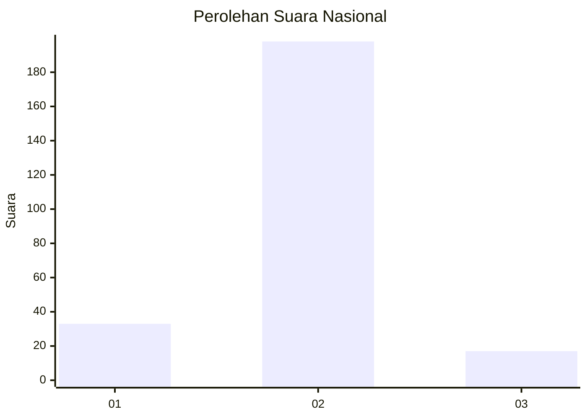
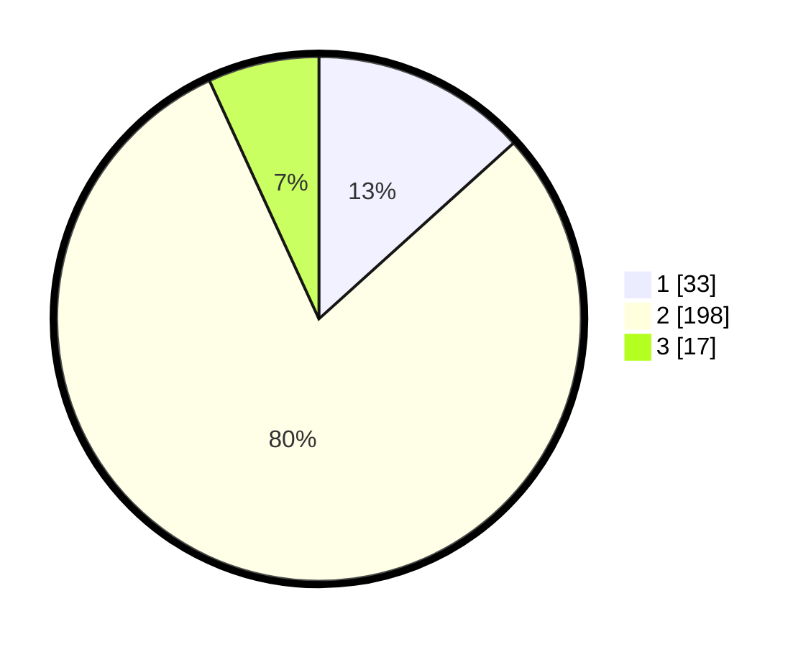

# Hasil

## Grafik

## Tabel

| No. | Nama Paslon    | Suara | Suara (raw) | Persentase |
|:--- |:-------------- | -----:| -----------:| ----------:|
| 1   | ANIES MUHAIMIN | 33    | [33][p-1]   | 13,31      |
| 2   | PRABOWO GIBRAN | 198   | [198][p-2]  | 79,84      |
| 3   | GANJAR MAHFUD  | 17    | [17][p-3]   | 6,85       |

[p-1]: https://github.com/gigit-pemilu/pemilu-2024/blob/main/pilpres/hitung-suara/sub/61-kalimantan-barat/sub/04-ketapang/sub/11-nanga-tayap/sub/2002-pangkalan-telok/sub/002-tps/sub/paslon-1.txt
[p-2]: https://github.com/gigit-pemilu/pemilu-2024/blob/main/pilpres/hitung-suara/sub/61-kalimantan-barat/sub/04-ketapang/sub/11-nanga-tayap/sub/2002-pangkalan-telok/sub/002-tps/sub/paslon-2.txt
[p-3]: https://github.com/gigit-pemilu/pemilu-2024/blob/main/pilpres/hitung-suara/sub/61-kalimantan-barat/sub/04-ketapang/sub/11-nanga-tayap/sub/2002-pangkalan-telok/sub/002-tps/sub/paslon-3.txt

## Foto C Plano

https://sirekap-obj-formc.kpu.go.id/8bd6/pemilu/ppwp/61/04/11/20/02/6104112002002-20240214-221217--2c570109-9224-4015-b977-39fa39d3e5c9.jpg

https://sirekap-obj-formc.kpu.go.id/8bd6/pemilu/ppwp/61/04/11/20/02/6104112002002-20240214-221419--66e8d31a-1149-46ce-bd24-95472a3d13c9.jpg

https://sirekap-obj-formc.kpu.go.id/8bd6/pemilu/ppwp/61/04/11/20/02/6104112002002-20240214-221552--ac4ad742-b856-42f6-ad63-7f9b77116ef9.jpg

## Metadata

| Key        | Value               |
| ---------- | ------------------- |
| Time Stamp | 2024-02-22 13:00:00 |

