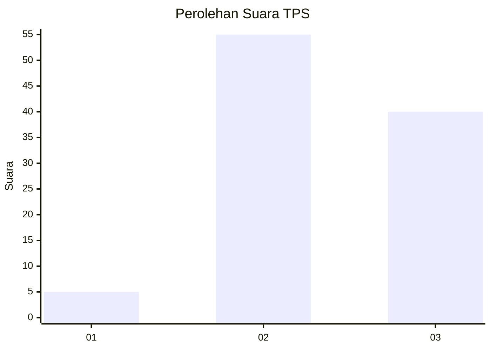
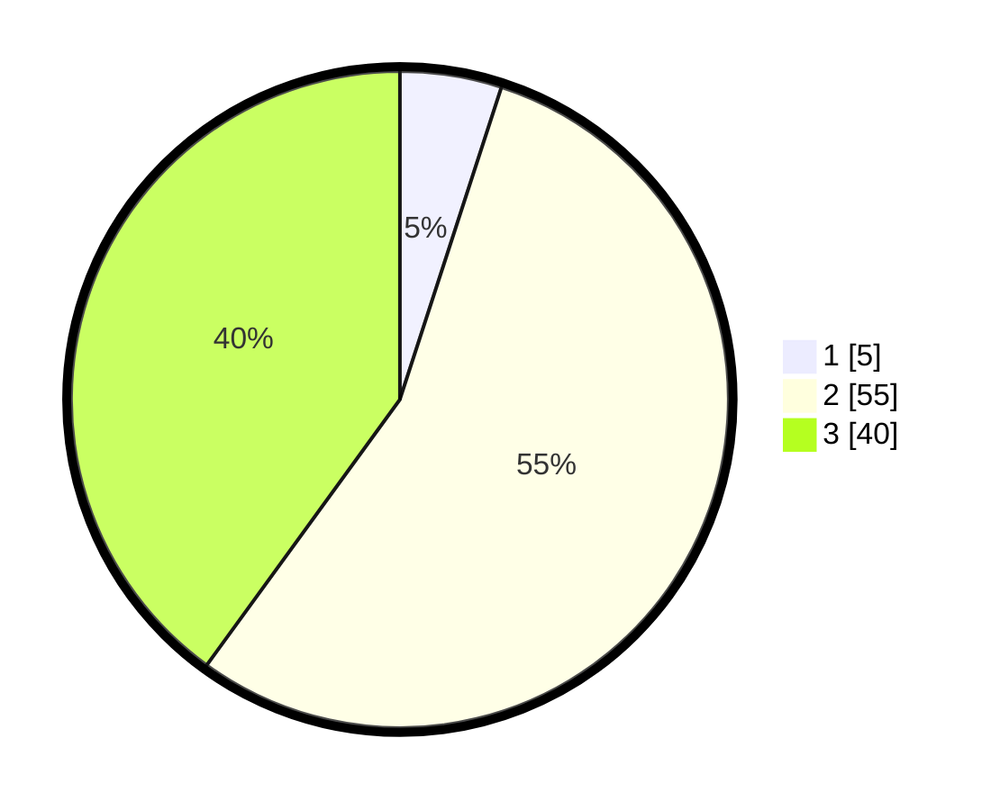

# Hasil

## Grafik

## Tabel

| No. | Nama Paslon    | Suara | Suara (raw) | Persentase |
|:--- |:-------------- | -----:| -----------:| ----------:|
| 1   | ANIES MUHAIMIN | 5     | [5][p-1]    | 5,00       |
| 2   | PRABOWO GIBRAN | 55    | [55][p-2]   | 55,00      |
| 3   | GANJAR MAHFUD  | 40    | [40][p-3]   | 40,00      |

[p-1]: https://github.com/gigit-pemilu/pemilu-2024-61-kalimantan-barat/blob/main/pilpres/hitung-suara/sub/61-kalimantan-barat/sub/04-ketapang/sub/11-nanga-tayap/sub/2010-sebadak-raya/sub/006-tps/sub/paslon-1.txt
[p-2]: https://github.com/gigit-pemilu/pemilu-2024-61-kalimantan-barat/blob/main/pilpres/hitung-suara/sub/61-kalimantan-barat/sub/04-ketapang/sub/11-nanga-tayap/sub/2010-sebadak-raya/sub/006-tps/sub/paslon-2.txt
[p-3]: https://github.com/gigit-pemilu/pemilu-2024-61-kalimantan-barat/blob/main/pilpres/hitung-suara/sub/61-kalimantan-barat/sub/04-ketapang/sub/11-nanga-tayap/sub/2010-sebadak-raya/sub/006-tps/sub/paslon-3.txt

## Foto C Plano

https://sirekap-obj-formc.kpu.go.id/b567/pemilu/ppwp/61/04/11/20/10/6104112010006-20240215-075608--e992ee27-21f7-480c-b2c0-130c2c56de12.jpg

https://sirekap-obj-formc.kpu.go.id/b567/pemilu/ppwp/61/04/11/20/10/6104112010006-20240215-080815--063a94ec-7104-4554-9095-13890106b5e0.jpg

https://sirekap-obj-formc.kpu.go.id/b567/pemilu/ppwp/61/04/11/20/10/6104112010006-20240215-075750--bdbce4d6-bc52-4312-8f68-7ba23a2e0739.jpg

## Metadata

| Key        | Value               |
| ---------- | ------------------- |
| Time Stamp | 2024-02-25 12:00:00 |

