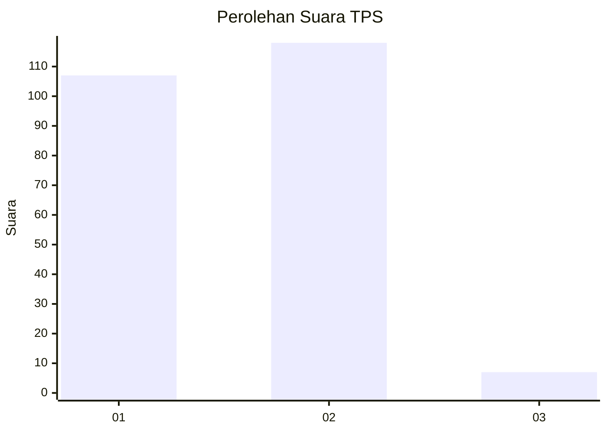
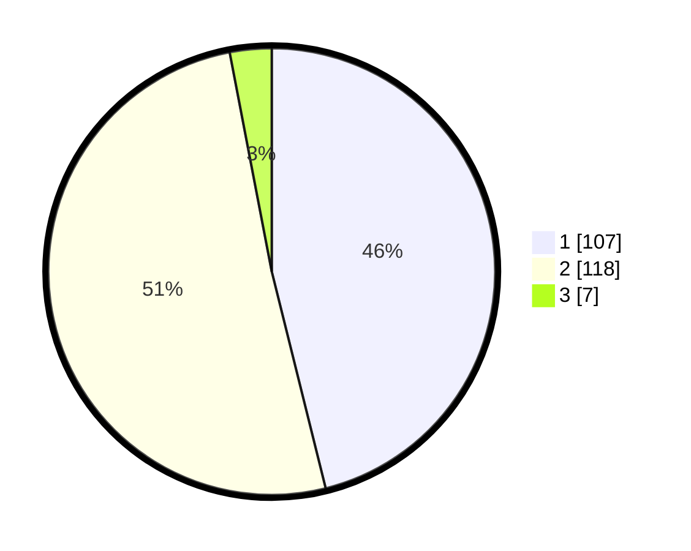

# Hasil

## Grafik

## Tabel

| No. | Nama Paslon    | Suara | Suara (raw) | Persentase |
|:--- |:-------------- | -----:| -----------:| ----------:|
| 1   | ANIES MUHAIMIN | 107   | [107][p-1]  | 46,12      |
| 2   | PRABOWO GIBRAN | 118   | [118][p-2]  | 50,86      |
| 3   | GANJAR MAHFUD  | 7     | [7][p-3]    | 3,02       |

[p-1]: https://github.com/gigit-pemilu/pemilu-2024-61-kalimantan-barat/blob/main/pilpres/hitung-suara/sub/61-kalimantan-barat/sub/04-ketapang/sub/12-matan-hilir-selatan/sub/2006-sungai-jawi/sub/005-tps/sub/paslon-1.txt
[p-2]: https://github.com/gigit-pemilu/pemilu-2024-61-kalimantan-barat/blob/main/pilpres/hitung-suara/sub/61-kalimantan-barat/sub/04-ketapang/sub/12-matan-hilir-selatan/sub/2006-sungai-jawi/sub/005-tps/sub/paslon-2.txt
[p-3]: https://github.com/gigit-pemilu/pemilu-2024-61-kalimantan-barat/blob/main/pilpres/hitung-suara/sub/61-kalimantan-barat/sub/04-ketapang/sub/12-matan-hilir-selatan/sub/2006-sungai-jawi/sub/005-tps/sub/paslon-3.txt

## Foto C Plano

https://sirekap-obj-formc.kpu.go.id/9f93/pemilu/ppwp/61/04/12/20/06/6104122006005-20240215-010855--d0779ed6-62e4-4ff7-b9c3-e8df151bfc84.jpg

https://sirekap-obj-formc.kpu.go.id/9f93/pemilu/ppwp/61/04/12/20/06/6104122006005-20240215-010923--50b91e02-fed2-4538-bdc6-f34ce13801bc.jpg

https://sirekap-obj-formc.kpu.go.id/9f93/pemilu/ppwp/61/04/12/20/06/6104122006005-20240215-010948--4732f938-17a1-4829-90ab-4823736a3c74.jpg

## Metadata

| Key        | Value               |
| ---------- | ------------------- |
| Time Stamp | 2024-02-25 12:00:00 |

