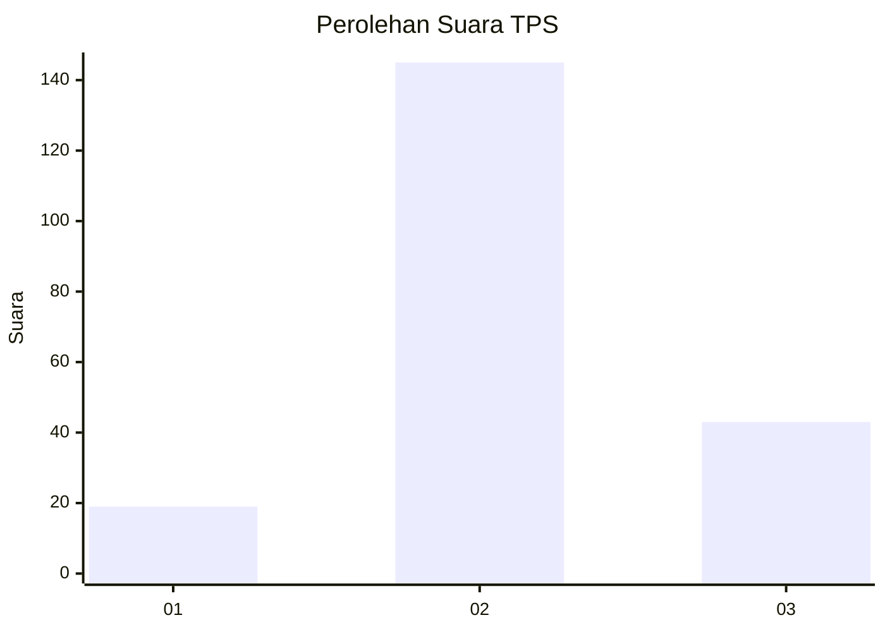
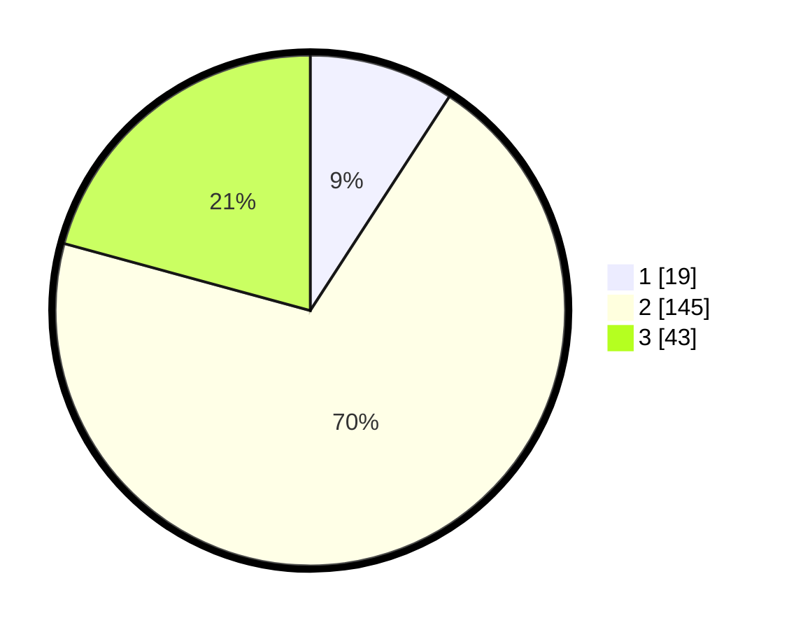

# Hasil

## Grafik

## Tabel

| No. | Nama Paslon    | Suara | Suara (raw) | Persentase |
|:--- |:-------------- | -----:| -----------:| ----------:|
| 1   | ANIES MUHAIMIN | 19    | [19][p-1]   | 9,18       |
| 2   | PRABOWO GIBRAN | 145   | [145][p-2]  | 70,05      |
| 3   | GANJAR MAHFUD  | 43    | [43][p-3]   | 20,77      |

[p-1]: https://github.com/gigit-pemilu/pemilu-2024-61-kalimantan-barat/blob/main/pilpres/hitung-suara/sub/61-kalimantan-barat/sub/04-ketapang/sub/13-tumbang-titi/sub/2001-tumbang-titi/sub/007-tps/sub/paslon-1.txt
[p-2]: https://github.com/gigit-pemilu/pemilu-2024-61-kalimantan-barat/blob/main/pilpres/hitung-suara/sub/61-kalimantan-barat/sub/04-ketapang/sub/13-tumbang-titi/sub/2001-tumbang-titi/sub/007-tps/sub/paslon-2.txt
[p-3]: https://github.com/gigit-pemilu/pemilu-2024-61-kalimantan-barat/blob/main/pilpres/hitung-suara/sub/61-kalimantan-barat/sub/04-ketapang/sub/13-tumbang-titi/sub/2001-tumbang-titi/sub/007-tps/sub/paslon-3.txt

## Foto C Plano

https://sirekap-obj-formc.kpu.go.id/b4b8/pemilu/ppwp/61/04/13/20/01/6104132001007-20240214-203331--9be4fc98-75a4-4c86-b967-76ce548a157e.jpg

https://sirekap-obj-formc.kpu.go.id/b4b8/pemilu/ppwp/61/04/13/20/01/6104132001007-20240214-203806--959fbed7-ed1b-4d8d-9300-fb9aadfb434a.jpg

https://sirekap-obj-formc.kpu.go.id/b4b8/pemilu/ppwp/61/04/13/20/01/6104132001007-20240214-203902--a7e24a11-3b0c-4f7e-ad55-e0c1da47910c.jpg

## Metadata

| Key        | Value               |
| ---------- | ------------------- |
| Time Stamp | 2024-02-22 13:00:00 |

