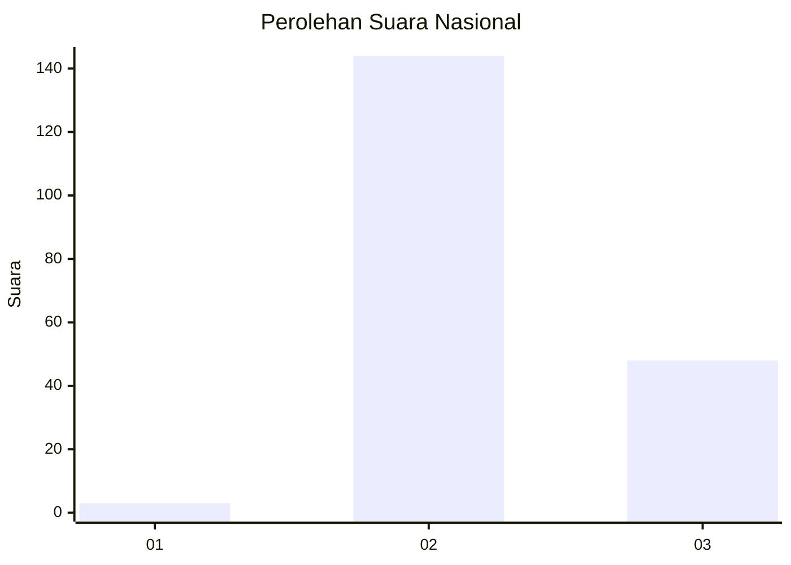
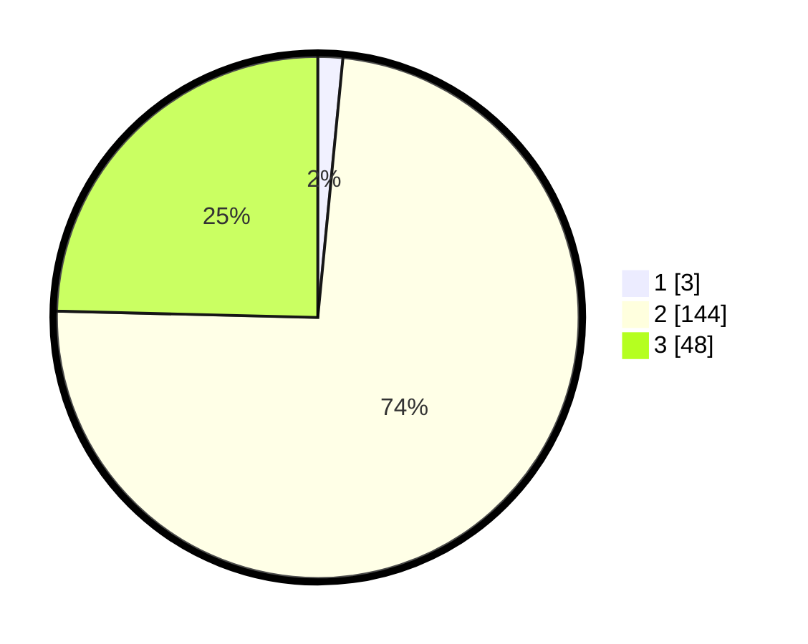

# Hasil

## Grafik

## Tabel

| No. | Nama Paslon    | Suara | Suara (raw) | Persentase |
|:--- |:-------------- | -----:| -----------:| ----------:|
| 1   | ANIES MUHAIMIN | 3     | [3][p-1]    | 1,54       |
| 2   | PRABOWO GIBRAN | 144   | [144][p-2]  | 73,85      |
| 3   | GANJAR MAHFUD  | 48    | [48][p-3]   | 24,62      |

[p-1]: https://github.com/gigit-pemilu/pemilu-2024/blob/main/pilpres/hitung-suara/sub/61-kalimantan-barat/sub/04-ketapang/sub/13-tumbang-titi/sub/2002-natai-panjang/sub/001-tps/sub/paslon-1.txt
[p-2]: https://github.com/gigit-pemilu/pemilu-2024/blob/main/pilpres/hitung-suara/sub/61-kalimantan-barat/sub/04-ketapang/sub/13-tumbang-titi/sub/2002-natai-panjang/sub/001-tps/sub/paslon-2.txt
[p-3]: https://github.com/gigit-pemilu/pemilu-2024/blob/main/pilpres/hitung-suara/sub/61-kalimantan-barat/sub/04-ketapang/sub/13-tumbang-titi/sub/2002-natai-panjang/sub/001-tps/sub/paslon-3.txt

## Foto C Plano

https://sirekap-obj-formc.kpu.go.id/d3d3/pemilu/ppwp/61/04/13/20/02/6104132002001-20240215-095809--b19241f7-e2dc-42cf-be91-711f3b047c94.jpg

https://sirekap-obj-formc.kpu.go.id/d3d3/pemilu/ppwp/61/04/13/20/02/6104132002001-20240215-094507--d075c6bb-e091-4fe9-9a3d-65d10ff10113.jpg

https://sirekap-obj-formc.kpu.go.id/d3d3/pemilu/ppwp/61/04/13/20/02/6104132002001-20240215-094548--d4d9aa5f-eea3-4c5d-9ca8-eeeeec8405fa.jpg

## Metadata

| Key        | Value               |
| ---------- | ------------------- |
| Time Stamp | 2024-02-22 13:00:00 |

