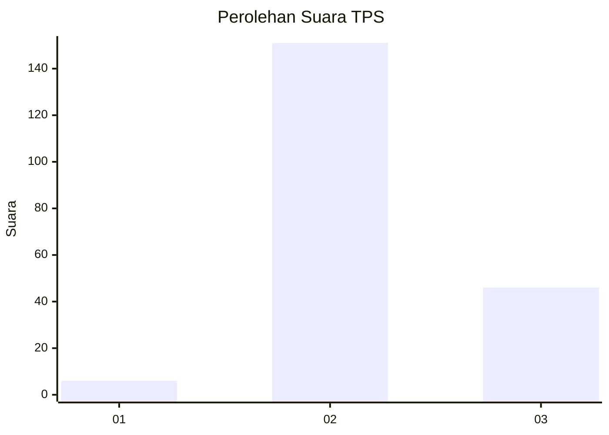
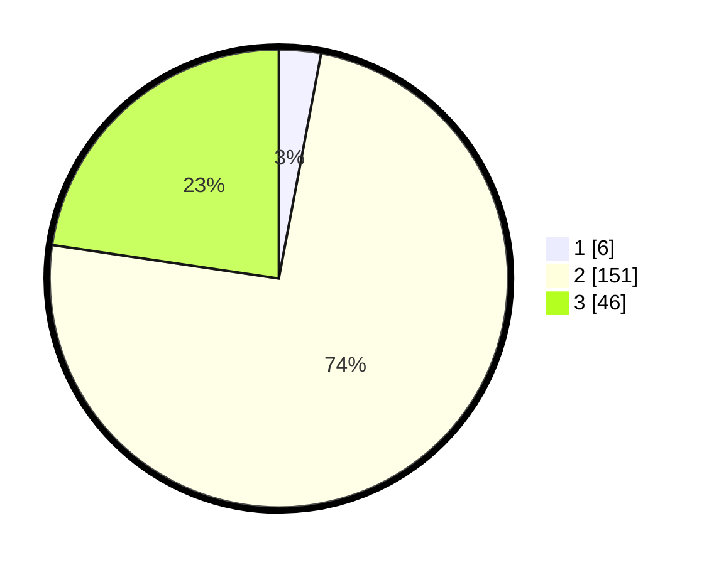

# Hasil

## Grafik

## Tabel

| No. | Nama Paslon    | Suara | Suara (raw) | Persentase |
|:--- |:-------------- | -----:| -----------:| ----------:|
| 1   | ANIES MUHAIMIN | 6     | [6][p-1]    | 2,96       |
| 2   | PRABOWO GIBRAN | 151   | [151][p-2]  | 74,38      |
| 3   | GANJAR MAHFUD  | 46    | [46][p-3]   | 22,66      |

[p-1]: https://github.com/gigit-pemilu/pemilu-2024-61-kalimantan-barat/blob/main/pilpres/hitung-suara/sub/61-kalimantan-barat/sub/04-ketapang/sub/13-tumbang-titi/sub/2002-natai-panjang/sub/002-tps/sub/paslon-1.txt
[p-2]: https://github.com/gigit-pemilu/pemilu-2024-61-kalimantan-barat/blob/main/pilpres/hitung-suara/sub/61-kalimantan-barat/sub/04-ketapang/sub/13-tumbang-titi/sub/2002-natai-panjang/sub/002-tps/sub/paslon-2.txt
[p-3]: https://github.com/gigit-pemilu/pemilu-2024-61-kalimantan-barat/blob/main/pilpres/hitung-suara/sub/61-kalimantan-barat/sub/04-ketapang/sub/13-tumbang-titi/sub/2002-natai-panjang/sub/002-tps/sub/paslon-3.txt

## Foto C Plano

https://sirekap-obj-formc.kpu.go.id/4a89/pemilu/ppwp/61/04/13/20/02/6104132002002-20240215-115235--a613380c-dec3-495c-bded-543ba0b736cc.jpg

https://sirekap-obj-formc.kpu.go.id/4a89/pemilu/ppwp/61/04/13/20/02/6104132002002-20240215-115402--b2a5c81a-701e-4791-96cf-7d99bff0b06f.jpg

https://sirekap-obj-formc.kpu.go.id/4a89/pemilu/ppwp/61/04/13/20/02/6104132002002-20240215-115519--10cb317b-7159-4c52-91dd-dd65235ba7c2.jpg

## Metadata

| Key        | Value               |
| ---------- | ------------------- |
| Time Stamp | 2024-02-22 13:00:00 |

