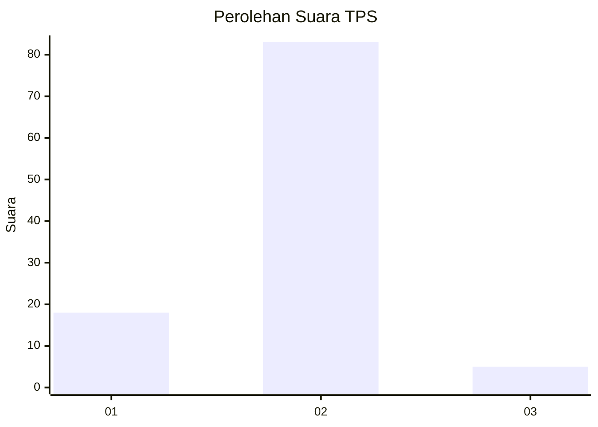
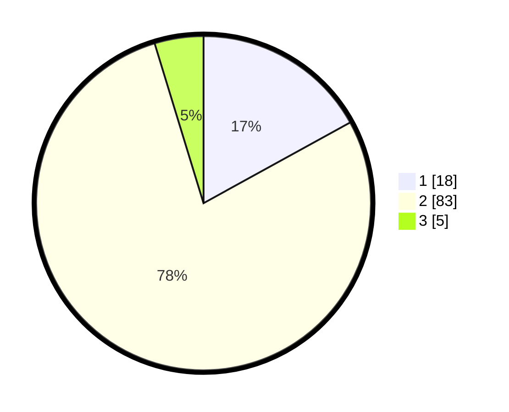

# Hasil

## Grafik

## Tabel

| No. | Nama Paslon    | Suara | Suara (raw) | Persentase |
|:--- |:-------------- | -----:| -----------:| ----------:|
| 1   | ANIES MUHAIMIN | 18    | [18][p-1]   | 16,98      |
| 2   | PRABOWO GIBRAN | 83    | [83][p-2]   | 78,30      |
| 3   | GANJAR MAHFUD  | 5     | [5][p-3]    | 4,72       |

[p-1]: https://github.com/gigit-pemilu/pemilu-2024-61-kalimantan-barat/blob/main/pilpres/hitung-suara/sub/61-kalimantan-barat/sub/04-ketapang/sub/13-tumbang-titi/sub/2013-pemuatan-jaya/sub/004-tps/sub/paslon-1.txt
[p-2]: https://github.com/gigit-pemilu/pemilu-2024-61-kalimantan-barat/blob/main/pilpres/hitung-suara/sub/61-kalimantan-barat/sub/04-ketapang/sub/13-tumbang-titi/sub/2013-pemuatan-jaya/sub/004-tps/sub/paslon-2.txt
[p-3]: https://github.com/gigit-pemilu/pemilu-2024-61-kalimantan-barat/blob/main/pilpres/hitung-suara/sub/61-kalimantan-barat/sub/04-ketapang/sub/13-tumbang-titi/sub/2013-pemuatan-jaya/sub/004-tps/sub/paslon-3.txt

## Foto C Plano

https://sirekap-obj-formc.kpu.go.id/8f2a/pemilu/ppwp/61/04/13/20/13/6104132013004-20240214-225702--0750b5e9-b471-4a40-85c2-2a131587ca79.jpg

https://sirekap-obj-formc.kpu.go.id/8f2a/pemilu/ppwp/61/04/13/20/13/6104132013004-20240214-221828--4a0ff111-4486-49bf-82fc-ddb8ed8dd9bb.jpg

https://sirekap-obj-formc.kpu.go.id/8f2a/pemilu/ppwp/61/04/13/20/13/6104132013004-20240214-222013--bfde7f7c-91e4-46b1-a506-bc210759c8fc.jpg

## Metadata

| Key        | Value               |
| ---------- | ------------------- |
| Time Stamp | 2024-02-22 13:00:00 |

