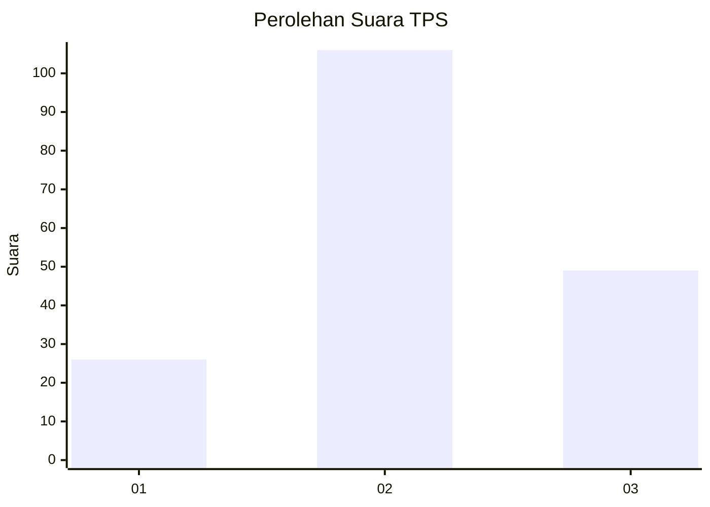
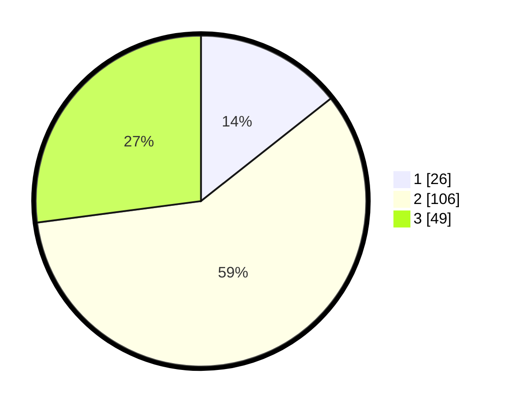

# Hasil

## Grafik

## Tabel

| No. | Nama Paslon    | Suara | Suara (raw) | Persentase |
|:--- |:-------------- | -----:| -----------:| ----------:|
| 1   | ANIES MUHAIMIN | 26    | [26][p-1]   | 14,36      |
| 2   | PRABOWO GIBRAN | 106   | [106][p-2]  | 58,56      |
| 3   | GANJAR MAHFUD  | 49    | [49][p-3]   | 27,07      |

[p-1]: https://github.com/gigit-pemilu/pemilu-2024-61-kalimantan-barat/blob/main/pilpres/hitung-suara/sub/61-kalimantan-barat/sub/04-ketapang/sub/16-delta-pawan/sub/1001-kantor/sub/001-tps/sub/paslon-1.txt
[p-2]: https://github.com/gigit-pemilu/pemilu-2024-61-kalimantan-barat/blob/main/pilpres/hitung-suara/sub/61-kalimantan-barat/sub/04-ketapang/sub/16-delta-pawan/sub/1001-kantor/sub/001-tps/sub/paslon-2.txt
[p-3]: https://github.com/gigit-pemilu/pemilu-2024-61-kalimantan-barat/blob/main/pilpres/hitung-suara/sub/61-kalimantan-barat/sub/04-ketapang/sub/16-delta-pawan/sub/1001-kantor/sub/001-tps/sub/paslon-3.txt

## Foto C Plano

https://sirekap-obj-formc.kpu.go.id/da95/pemilu/ppwp/61/04/16/10/01/6104161001001-20240214-155633--582b12dc-d91a-4e02-992e-4e75b03b65c5.jpg

https://sirekap-obj-formc.kpu.go.id/da95/pemilu/ppwp/61/04/16/10/01/6104161001001-20240214-155557--e0af6f49-1369-4c23-864d-c48452fab7ee.jpg

https://sirekap-obj-formc.kpu.go.id/da95/pemilu/ppwp/61/04/16/10/01/6104161001001-20240214-160111--bcc0e508-cab1-431b-8457-851e7a482d0c.jpg

## Metadata

| Key        | Value               |
| ---------- | ------------------- |
| Time Stamp | 2024-02-22 13:00:00 |

