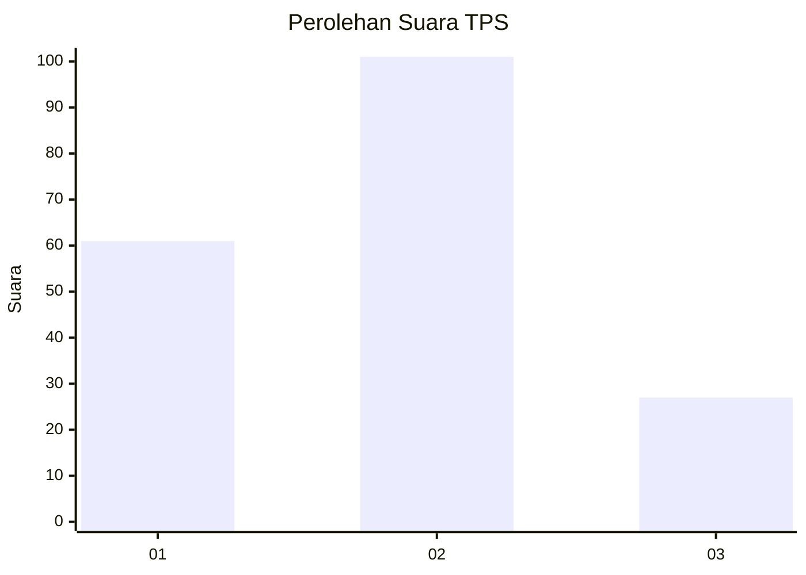
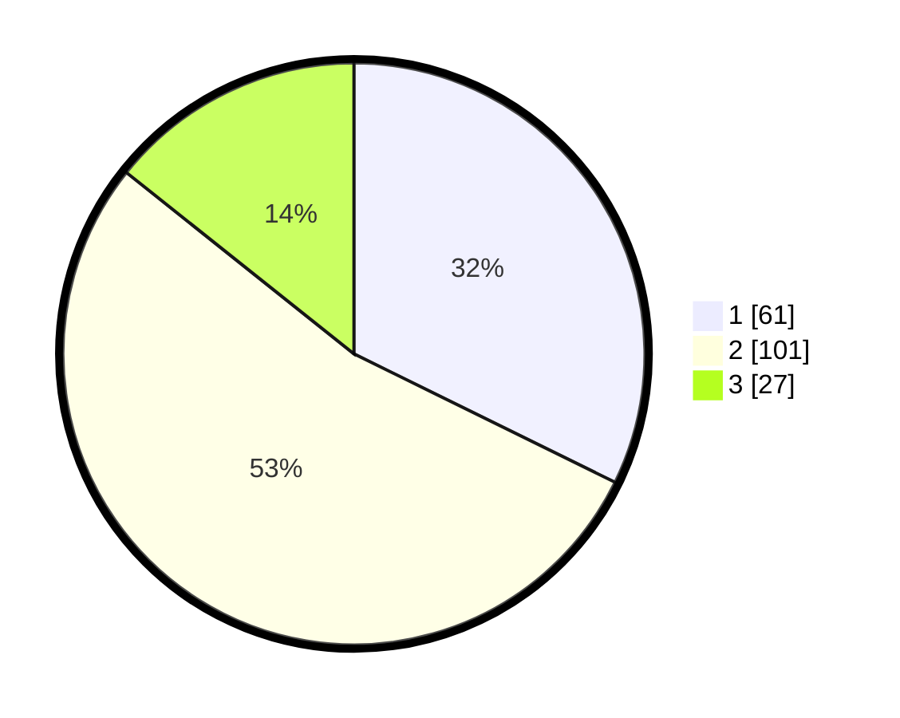

# Hasil

## Grafik

## Tabel

| No. | Nama Paslon    | Suara | Suara (raw) | Persentase |
|:--- |:-------------- | -----:| -----------:| ----------:|
| 1   | ANIES MUHAIMIN | 61    | [61][p-1]   | 32,28      |
| 2   | PRABOWO GIBRAN | 101   | [101][p-2]  | 53,44      |
| 3   | GANJAR MAHFUD  | 27    | [27][p-3]   | 14,29      |

[p-1]: https://github.com/gigit-pemilu/pemilu-2024-61-kalimantan-barat/blob/main/pilpres/hitung-suara/sub/61-kalimantan-barat/sub/04-ketapang/sub/16-delta-pawan/sub/1001-kantor/sub/005-tps/sub/paslon-1.txt
[p-2]: https://github.com/gigit-pemilu/pemilu-2024-61-kalimantan-barat/blob/main/pilpres/hitung-suara/sub/61-kalimantan-barat/sub/04-ketapang/sub/16-delta-pawan/sub/1001-kantor/sub/005-tps/sub/paslon-2.txt
[p-3]: https://github.com/gigit-pemilu/pemilu-2024-61-kalimantan-barat/blob/main/pilpres/hitung-suara/sub/61-kalimantan-barat/sub/04-ketapang/sub/16-delta-pawan/sub/1001-kantor/sub/005-tps/sub/paslon-3.txt

## Foto C Plano

https://sirekap-obj-formc.kpu.go.id/bb3f/pemilu/ppwp/61/04/16/10/01/6104161001005-20240214-162248--946b4e38-8fc9-488d-bcdf-566d1ea1c27b.jpg

https://sirekap-obj-formc.kpu.go.id/bb3f/pemilu/ppwp/61/04/16/10/01/6104161001005-20240215-035937--88c4a963-4776-42c4-8e9b-585d21b95d26.jpg

https://sirekap-obj-formc.kpu.go.id/bb3f/pemilu/ppwp/61/04/16/10/01/6104161001005-20240215-035953--2c86e088-b6fb-4b87-9d71-c243efc83acc.jpg

## Metadata

| Key        | Value               |
| ---------- | ------------------- |
| Time Stamp | 2024-02-22 13:00:00 |

