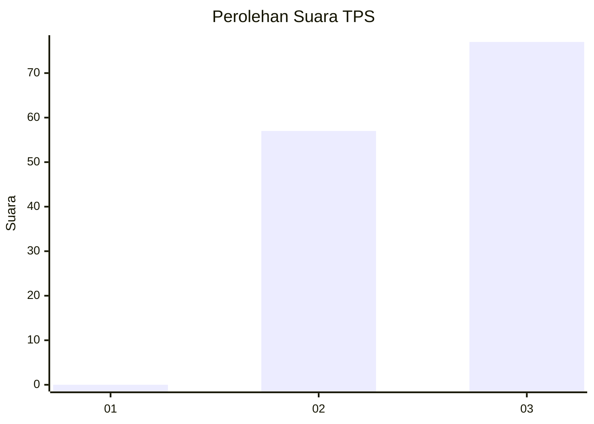
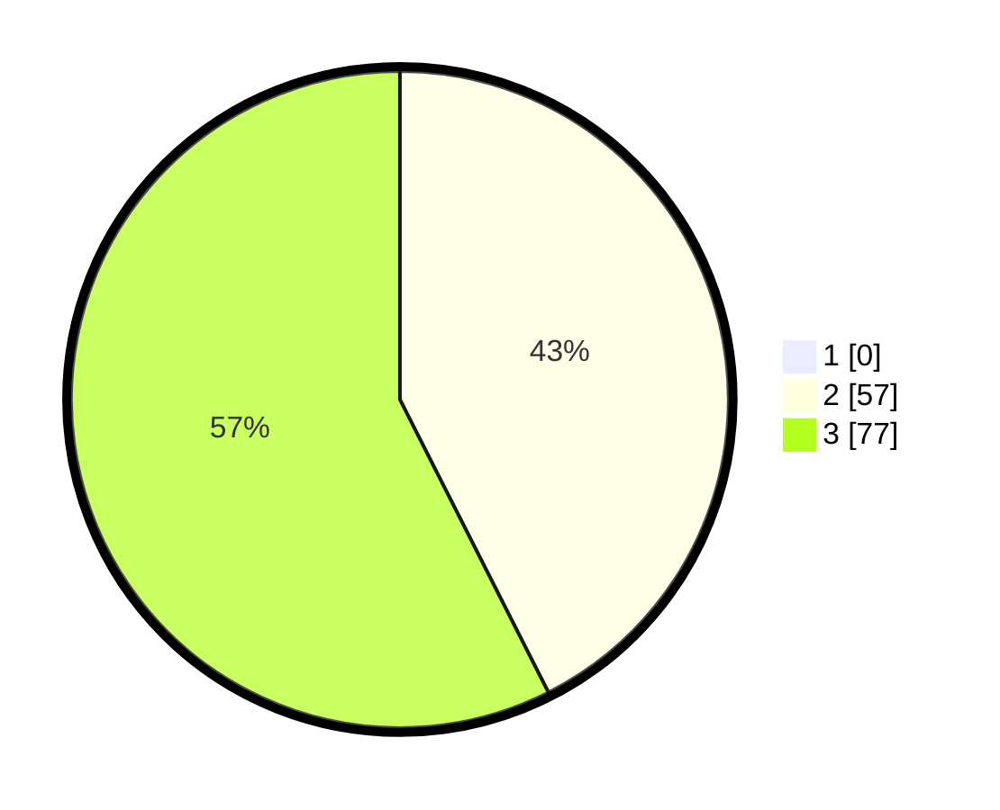

# Hasil

## Grafik

## Tabel

| No. | Nama Paslon    | Suara | Suara (raw) | Persentase |
|:--- |:-------------- | -----:| -----------:| ----------:|
| 1   | ANIES MUHAIMIN | 0     | [0][p-1]    | 0,00       |
| 2   | PRABOWO GIBRAN | 57    | [57][p-2]   | 42,54      |
| 3   | GANJAR MAHFUD  | 77    | [77][p-3]   | 57,46      |

[p-1]: https://github.com/gigit-pemilu/pemilu-2024-61-kalimantan-barat/blob/main/pilpres/hitung-suara/sub/61-kalimantan-barat/sub/04-ketapang/sub/16-delta-pawan/sub/1001-kantor/sub/014-tps/sub/paslon-1.txt
[p-2]: https://github.com/gigit-pemilu/pemilu-2024-61-kalimantan-barat/blob/main/pilpres/hitung-suara/sub/61-kalimantan-barat/sub/04-ketapang/sub/16-delta-pawan/sub/1001-kantor/sub/014-tps/sub/paslon-2.txt
[p-3]: https://github.com/gigit-pemilu/pemilu-2024-61-kalimantan-barat/blob/main/pilpres/hitung-suara/sub/61-kalimantan-barat/sub/04-ketapang/sub/16-delta-pawan/sub/1001-kantor/sub/014-tps/sub/paslon-3.txt

## Foto C Plano

https://sirekap-obj-formc.kpu.go.id/5bb5/pemilu/ppwp/61/04/16/10/01/6104161001014-20240215-003802--5fbdd0a0-7cd8-4bf6-87f0-18f22355a614.jpg

https://sirekap-obj-formc.kpu.go.id/5bb5/pemilu/ppwp/61/04/16/10/01/6104161001014-20240215-004042--973b5061-e4e5-453a-99bd-1e14fc9e6311.jpg

https://sirekap-obj-formc.kpu.go.id/5bb5/pemilu/ppwp/61/04/16/10/01/6104161001014-20240215-004234--6e9a01ca-4a5d-484e-97f6-9c000e6d6dfe.jpg

## Metadata

| Key        | Value               |
| ---------- | ------------------- |
| Time Stamp | 2024-02-22 13:00:00 |

