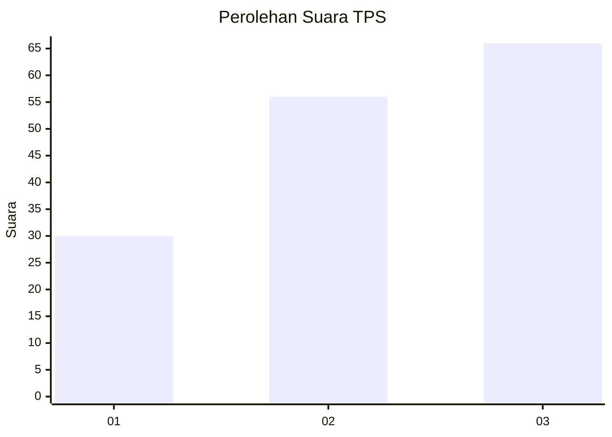
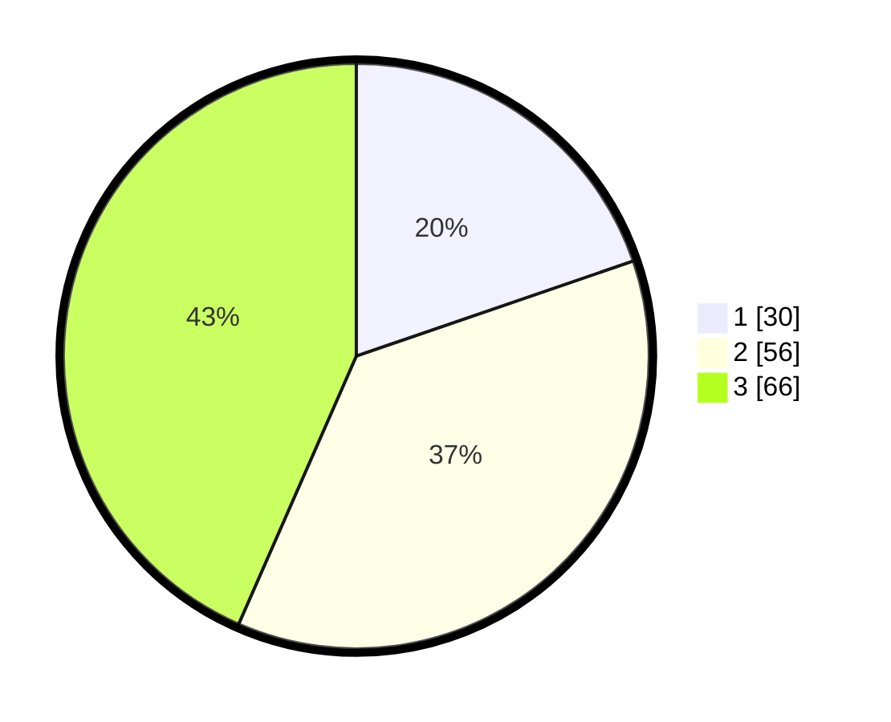

# Hasil

## Grafik

## Tabel

| No. | Nama Paslon    | Suara | Suara (raw) | Persentase |
|:--- |:-------------- | -----:| -----------:| ----------:|
| 1   | ANIES MUHAIMIN | 30    | [30][p-1]   | 19,74      |
| 2   | PRABOWO GIBRAN | 56    | [56][p-2]   | 36,84      |
| 3   | GANJAR MAHFUD  | 66    | [66][p-3]   | 43,42      |

[p-1]: https://github.com/gigit-pemilu/pemilu-2024-61-kalimantan-barat/blob/main/pilpres/hitung-suara/sub/61-kalimantan-barat/sub/04-ketapang/sub/16-delta-pawan/sub/1003-mulia-baru/sub/019-tps/sub/paslon-1.txt
[p-2]: https://github.com/gigit-pemilu/pemilu-2024-61-kalimantan-barat/blob/main/pilpres/hitung-suara/sub/61-kalimantan-barat/sub/04-ketapang/sub/16-delta-pawan/sub/1003-mulia-baru/sub/019-tps/sub/paslon-2.txt
[p-3]: https://github.com/gigit-pemilu/pemilu-2024-61-kalimantan-barat/blob/main/pilpres/hitung-suara/sub/61-kalimantan-barat/sub/04-ketapang/sub/16-delta-pawan/sub/1003-mulia-baru/sub/019-tps/sub/paslon-3.txt

## Foto C Plano

https://sirekap-obj-formc.kpu.go.id/1283/pemilu/ppwp/61/04/16/10/03/6104161003019-20240214-234056--b1b07f23-a2d7-48e9-800f-4c4092eef29c.jpg

https://sirekap-obj-formc.kpu.go.id/1283/pemilu/ppwp/61/04/16/10/03/6104161003019-20240214-234134--236e48d8-2fe1-4c10-9b74-e6122ddfd2ad.jpg

https://sirekap-obj-formc.kpu.go.id/1283/pemilu/ppwp/61/04/16/10/03/6104161003019-20240214-234252--8c479cde-b1d0-4d1a-bbc0-de9dc44b6321.jpg

## Metadata

| Key        | Value               |
| ---------- | ------------------- |
| Time Stamp | 2024-02-22 13:00:00 |

