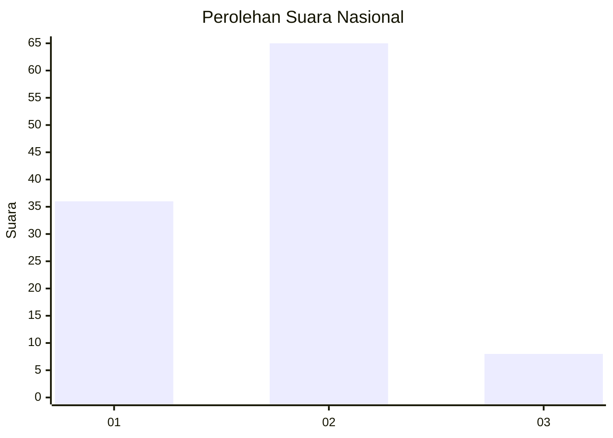
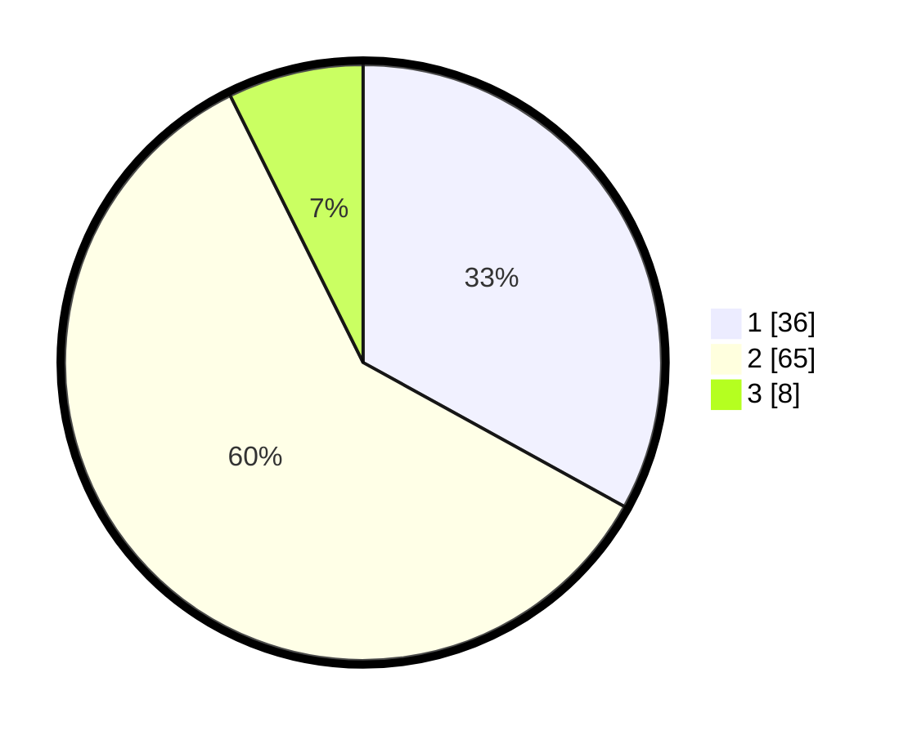

# Hasil

## Grafik

## Tabel

| No. | Nama Paslon    | Suara | Suara (raw) | Persentase |
|:--- |:-------------- | -----:| -----------:| ----------:|
| 1   | ANIES MUHAIMIN | 36    | [36][p-1]   | 33,03      |
| 2   | PRABOWO GIBRAN | 65    | [65][p-2]   | 59,63      |
| 3   | GANJAR MAHFUD  | 8     | [8][p-3]    | 7,34       |

[p-1]: https://github.com/gigit-pemilu/pemilu-2024/blob/main/pilpres/hitung-suara/sub/61-kalimantan-barat/sub/04-ketapang/sub/16-delta-pawan/sub/1005-suka-harja/sub/002-tps/sub/paslon-1.txt
[p-2]: https://github.com/gigit-pemilu/pemilu-2024/blob/main/pilpres/hitung-suara/sub/61-kalimantan-barat/sub/04-ketapang/sub/16-delta-pawan/sub/1005-suka-harja/sub/002-tps/sub/paslon-2.txt
[p-3]: https://github.com/gigit-pemilu/pemilu-2024/blob/main/pilpres/hitung-suara/sub/61-kalimantan-barat/sub/04-ketapang/sub/16-delta-pawan/sub/1005-suka-harja/sub/002-tps/sub/paslon-3.txt

## Foto C Plano

https://sirekap-obj-formc.kpu.go.id/a403/pemilu/ppwp/61/04/16/10/05/6104161005002-20240217-143000--c41aaf1b-51ff-4742-a780-b4c1372b8e8f.jpg

https://sirekap-obj-formc.kpu.go.id/a403/pemilu/ppwp/61/04/16/10/05/6104161005002-20240217-143147--6fc70aec-0e31-4f89-8fb5-fc0f99aec9bf.jpg

https://sirekap-obj-formc.kpu.go.id/a403/pemilu/ppwp/61/04/16/10/05/6104161005002-20240215-041910--e612859c-f949-4524-8786-2abbad957276.jpg

## Metadata

| Key        | Value               |
| ---------- | ------------------- |
| Time Stamp | 2024-02-22 13:00:00 |

