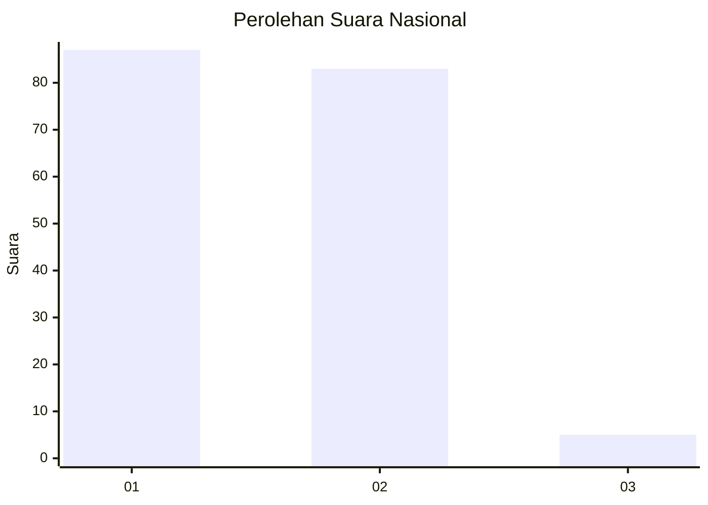
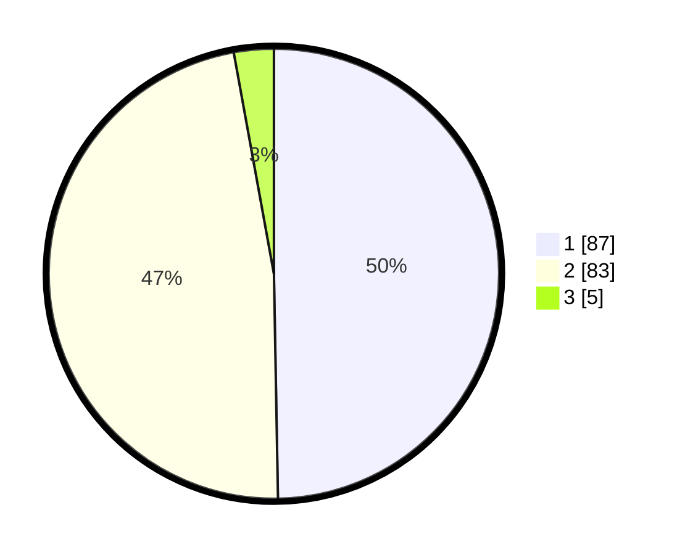

# Hasil

## Grafik

## Tabel

| No. | Nama Paslon    | Suara | Suara (raw) | Persentase |
|:--- |:-------------- | -----:| -----------:| ----------:|
| 1   | ANIES MUHAIMIN | 87    | [87][p-1]   | 49,71      |
| 2   | PRABOWO GIBRAN | 83    | [83][p-2]   | 47,43      |
| 3   | GANJAR MAHFUD  | 5     | [5][p-3]    | 2,86       |

[p-1]: https://github.com/gigit-pemilu/pemilu-2024/blob/main/pilpres/hitung-suara/sub/61-kalimantan-barat/sub/04-ketapang/sub/18-benua-kayong/sub/1001-kauman/sub/001-tps/sub/paslon-1.txt
[p-2]: https://github.com/gigit-pemilu/pemilu-2024/blob/main/pilpres/hitung-suara/sub/61-kalimantan-barat/sub/04-ketapang/sub/18-benua-kayong/sub/1001-kauman/sub/001-tps/sub/paslon-2.txt
[p-3]: https://github.com/gigit-pemilu/pemilu-2024/blob/main/pilpres/hitung-suara/sub/61-kalimantan-barat/sub/04-ketapang/sub/18-benua-kayong/sub/1001-kauman/sub/001-tps/sub/paslon-3.txt

## Foto C Plano

https://sirekap-obj-formc.kpu.go.id/31d7/pemilu/ppwp/61/04/18/10/01/6104181001001-20240215-005357--6f5c8ccb-1e86-480f-9184-e22eac6aac74.jpg

https://sirekap-obj-formc.kpu.go.id/31d7/pemilu/ppwp/61/04/18/10/01/6104181001001-20240215-005529--78807314-12ce-4cd0-bb34-693c47e72e41.jpg

https://sirekap-obj-formc.kpu.go.id/31d7/pemilu/ppwp/61/04/18/10/01/6104181001001-20240215-020301--2cc0fa34-7224-4383-85d1-47c8823981cb.jpg

## Metadata

| Key        | Value               |
| ---------- | ------------------- |
| Time Stamp | 2024-02-22 13:00:00 |

