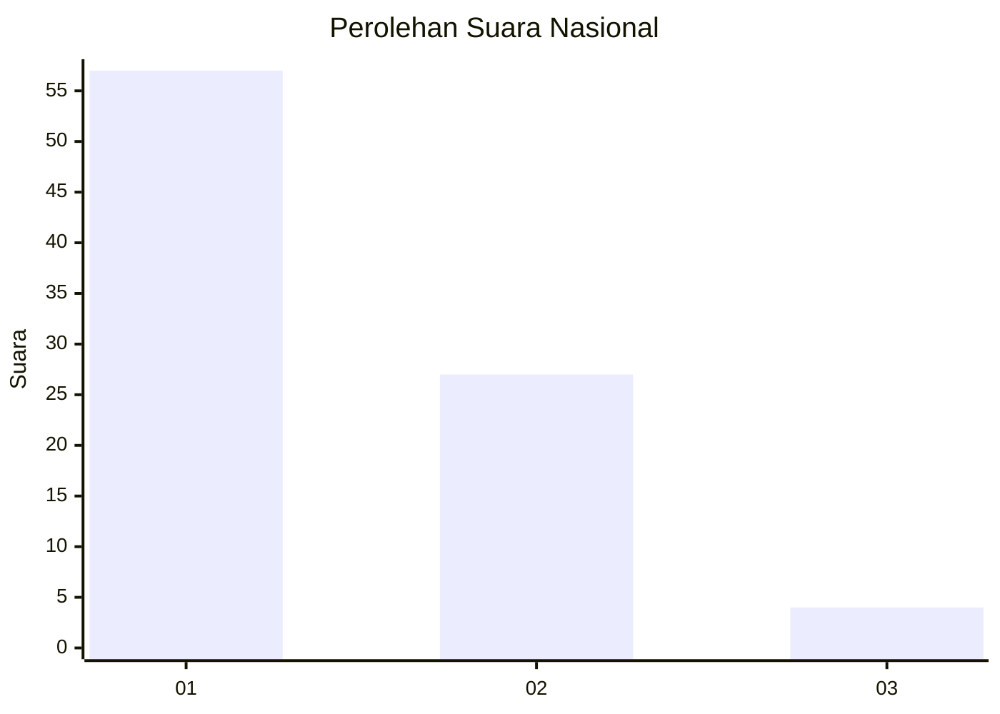
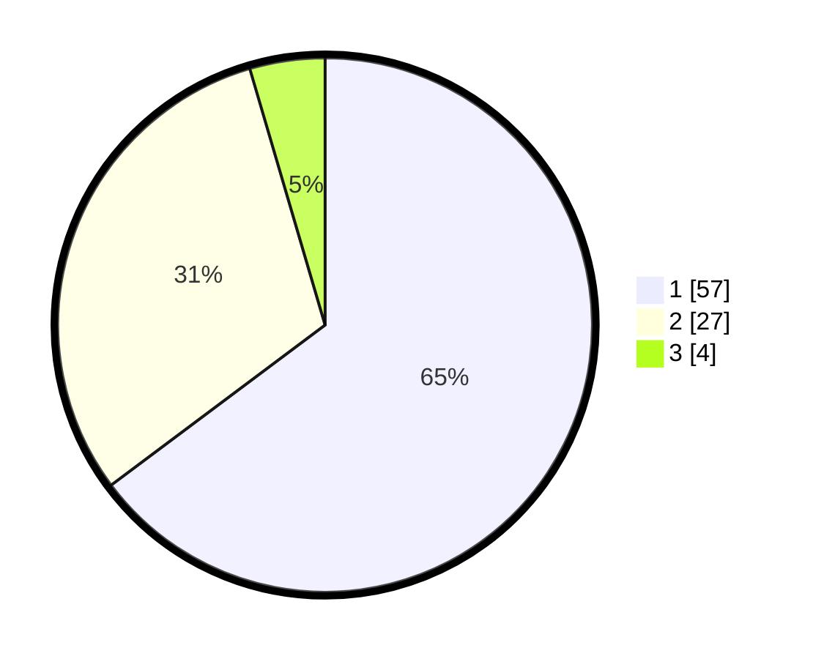

# Hasil

## Grafik

## Tabel

| No. | Nama Paslon    | Suara | Suara (raw) | Persentase |
|:--- |:-------------- | -----:| -----------:| ----------:|
| 1   | ANIES MUHAIMIN | 57    | [57][p-1]   | 64,77      |
| 2   | PRABOWO GIBRAN | 27    | [27][p-2]   | 30,68      |
| 3   | GANJAR MAHFUD  | 4     | [4][p-3]    | 4,55       |

[p-1]: https://github.com/gigit-pemilu/pemilu-2024/blob/main/pilpres/hitung-suara/sub/61-kalimantan-barat/sub/04-ketapang/sub/18-benua-kayong/sub/1001-kauman/sub/006-tps/sub/paslon-1.txt
[p-2]: https://github.com/gigit-pemilu/pemilu-2024/blob/main/pilpres/hitung-suara/sub/61-kalimantan-barat/sub/04-ketapang/sub/18-benua-kayong/sub/1001-kauman/sub/006-tps/sub/paslon-2.txt
[p-3]: https://github.com/gigit-pemilu/pemilu-2024/blob/main/pilpres/hitung-suara/sub/61-kalimantan-barat/sub/04-ketapang/sub/18-benua-kayong/sub/1001-kauman/sub/006-tps/sub/paslon-3.txt

## Foto C Plano

https://sirekap-obj-formc.kpu.go.id/bf86/pemilu/ppwp/61/04/18/10/01/6104181001006-20240220-214216--80bd6fba-f84b-4af9-bf68-ba42b1794f84.jpg

https://sirekap-obj-formc.kpu.go.id/bf86/pemilu/ppwp/61/04/18/10/01/6104181001006-20240220-214325--7f362de2-754f-4cbb-b4c6-c5f6e2156691.jpg

https://sirekap-obj-formc.kpu.go.id/bf86/pemilu/ppwp/61/04/18/10/01/6104181001006-20240220-214418--5ff851ae-67f7-4827-b534-80bc82eb20e0.jpg

## Metadata

| Key        | Value               |
| ---------- | ------------------- |
| Time Stamp | 2024-02-22 13:00:00 |

## DATA PEMILIH TETAP

Jumlah pemilih dalam DPT: **259**.
 * L: **122**.
 * P: **137**.

## DATA PENGGUNA HAK PILIH

Jumlah pengguna hak pilih dalam DPT: **590**.
 * L: **555**.
 * P: **501**.

Jumlah pengguna hak pilih dalam DPTb: **1**.
 * L: **0**.
 * P: **1**.

Jumlah pengguna hak pilih dalam DPK: **0**.
 * L: **0**.
 * P: **0**.

Jumlah pengguna hak pilih: **191**.
 * L: **89**.
 * P: **102**.

## JUMLAH SUARA SAH DAN TIDAK SAH

JUMLAH SELURUH SUARA SAH: **188**.

JUMLAH SUARA TIDAK SAH: **3**.

JUMLAH SELURUH SUARA SAH DAN SUARA TIDAK SAH: **191**.

