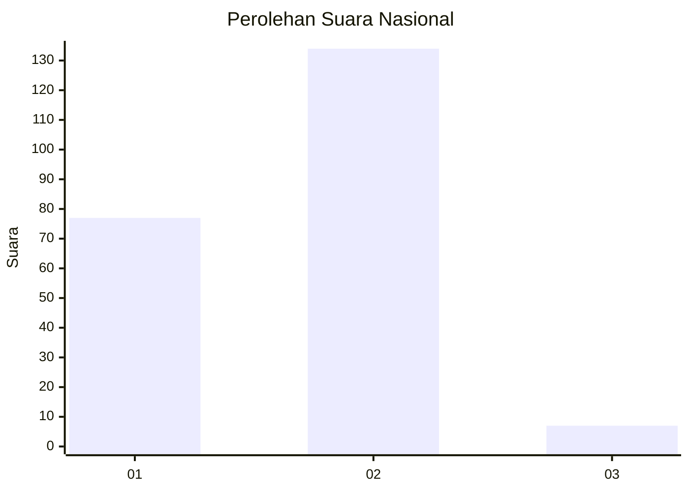
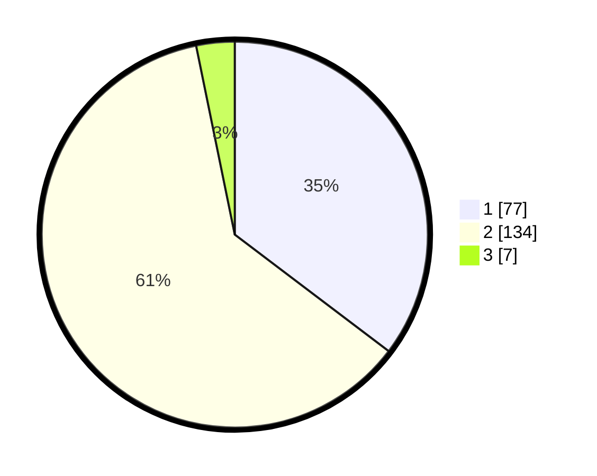

# Hasil

## Grafik

## Tabel

| No. | Nama Paslon    | Suara | Suara (raw) | Persentase |
|:--- |:-------------- | -----:| -----------:| ----------:|
| 1   | ANIES MUHAIMIN | 77    | [77][p-1]   | 35,32      |
| 2   | PRABOWO GIBRAN | 134   | [134][p-2]  | 61,47      |
| 3   | GANJAR MAHFUD  | 7     | [7][p-3]    | 3,21       |

[p-1]: https://github.com/gigit-pemilu/pemilu-2024/blob/main/pilpres/hitung-suara/sub/61-kalimantan-barat/sub/04-ketapang/sub/18-benua-kayong/sub/1004-tuan-tuan/sub/006-tps/sub/paslon-1.txt
[p-2]: https://github.com/gigit-pemilu/pemilu-2024/blob/main/pilpres/hitung-suara/sub/61-kalimantan-barat/sub/04-ketapang/sub/18-benua-kayong/sub/1004-tuan-tuan/sub/006-tps/sub/paslon-2.txt
[p-3]: https://github.com/gigit-pemilu/pemilu-2024/blob/main/pilpres/hitung-suara/sub/61-kalimantan-barat/sub/04-ketapang/sub/18-benua-kayong/sub/1004-tuan-tuan/sub/006-tps/sub/paslon-3.txt

## Foto C Plano

https://sirekap-obj-formc.kpu.go.id/1c97/pemilu/ppwp/61/04/18/10/04/6104181004006-20240224-103113--393a50ce-8db5-4d8f-b335-c46193829d24.jpg

https://sirekap-obj-formc.kpu.go.id/1c97/pemilu/ppwp/61/04/18/10/04/6104181004006-20240224-103248--f4fc8dd3-433d-4a5c-8e24-c33135bda83a.jpg

https://sirekap-obj-formc.kpu.go.id/1c97/pemilu/ppwp/61/04/18/10/04/6104181004006-20240224-103418--fca7a383-bb2e-42f9-851e-ecab23576175.jpg

## Metadata

| Key        | Value               |
| ---------- | ------------------- |
| Time Stamp | 2024-02-24 22:31:28 |

## DATA PEMILIH TETAP

Jumlah pemilih dalam DPT: **210**.
 * L: **565**.
 * P: **242**.

## DATA PENGGUNA HAK PILIH

Jumlah pengguna hak pilih dalam DPT: **10**.
 * L: **202**.
 * P: **20**.

Jumlah pengguna hak pilih dalam DPTb: **20**.
 * L: **0**.
 * P: **5**.

Jumlah pengguna hak pilih dalam DPK: **70**.
 * L: **0**.
 * P: **55**.

Jumlah pengguna hak pilih: **10**.
 * L: **0**.
 * P: **75**.

## JUMLAH SUARA SAH DAN TIDAK SAH

JUMLAH SELURUH SUARA SAH: **218**.

JUMLAH SUARA TIDAK SAH: **3**.

JUMLAH SELURUH SUARA SAH DAN SUARA TIDAK SAH: **221**.

