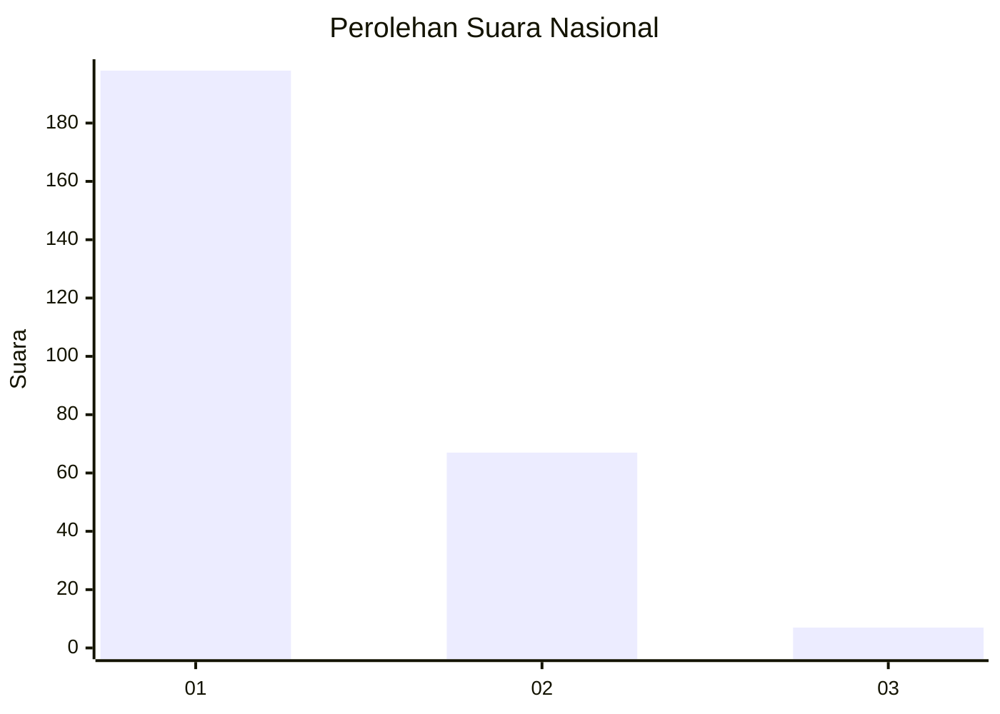
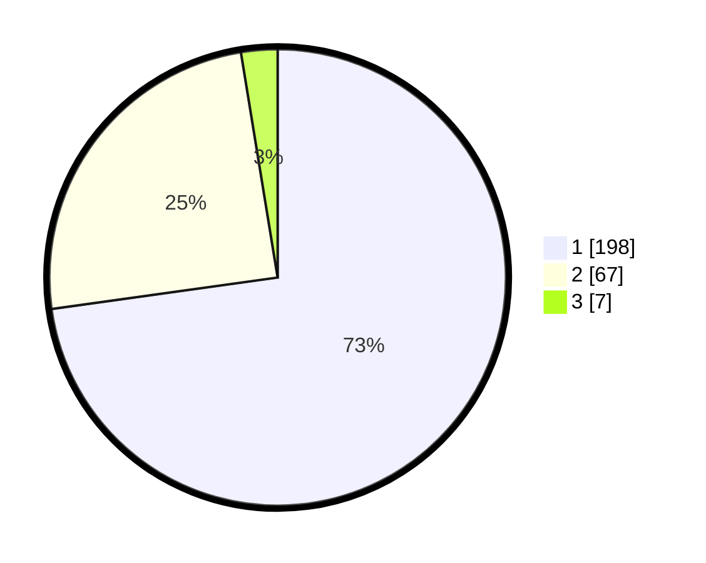

# Hasil

## Grafik

## Tabel

| No. | Nama Paslon    | Suara | Suara (raw) | Persentase |
|:--- |:-------------- | -----:| -----------:| ----------:|
| 1   | ANIES MUHAIMIN | 198   | [198][p-1]  | 72,79      |
| 2   | PRABOWO GIBRAN | 67    | [67][p-2]   | 24,63      |
| 3   | GANJAR MAHFUD  | 7     | [7][p-3]    | 2,57       |

[p-1]: https://github.com/gigit-pemilu/pemilu-2024/blob/main/pilpres/hitung-suara/sub/61-kalimantan-barat/sub/04-ketapang/sub/18-benua-kayong/sub/2010-mekar-sari/sub/003-tps/sub/paslon-1.txt
[p-2]: https://github.com/gigit-pemilu/pemilu-2024/blob/main/pilpres/hitung-suara/sub/61-kalimantan-barat/sub/04-ketapang/sub/18-benua-kayong/sub/2010-mekar-sari/sub/003-tps/sub/paslon-2.txt
[p-3]: https://github.com/gigit-pemilu/pemilu-2024/blob/main/pilpres/hitung-suara/sub/61-kalimantan-barat/sub/04-ketapang/sub/18-benua-kayong/sub/2010-mekar-sari/sub/003-tps/sub/paslon-3.txt

## Foto C Plano

https://sirekap-obj-formc.kpu.go.id/9623/pemilu/ppwp/61/04/18/20/10/6104182010003-20240215-025126--30c2f461-c9e4-4ee7-a5a4-c53d956e9365.jpg

https://sirekap-obj-formc.kpu.go.id/9623/pemilu/ppwp/61/04/18/20/10/6104182010003-20240215-020138--d95c8d2e-e4a7-42e9-98c5-09033c08d524.jpg

https://sirekap-obj-formc.kpu.go.id/9623/pemilu/ppwp/61/04/18/20/10/6104182010003-20240215-020321--d16da185-1f4f-4b60-913f-2fe2e3f7b1a2.jpg

## Metadata

| Key        | Value               |
| ---------- | ------------------- |
| Time Stamp | 2024-02-22 13:00:00 |

