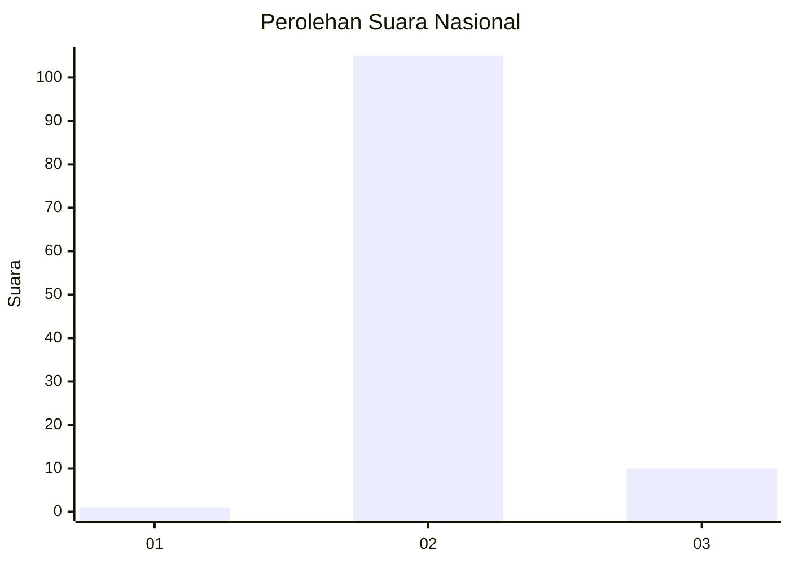
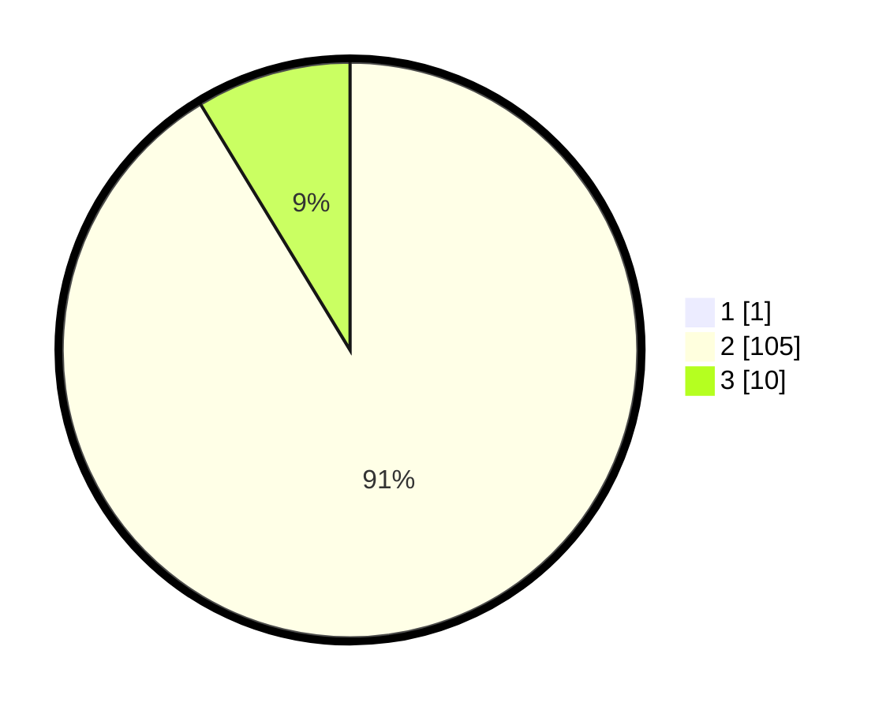

# Hasil

## Grafik

## Tabel

| No. | Nama Paslon    | Suara | Suara (raw) | Persentase |
|:--- |:-------------- | -----:| -----------:| ----------:|
| 1   | ANIES MUHAIMIN | 1     | [1][p-1]    | 0,86       |
| 2   | PRABOWO GIBRAN | 105   | [105][p-2]  | 90,52      |
| 3   | GANJAR MAHFUD  | 10    | [10][p-3]   | 8,62       |

[p-1]: https://github.com/gigit-pemilu/pemilu-2024/blob/main/pilpres/hitung-suara/sub/61-kalimantan-barat/sub/04-ketapang/sub/19-hulu-sungai/sub/2010-kenyabur/sub/001-tps/sub/paslon-1.txt
[p-2]: https://github.com/gigit-pemilu/pemilu-2024/blob/main/pilpres/hitung-suara/sub/61-kalimantan-barat/sub/04-ketapang/sub/19-hulu-sungai/sub/2010-kenyabur/sub/001-tps/sub/paslon-2.txt
[p-3]: https://github.com/gigit-pemilu/pemilu-2024/blob/main/pilpres/hitung-suara/sub/61-kalimantan-barat/sub/04-ketapang/sub/19-hulu-sungai/sub/2010-kenyabur/sub/001-tps/sub/paslon-3.txt

## Foto C Plano

https://sirekap-obj-formc.kpu.go.id/c944/pemilu/ppwp/61/04/19/20/10/6104192010001-20240217-120724--7029bd7f-43ef-4bef-af63-7edf22c3f035.jpg

https://sirekap-obj-formc.kpu.go.id/c944/pemilu/ppwp/61/04/19/20/10/6104192010001-20240217-120842--d9c5a843-4cb2-432d-98ad-a9523f42056d.jpg

https://sirekap-obj-formc.kpu.go.id/c944/pemilu/ppwp/61/04/19/20/10/6104192010001-20240217-121001--3a9df3bf-0320-4cd3-9d25-941829c8feb8.jpg

## Metadata

| Key        | Value               |
| ---------- | ------------------- |
| Time Stamp | 2024-02-24 23:00:00 |

