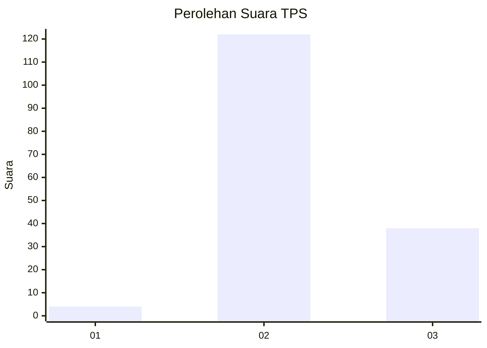
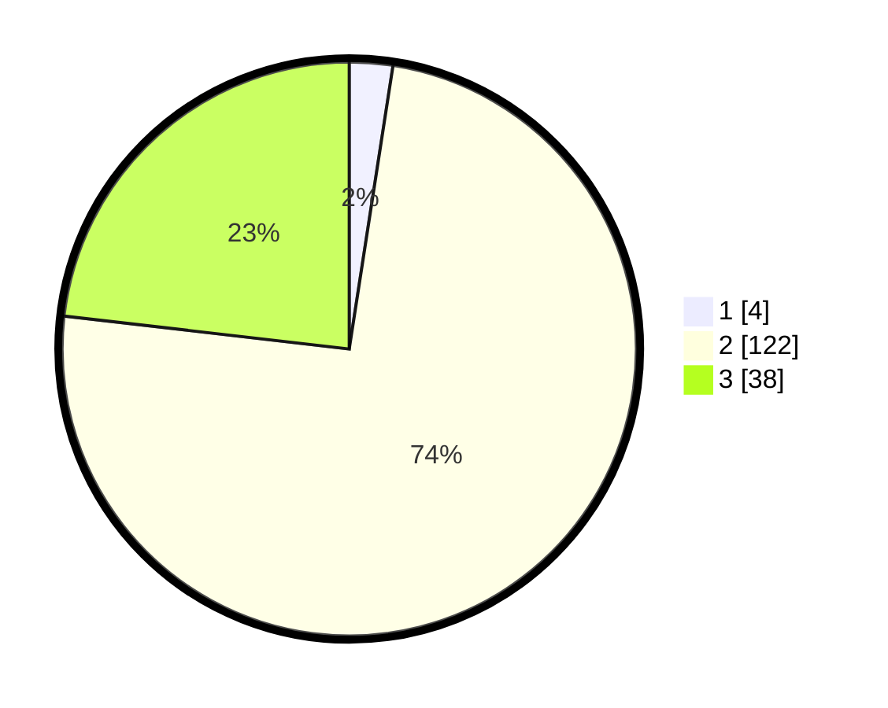

# Hasil

## Grafik

## Tabel

| No. | Nama Paslon    | Suara | Suara (raw) | Persentase |
|:--- |:-------------- | -----:| -----------:| ----------:|
| 1   | ANIES MUHAIMIN | 4     | [4][p-1]    | 2,44       |
| 2   | PRABOWO GIBRAN | 122   | [122][p-2]  | 74,39      |
| 3   | GANJAR MAHFUD  | 38    | [38][p-3]   | 23,17      |

[p-1]: https://github.com/gigit-pemilu/pemilu-2024-61-kalimantan-barat/blob/main/pilpres/hitung-suara/sub/61-kalimantan-barat/sub/04-ketapang/sub/21-air-upas/sub/2001-air-upas/sub/008-tps/sub/paslon-1.txt
[p-2]: https://github.com/gigit-pemilu/pemilu-2024-61-kalimantan-barat/blob/main/pilpres/hitung-suara/sub/61-kalimantan-barat/sub/04-ketapang/sub/21-air-upas/sub/2001-air-upas/sub/008-tps/sub/paslon-2.txt
[p-3]: https://github.com/gigit-pemilu/pemilu-2024-61-kalimantan-barat/blob/main/pilpres/hitung-suara/sub/61-kalimantan-barat/sub/04-ketapang/sub/21-air-upas/sub/2001-air-upas/sub/008-tps/sub/paslon-3.txt

## Foto C Plano

https://sirekap-obj-formc.kpu.go.id/25be/pemilu/ppwp/61/04/21/20/01/6104212001008-20240222-103655--7e9d6bfd-6730-4423-bf08-edc4c923ad73.jpg

https://sirekap-obj-formc.kpu.go.id/25be/pemilu/ppwp/61/04/21/20/01/6104212001008-20240222-103915--87d94397-79ac-48e2-9722-532c94179e2f.jpg

https://sirekap-obj-formc.kpu.go.id/25be/pemilu/ppwp/61/04/21/20/01/6104212001008-20240222-104110--db13e78b-fee5-4cb2-a998-377061d8e3b5.jpg

## Metadata

| Key        | Value               |
| ---------- | ------------------- |
| Time Stamp | 2024-02-24 22:31:28 |

