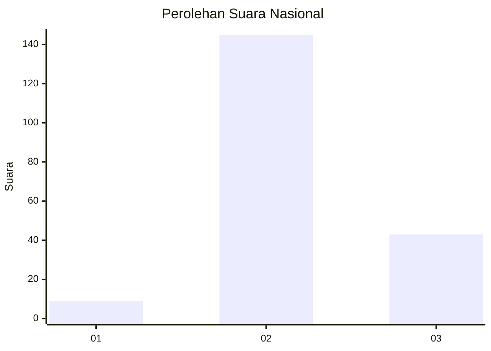

# Hasil

## Grafik

## Tabel

| No. | Nama Paslon    | Suara | Suara (raw) | Persentase |
|:--- |:-------------- | -----:| -----------:| ----------:|
| 1   | ANIES MUHAIMIN | 9     | [9][p-1]    | 4,57       |
| 2   | PRABOWO GIBRAN | 145   | [145][p-2]  | 73,60      |
| 3   | GANJAR MAHFUD  | 43    | [43][p-3]   | 21,83      |

[p-1]: https://github.com/gigit-pemilu/pemilu-2024/blob/main/pilpres/hitung-suara/sub/61-kalimantan-barat/sub/04-ketapang/sub/22-singkup/sub/2001-suka-mulia/sub/004-tps/sub/paslon-1.txt
[p-2]: https://github.com/gigit-pemilu/pemilu-2024/blob/main/pilpres/hitung-suara/sub/61-kalimantan-barat/sub/04-ketapang/sub/22-singkup/sub/2001-suka-mulia/sub/004-tps/sub/paslon-2.txt
[p-3]: https://github.com/gigit-pemilu/pemilu-2024/blob/main/pilpres/hitung-suara/sub/61-kalimantan-barat/sub/04-ketapang/sub/22-singkup/sub/2001-suka-mulia/sub/004-tps/sub/paslon-3.txt

## Foto C Plano

https://sirekap-obj-formc.kpu.go.id/d4b7/pemilu/ppwp/61/04/22/20/01/6104222001004-20240219-183304--e82d2172-6154-4481-9da3-aa0f56539fce.jpg

https://sirekap-obj-formc.kpu.go.id/d4b7/pemilu/ppwp/61/04/22/20/01/6104222001004-20240219-183609--4a7cb853-5750-431b-b434-089a3b77f32d.jpg

https://sirekap-obj-formc.kpu.go.id/d4b7/pemilu/ppwp/61/04/22/20/01/6104222001004-20240219-183733--3a2b915e-be98-4d8e-b93c-6f95e6d9b122.jpg

## Metadata

| Key        | Value               |
| ---------- | ------------------- |
| Time Stamp | 2024-02-22 13:00:00 |

