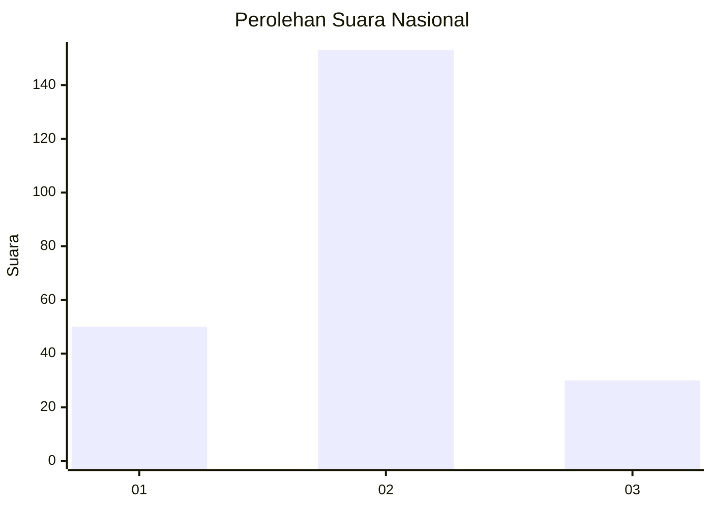
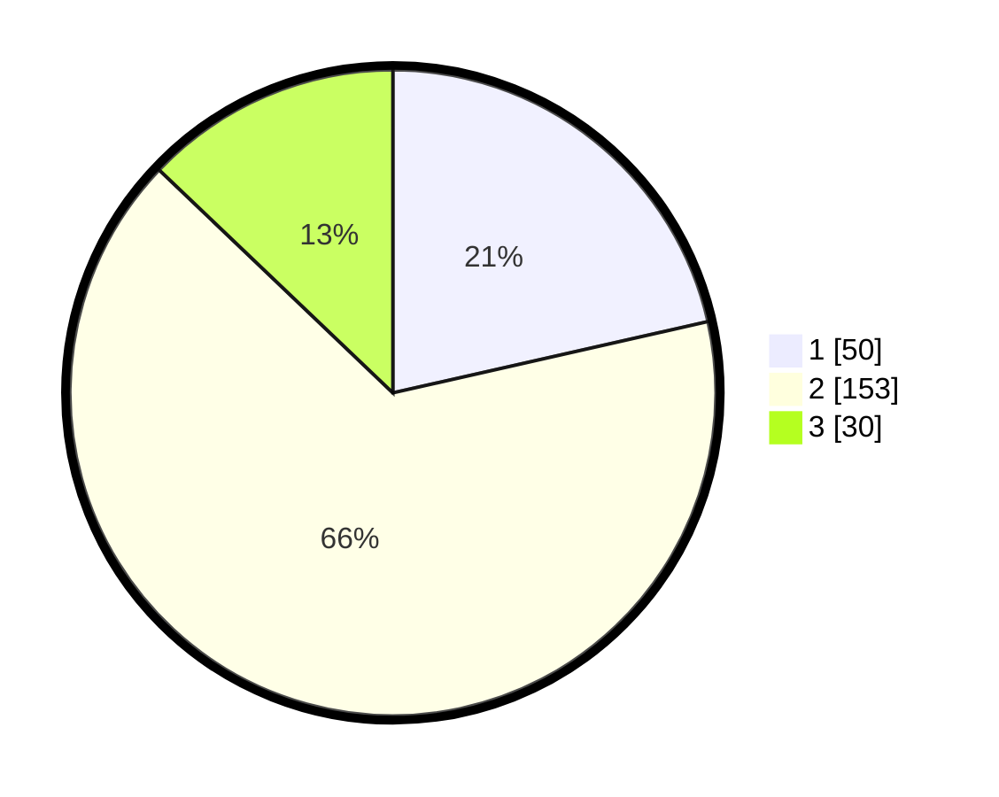

# Hasil

## Grafik

## Tabel

| No. | Nama Paslon    | Suara | Suara (raw) | Persentase |
|:--- |:-------------- | -----:| -----------:| ----------:|
| 1   | ANIES MUHAIMIN | 50    | [50][p-1]   | 21,46      |
| 2   | PRABOWO GIBRAN | 153   | [153][p-2]  | 65,67      |
| 3   | GANJAR MAHFUD  | 30    | [30][p-3]   | 12,88      |

[p-1]: https://github.com/gigit-pemilu/pemilu-2024/blob/main/pilpres/hitung-suara/sub/61-kalimantan-barat/sub/04-ketapang/sub/25-sungai-melayu-rayak/sub/2002-sungai-melayu-baru/sub/002-tps/sub/paslon-1.txt
[p-2]: https://github.com/gigit-pemilu/pemilu-2024/blob/main/pilpres/hitung-suara/sub/61-kalimantan-barat/sub/04-ketapang/sub/25-sungai-melayu-rayak/sub/2002-sungai-melayu-baru/sub/002-tps/sub/paslon-2.txt
[p-3]: https://github.com/gigit-pemilu/pemilu-2024/blob/main/pilpres/hitung-suara/sub/61-kalimantan-barat/sub/04-ketapang/sub/25-sungai-melayu-rayak/sub/2002-sungai-melayu-baru/sub/002-tps/sub/paslon-3.txt

## Foto C Plano

https://sirekap-obj-formc.kpu.go.id/bbc7/pemilu/ppwp/61/04/25/20/02/6104252002002-20240215-022515--eed3d572-9e26-49e3-a8e2-6b2d645d2e28.jpg

https://sirekap-obj-formc.kpu.go.id/bbc7/pemilu/ppwp/61/04/25/20/02/6104252002002-20240215-022643--15744284-9801-402f-948d-b0e35fe4c6dc.jpg

https://sirekap-obj-formc.kpu.go.id/bbc7/pemilu/ppwp/61/04/25/20/02/6104252002002-20240215-022804--88a90c78-e40b-4036-bee7-7c5764deac58.jpg

## Metadata

| Key        | Value               |
| ---------- | ------------------- |
| Time Stamp | 2024-02-22 13:00:00 |

