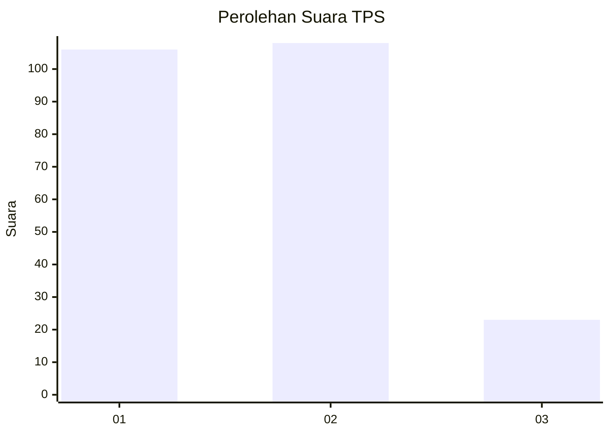
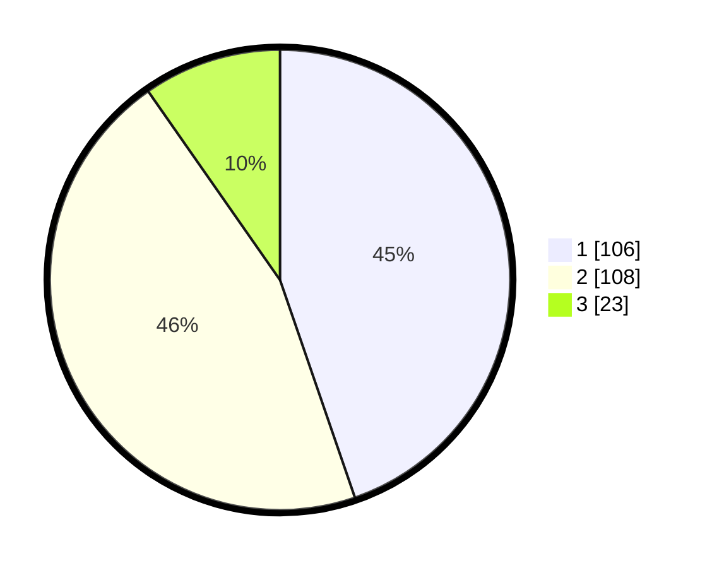

# Hasil

## Grafik

## Tabel

| No. | Nama Paslon    | Suara | Suara (raw) | Persentase |
|:--- |:-------------- | -----:| -----------:| ----------:|
| 1   | ANIES MUHAIMIN | 106   | [106][p-1]  | 44,73      |
| 2   | PRABOWO GIBRAN | 108   | [108][p-2]  | 45,57      |
| 3   | GANJAR MAHFUD  | 23    | [23][p-3]   | 9,70       |

[p-1]: https://github.com/gigit-pemilu/pemilu-2024-61-kalimantan-barat/blob/main/pilpres/hitung-suara/sub/61-kalimantan-barat/sub/05-sintang/sub/01-sintang/sub/1001-ladang/sub/004-tps/sub/paslon-1.txt
[p-2]: https://github.com/gigit-pemilu/pemilu-2024-61-kalimantan-barat/blob/main/pilpres/hitung-suara/sub/61-kalimantan-barat/sub/05-sintang/sub/01-sintang/sub/1001-ladang/sub/004-tps/sub/paslon-2.txt
[p-3]: https://github.com/gigit-pemilu/pemilu-2024-61-kalimantan-barat/blob/main/pilpres/hitung-suara/sub/61-kalimantan-barat/sub/05-sintang/sub/01-sintang/sub/1001-ladang/sub/004-tps/sub/paslon-3.txt

## Foto C Plano

https://sirekap-obj-formc.kpu.go.id/cd2b/pemilu/ppwp/61/05/01/10/01/6105011001004-20240222-134218--a0d197bc-9c22-498a-a7de-0ff9d4810fbd.jpg

https://sirekap-obj-formc.kpu.go.id/cd2b/pemilu/ppwp/61/05/01/10/01/6105011001004-20240222-134437--a41de4c6-3f91-4b33-bd84-d7c73799e16b.jpg

https://sirekap-obj-formc.kpu.go.id/cd2b/pemilu/ppwp/61/05/01/10/01/6105011001004-20240216-230129--2dacd447-3f4a-4f4f-b90d-9c9e18176994.jpg

## Metadata

| Key        | Value               |
| ---------- | ------------------- |
| Time Stamp | 2024-02-24 22:31:28 |

