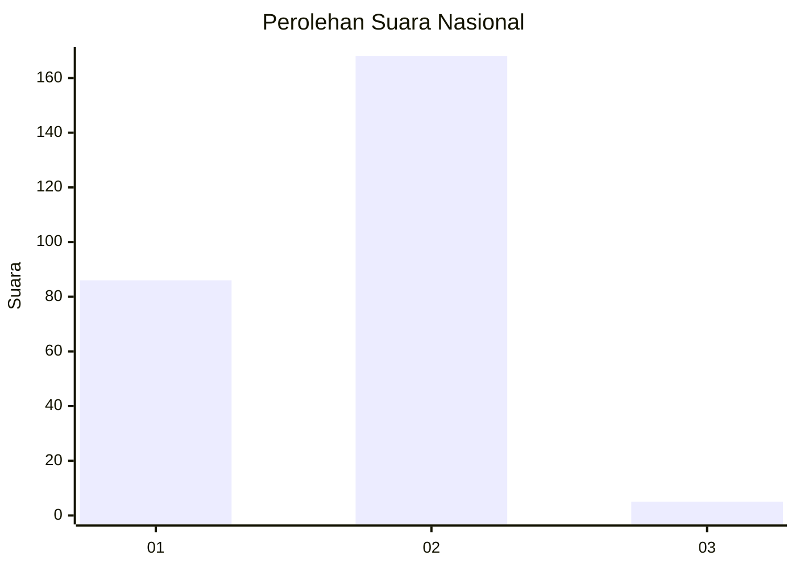
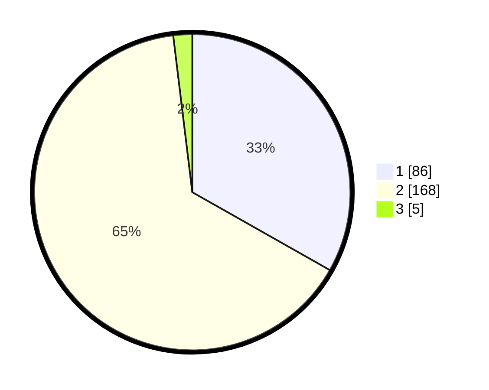

# Hasil

## Grafik

## Tabel

| No. | Nama Paslon    | Suara | Suara (raw) | Persentase |
|:--- |:-------------- | -----:| -----------:| ----------:|
| 1   | ANIES MUHAIMIN | 86    | [86][p-1]   | 33,20      |
| 2   | PRABOWO GIBRAN | 168   | [168][p-2]  | 64,86      |
| 3   | GANJAR MAHFUD  | 5     | [5][p-3]    | 1,93       |

[p-1]: https://github.com/gigit-pemilu/pemilu-2024/blob/main/pilpres/hitung-suara/sub/61-kalimantan-barat/sub/05-sintang/sub/01-sintang/sub/1001-ladang/sub/008-tps/sub/paslon-1.txt
[p-2]: https://github.com/gigit-pemilu/pemilu-2024/blob/main/pilpres/hitung-suara/sub/61-kalimantan-barat/sub/05-sintang/sub/01-sintang/sub/1001-ladang/sub/008-tps/sub/paslon-2.txt
[p-3]: https://github.com/gigit-pemilu/pemilu-2024/blob/main/pilpres/hitung-suara/sub/61-kalimantan-barat/sub/05-sintang/sub/01-sintang/sub/1001-ladang/sub/008-tps/sub/paslon-3.txt

## Foto C Plano

https://sirekap-obj-formc.kpu.go.id/961b/pemilu/ppwp/61/05/01/10/01/6105011001008-20240215-094002--09f4cc1d-9a1c-4798-93eb-11f858ed06f8.jpg

https://sirekap-obj-formc.kpu.go.id/961b/pemilu/ppwp/61/05/01/10/01/6105011001008-20240215-094051--8bb8311b-ffb9-49e5-8b25-c193cd94b055.jpg

https://sirekap-obj-formc.kpu.go.id/961b/pemilu/ppwp/61/05/01/10/01/6105011001008-20240215-094112--55a598c5-e35d-4185-bd05-7f85bccc8763.jpg

## Metadata

| Key        | Value               |
| ---------- | ------------------- |
| Time Stamp | 2024-02-15 18:00:26 |

