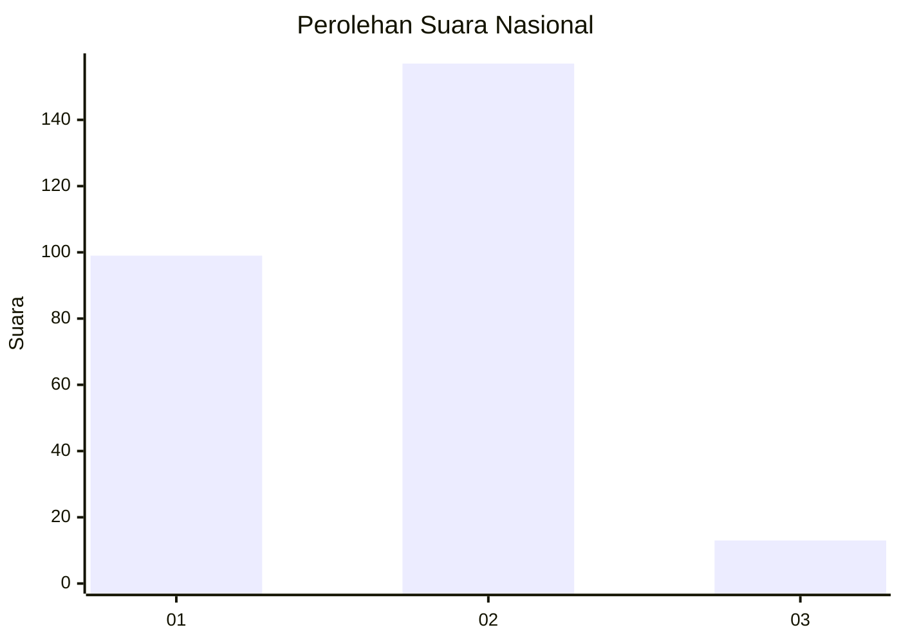
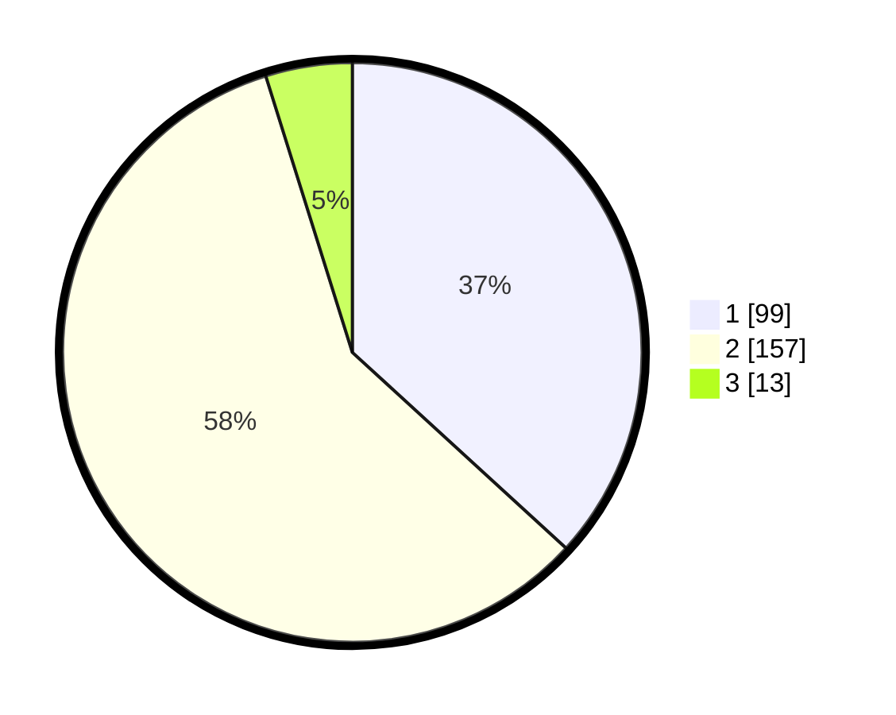

# Hasil

## Grafik

## Tabel

| No. | Nama Paslon    | Suara | Suara (raw) | Persentase |
|:--- |:-------------- | -----:| -----------:| ----------:|
| 1   | ANIES MUHAIMIN | 99    | [99][p-1]   | 36,80      |
| 2   | PRABOWO GIBRAN | 157   | [157][p-2]  | 58,36      |
| 3   | GANJAR MAHFUD  | 13    | [13][p-3]   | 4,83       |

[p-1]: https://github.com/gigit-pemilu/pemilu-2024/blob/main/pilpres/hitung-suara/sub/61-kalimantan-barat/sub/05-sintang/sub/01-sintang/sub/1022-mekar-jaya/sub/003-tps/sub/paslon-1.txt
[p-2]: https://github.com/gigit-pemilu/pemilu-2024/blob/main/pilpres/hitung-suara/sub/61-kalimantan-barat/sub/05-sintang/sub/01-sintang/sub/1022-mekar-jaya/sub/003-tps/sub/paslon-2.txt
[p-3]: https://github.com/gigit-pemilu/pemilu-2024/blob/main/pilpres/hitung-suara/sub/61-kalimantan-barat/sub/05-sintang/sub/01-sintang/sub/1022-mekar-jaya/sub/003-tps/sub/paslon-3.txt

## Foto C Plano

https://sirekap-obj-formc.kpu.go.id/4504/pemilu/ppwp/61/05/01/10/22/6105011022003-20240221-232014--bbc6861c-5c80-412b-8381-70423c9d02f4.jpg

https://sirekap-obj-formc.kpu.go.id/4504/pemilu/ppwp/61/05/01/10/22/6105011022003-20240221-232046--5f87a367-991e-4f96-a096-7aa74b2e75f7.jpg

https://sirekap-obj-formc.kpu.go.id/4504/pemilu/ppwp/61/05/01/10/22/6105011022003-20240221-232121--0b4d3cb0-4556-4947-baf1-d51f261046ea.jpg

## Metadata

| Key        | Value               |
| ---------- | ------------------- |
| Time Stamp | 2024-02-22 18:00:00 |

