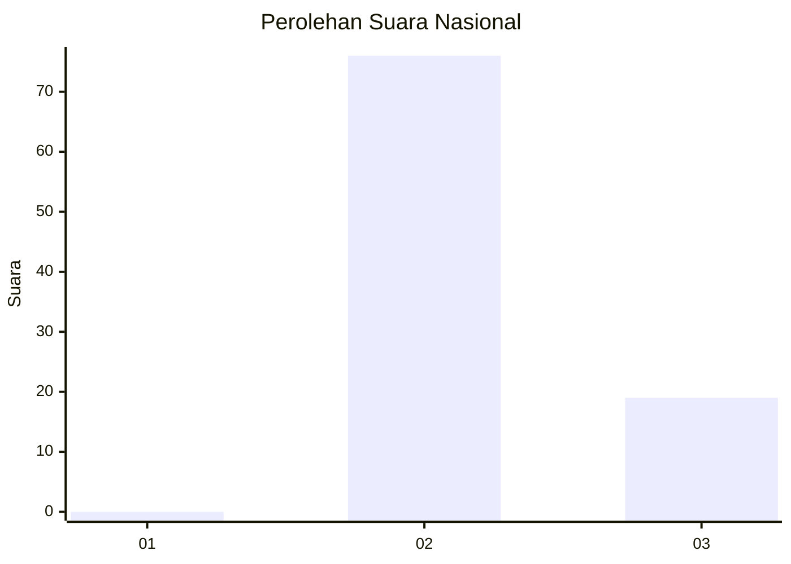
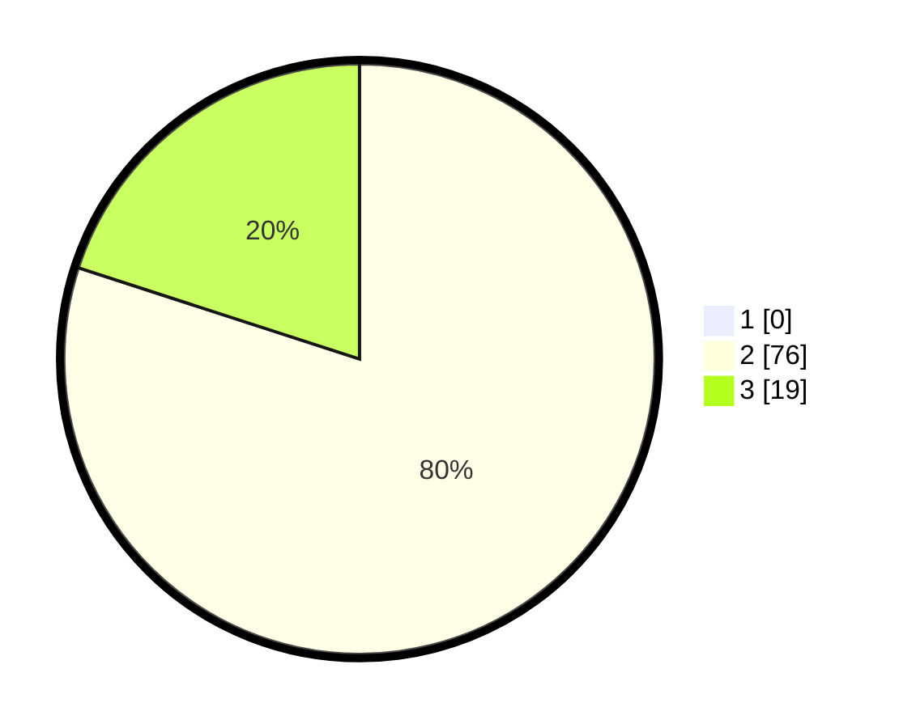

# Hasil

## Grafik

## Tabel

| No. | Nama Paslon    | Suara | Suara (raw) | Persentase |
|:--- |:-------------- | -----:| -----------:| ----------:|
| 1   | ANIES MUHAIMIN | 0     | [0][p-1]    | 0,00       |
| 2   | PRABOWO GIBRAN | 76    | [76][p-2]   | 80,00      |
| 3   | GANJAR MAHFUD  | 19    | [19][p-3]   | 20,00      |

[p-1]: https://github.com/gigit-pemilu/pemilu-2024/blob/main/pilpres/hitung-suara/sub/61-kalimantan-barat/sub/05-sintang/sub/01-sintang/sub/2029-kebiau-baru/sub/003-tps/sub/paslon-1.txt
[p-2]: https://github.com/gigit-pemilu/pemilu-2024/blob/main/pilpres/hitung-suara/sub/61-kalimantan-barat/sub/05-sintang/sub/01-sintang/sub/2029-kebiau-baru/sub/003-tps/sub/paslon-2.txt
[p-3]: https://github.com/gigit-pemilu/pemilu-2024/blob/main/pilpres/hitung-suara/sub/61-kalimantan-barat/sub/05-sintang/sub/01-sintang/sub/2029-kebiau-baru/sub/003-tps/sub/paslon-3.txt

## Foto C Plano

https://sirekap-obj-formc.kpu.go.id/02a2/pemilu/ppwp/61/05/01/20/29/6105012029003-20240224-163912--0b5bc9bb-d233-4e1f-a61a-00723c3db990.jpg

https://sirekap-obj-formc.kpu.go.id/02a2/pemilu/ppwp/61/05/01/20/29/6105012029003-20240224-163336--99887765-7770-4ed0-b116-4fbf1a01212e.jpg

https://sirekap-obj-formc.kpu.go.id/02a2/pemilu/ppwp/61/05/01/20/29/6105012029003-20240224-164038--bf789aed-2305-4359-b871-6caccec3aca6.jpg

## Metadata

| Key        | Value               |
| ---------- | ------------------- |
| Time Stamp | 2024-02-29 15:00:00 |

