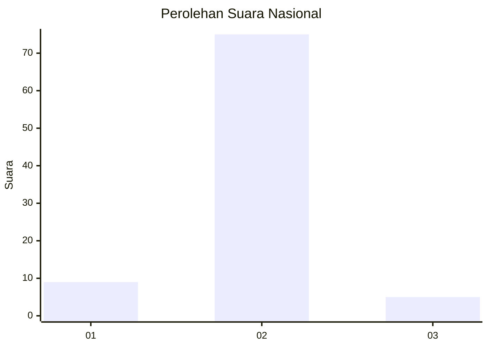
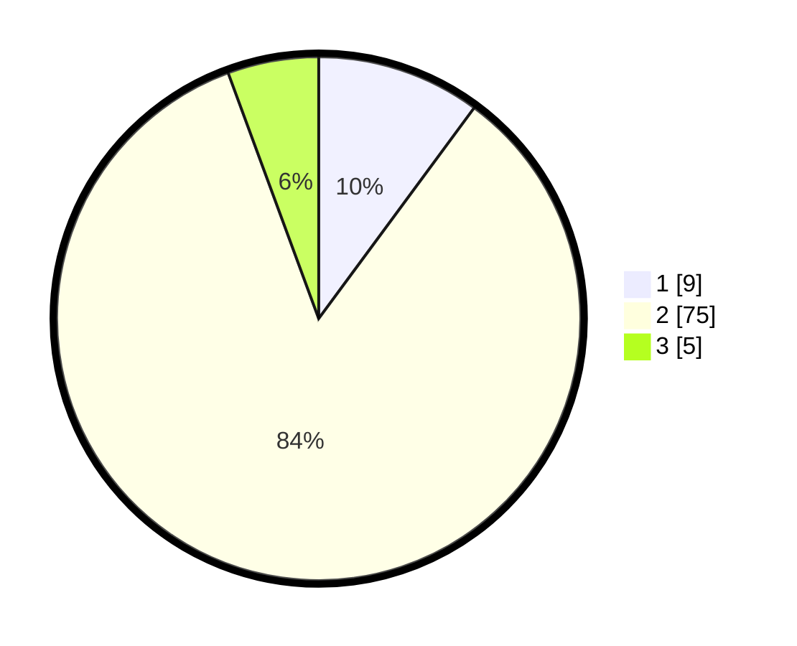

# Hasil

## Grafik

## Tabel

| No. | Nama Paslon    | Suara | Suara (raw) | Persentase |
|:--- |:-------------- | -----:| -----------:| ----------:|
| 1   | ANIES MUHAIMIN | 9     | [9][p-1]    | 10,11      |
| 2   | PRABOWO GIBRAN | 75    | [75][p-2]   | 84,27      |
| 3   | GANJAR MAHFUD  | 5     | [5][p-3]    | 5,62       |

[p-1]: https://github.com/gigit-pemilu/pemilu-2024/blob/main/pilpres/hitung-suara/sub/61-kalimantan-barat/sub/05-sintang/sub/03-sepauk/sub/2001-nanga-sepauk/sub/004-tps/sub/paslon-1.txt
[p-2]: https://github.com/gigit-pemilu/pemilu-2024/blob/main/pilpres/hitung-suara/sub/61-kalimantan-barat/sub/05-sintang/sub/03-sepauk/sub/2001-nanga-sepauk/sub/004-tps/sub/paslon-2.txt
[p-3]: https://github.com/gigit-pemilu/pemilu-2024/blob/main/pilpres/hitung-suara/sub/61-kalimantan-barat/sub/05-sintang/sub/03-sepauk/sub/2001-nanga-sepauk/sub/004-tps/sub/paslon-3.txt

## Foto C Plano

https://sirekap-obj-formc.kpu.go.id/6e13/pemilu/ppwp/61/05/03/20/01/6105032001004-20240216-145747--3b995e59-9bd1-4b27-ac7f-3fff6d079465.jpg

https://sirekap-obj-formc.kpu.go.id/6e13/pemilu/ppwp/61/05/03/20/01/6105032001004-20240215-140454--6310fe97-6870-446d-a3dc-8981f3583e8c.jpg

https://sirekap-obj-formc.kpu.go.id/6e13/pemilu/ppwp/61/05/03/20/01/6105032001004-20240216-145747--0637459e-16b8-4da3-b80a-dcbaf517557f.jpg

## Metadata

| Key        | Value               |
| ---------- | ------------------- |
| Time Stamp | 2024-02-16 16:25:10 |

## DATA PEMILIH TETAP

Jumlah pemilih dalam DPT: **99**.
 * L: **54**.
 * P: **45**.

## DATA PENGGUNA HAK PILIH

Jumlah pengguna hak pilih dalam DPT: **92**.
 * L: **48**.
 * P: **44**.

Jumlah pengguna hak pilih dalam DPTb: **0**.
 * L: **0**.
 * P: **0**.

Jumlah pengguna hak pilih dalam DPK: **0**.
 * L: **0**.
 * P: **0**.

Jumlah pengguna hak pilih: **92**.
 * L: **48**.
 * P: **44**.

## JUMLAH SUARA SAH DAN TIDAK SAH

JUMLAH SELURUH SUARA SAH: **89**.

JUMLAH SUARA TIDAK SAH: **3**.

JUMLAH SELURUH SUARA SAH DAN SUARA TIDAK SAH: **92**.

