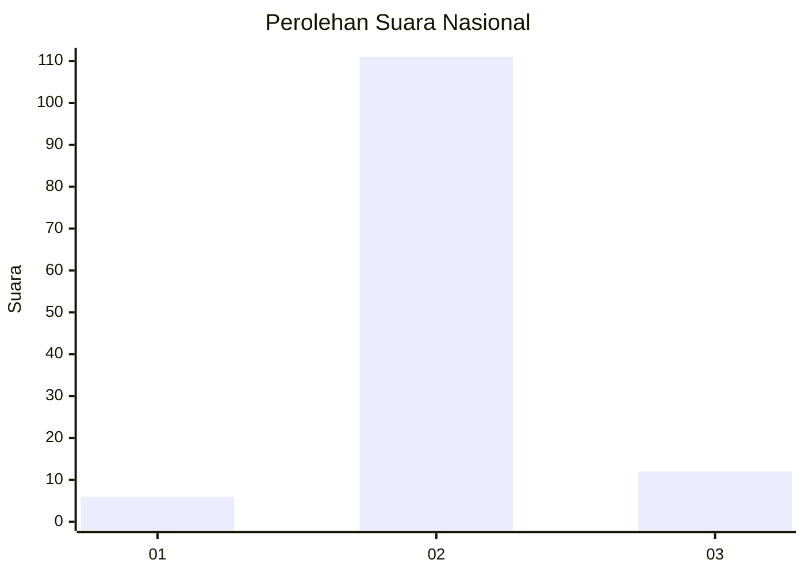
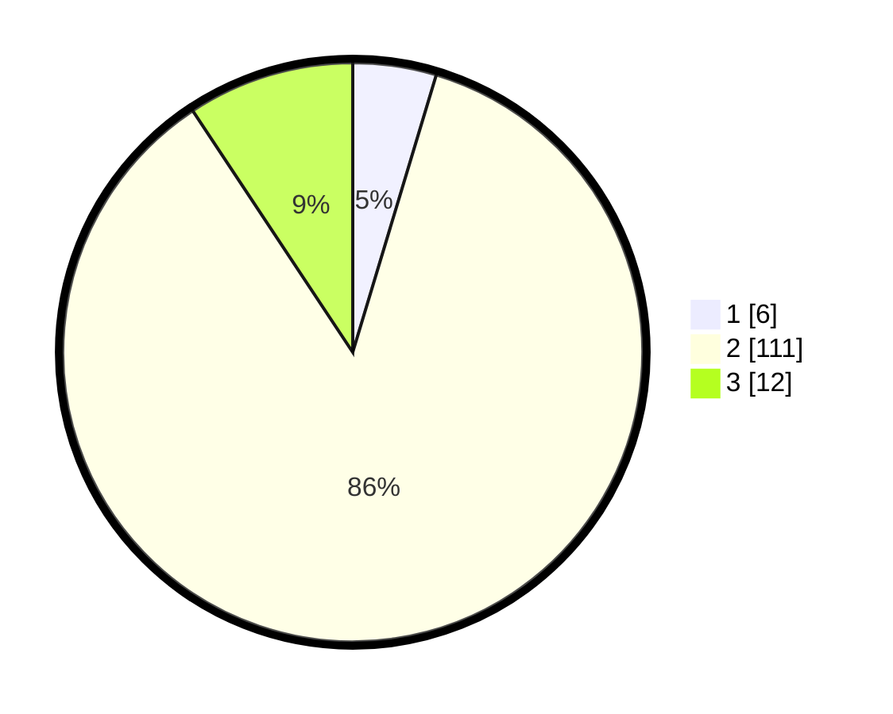

# Hasil

## Grafik

## Tabel

| No. | Nama Paslon    | Suara | Suara (raw) | Persentase |
|:--- |:-------------- | -----:| -----------:| ----------:|
| 1   | ANIES MUHAIMIN | 6     | [6][p-1]    | 4,65       |
| 2   | PRABOWO GIBRAN | 111   | [111][p-2]  | 86,05      |
| 3   | GANJAR MAHFUD  | 12    | [12][p-3]   | 9,30       |

[p-1]: https://github.com/gigit-pemilu/pemilu-2024/blob/main/pilpres/hitung-suara/sub/61-kalimantan-barat/sub/05-sintang/sub/05-ketungau-tengah/sub/2012-margahayu/sub/004-tps/sub/paslon-1.txt
[p-2]: https://github.com/gigit-pemilu/pemilu-2024/blob/main/pilpres/hitung-suara/sub/61-kalimantan-barat/sub/05-sintang/sub/05-ketungau-tengah/sub/2012-margahayu/sub/004-tps/sub/paslon-2.txt
[p-3]: https://github.com/gigit-pemilu/pemilu-2024/blob/main/pilpres/hitung-suara/sub/61-kalimantan-barat/sub/05-sintang/sub/05-ketungau-tengah/sub/2012-margahayu/sub/004-tps/sub/paslon-3.txt

## Foto C Plano

https://sirekap-obj-formc.kpu.go.id/9563/pemilu/ppwp/61/05/05/20/12/6105052012004-20240215-114236--6abbef65-c813-4cd5-b840-c3e6bb6c1ff1.jpg

https://sirekap-obj-formc.kpu.go.id/9563/pemilu/ppwp/61/05/05/20/12/6105052012004-20240215-114700--277d6b3a-17e6-49b4-a319-f27fe66e57aa.jpg

https://sirekap-obj-formc.kpu.go.id/9563/pemilu/ppwp/61/05/05/20/12/6105052012004-20240215-115056--00e3bb50-a0e3-4fe1-a46c-38ca2d66a0ad.jpg

## Metadata

| Key        | Value               |
| ---------- | ------------------- |
| Time Stamp | 2024-02-15 17:30:25 |

