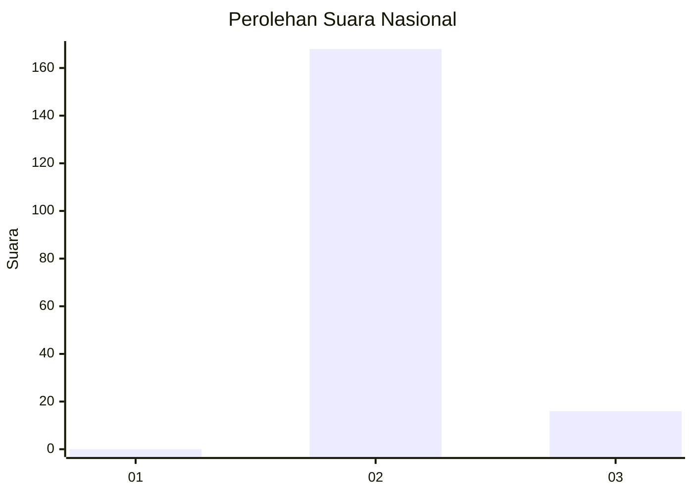
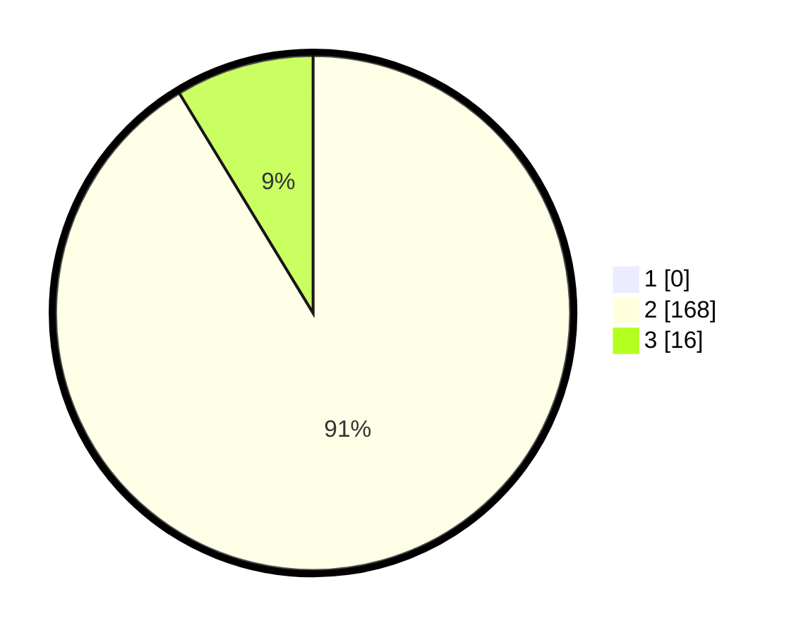

# Hasil

## Grafik

## Tabel

| No. | Nama Paslon    | Suara | Suara (raw) | Persentase |
|:--- |:-------------- | -----:| -----------:| ----------:|
| 1   | ANIES MUHAIMIN | 0     | [0][p-1]    | 0,00       |
| 2   | PRABOWO GIBRAN | 168   | [168][p-2]  | 91,30      |
| 3   | GANJAR MAHFUD  | 16    | [16][p-3]   | 8,70       |

[p-1]: https://github.com/gigit-pemilu/pemilu-2024/blob/main/pilpres/hitung-suara/sub/61-kalimantan-barat/sub/05-sintang/sub/05-ketungau-tengah/sub/2018-mungguk-gelombang/sub/001-tps/sub/paslon-1.txt
[p-2]: https://github.com/gigit-pemilu/pemilu-2024/blob/main/pilpres/hitung-suara/sub/61-kalimantan-barat/sub/05-sintang/sub/05-ketungau-tengah/sub/2018-mungguk-gelombang/sub/001-tps/sub/paslon-2.txt
[p-3]: https://github.com/gigit-pemilu/pemilu-2024/blob/main/pilpres/hitung-suara/sub/61-kalimantan-barat/sub/05-sintang/sub/05-ketungau-tengah/sub/2018-mungguk-gelombang/sub/001-tps/sub/paslon-3.txt

## Foto C Plano

https://sirekap-obj-formc.kpu.go.id/8a02/pemilu/ppwp/61/05/05/20/18/6105052018001-20240220-112450--a1c20a6c-e193-45bb-bba0-2c8ae8a2001e.jpg

https://sirekap-obj-formc.kpu.go.id/8a02/pemilu/ppwp/61/05/05/20/18/6105052018001-20240220-112744--8421c0ee-7ebb-45b8-a5f6-f4757093dec2.jpg

https://sirekap-obj-formc.kpu.go.id/8a02/pemilu/ppwp/61/05/05/20/18/6105052018001-20240220-112812--b6a123b1-9ac1-4338-9bc4-121cada4aa52.jpg

## Metadata

| Key        | Value               |
| ---------- | ------------------- |
| Time Stamp | 2024-02-22 18:00:00 |

