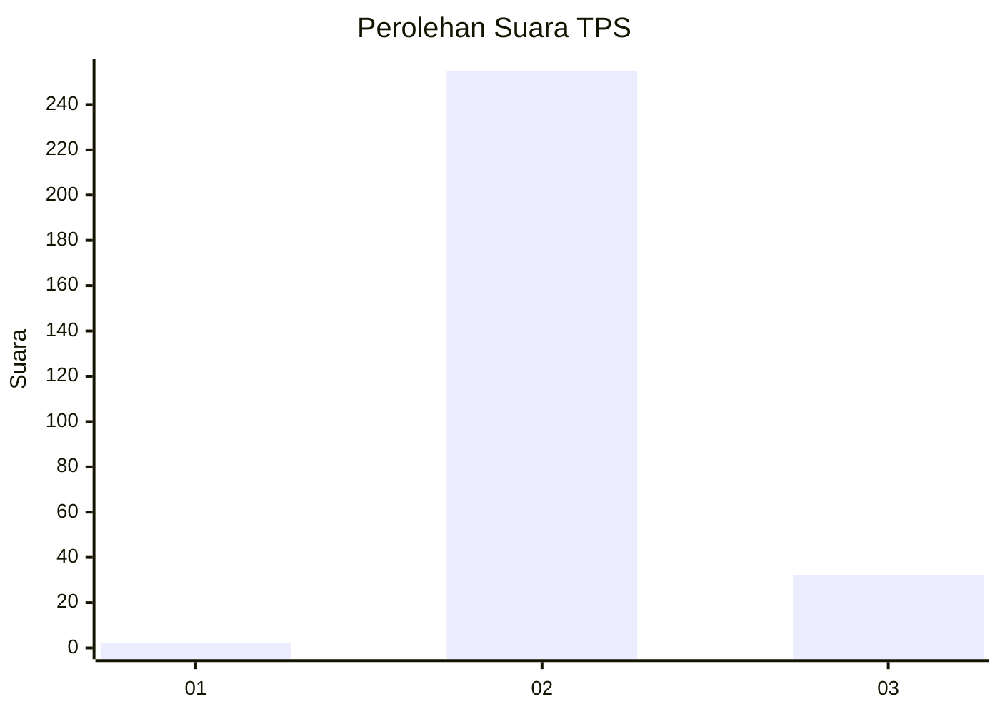
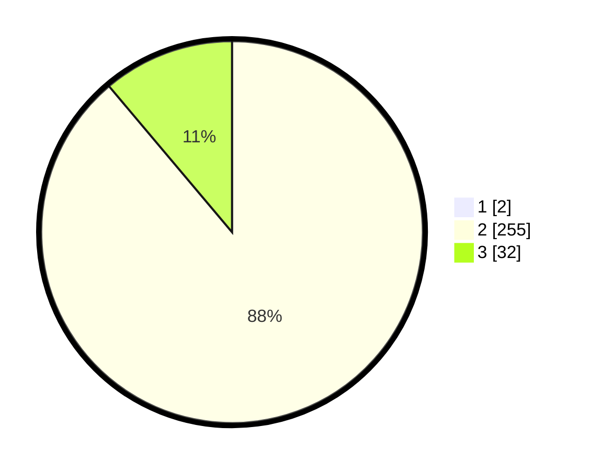

# Hasil

## Grafik

## Tabel

| No. | Nama Paslon    | Suara | Suara (raw) | Persentase |
|:--- |:-------------- | -----:| -----------:| ----------:|
| 1   | ANIES MUHAIMIN | 2     | [2][p-1]    | 0,69       |
| 2   | PRABOWO GIBRAN | 255   | [255][p-2]  | 88,24      |
| 3   | GANJAR MAHFUD  | 32    | [32][p-3]   | 11,07      |

[p-1]: https://github.com/gigit-pemilu/pemilu-2024-61-kalimantan-barat/blob/main/pilpres/hitung-suara/sub/61-kalimantan-barat/sub/05-sintang/sub/05-ketungau-tengah/sub/2018-mungguk-gelombang/sub/002-tps/sub/paslon-1.txt
[p-2]: https://github.com/gigit-pemilu/pemilu-2024-61-kalimantan-barat/blob/main/pilpres/hitung-suara/sub/61-kalimantan-barat/sub/05-sintang/sub/05-ketungau-tengah/sub/2018-mungguk-gelombang/sub/002-tps/sub/paslon-2.txt
[p-3]: https://github.com/gigit-pemilu/pemilu-2024-61-kalimantan-barat/blob/main/pilpres/hitung-suara/sub/61-kalimantan-barat/sub/05-sintang/sub/05-ketungau-tengah/sub/2018-mungguk-gelombang/sub/002-tps/sub/paslon-3.txt

## Foto C Plano

https://sirekap-obj-formc.kpu.go.id/17a9/pemilu/ppwp/61/05/05/20/18/6105052018002-20240220-113123--76d6000b-c7f4-4ce6-b917-277e9b2b5ca4.jpg

https://sirekap-obj-formc.kpu.go.id/17a9/pemilu/ppwp/61/05/05/20/18/6105052018002-20240220-113227--613dabc7-24dc-40d3-8e97-5116c3f849f3.jpg

https://sirekap-obj-formc.kpu.go.id/17a9/pemilu/ppwp/61/05/05/20/18/6105052018002-20240220-113305--04d4d1c0-15f9-4ed2-9614-11ad24197cd3.jpg

## Metadata

| Key        | Value               |
| ---------- | ------------------- |
| Time Stamp | 2024-02-22 18:00:00 |

