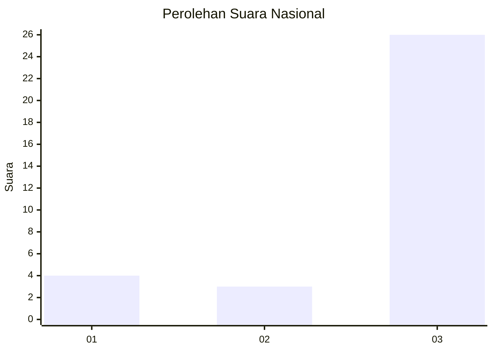
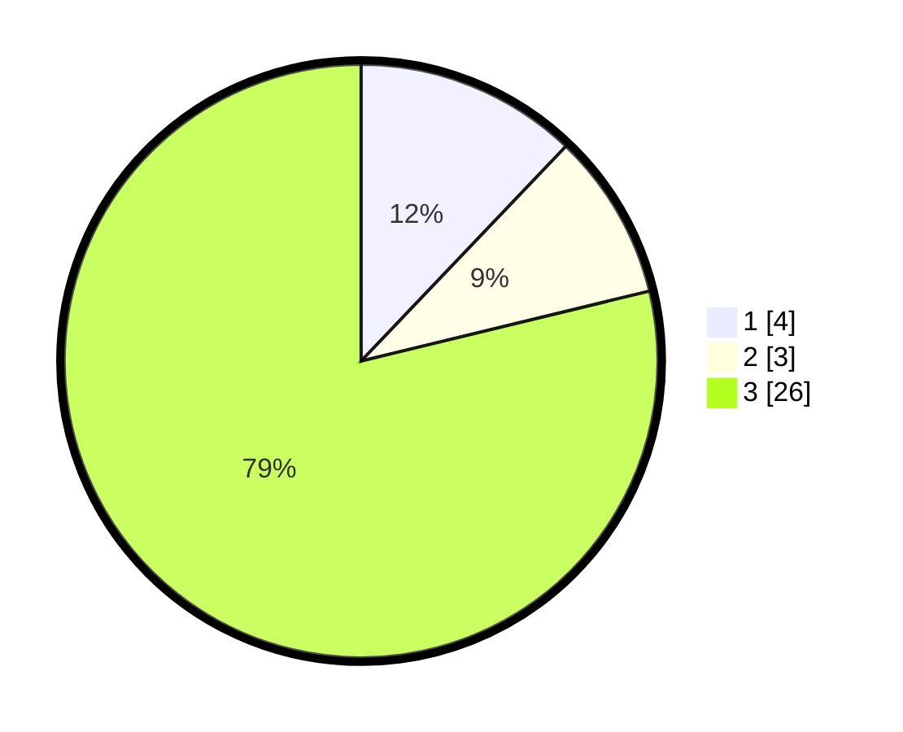

# Hasil

## Grafik

## Tabel

| No. | Nama Paslon    | Suara | Suara (raw) | Persentase |
|:--- |:-------------- | -----:| -----------:| ----------:|
| 1   | ANIES MUHAIMIN | 4     | [4][p-1]    | 12,12      |
| 2   | PRABOWO GIBRAN | 3     | [3][p-2]    | 9,09       |
| 3   | GANJAR MAHFUD  | 26    | [26][p-3]   | 78,79      |

[p-1]: https://github.com/gigit-pemilu/pemilu-2024/blob/main/pilpres/hitung-suara/sub/61-kalimantan-barat/sub/05-sintang/sub/05-ketungau-tengah/sub/2025-padung-kumang/sub/001-tps/sub/paslon-1.txt
[p-2]: https://github.com/gigit-pemilu/pemilu-2024/blob/main/pilpres/hitung-suara/sub/61-kalimantan-barat/sub/05-sintang/sub/05-ketungau-tengah/sub/2025-padung-kumang/sub/001-tps/sub/paslon-2.txt
[p-3]: https://github.com/gigit-pemilu/pemilu-2024/blob/main/pilpres/hitung-suara/sub/61-kalimantan-barat/sub/05-sintang/sub/05-ketungau-tengah/sub/2025-padung-kumang/sub/001-tps/sub/paslon-3.txt

## Foto C Plano

https://sirekap-obj-formc.kpu.go.id/5294/pemilu/ppwp/61/05/05/20/25/6105052025001-20240220-153119--3b0e0f3c-6a03-4dca-ba51-57a8b2171079.jpg

https://sirekap-obj-formc.kpu.go.id/5294/pemilu/ppwp/61/05/05/20/25/6105052025001-20240220-153208--fbdb16e7-9e94-43b7-b8dc-f26493796ab0.jpg

https://sirekap-obj-formc.kpu.go.id/5294/pemilu/ppwp/61/05/05/20/25/6105052025001-20240220-153402--3f49b71a-267c-42a0-ad45-0c49f0c4dfd6.jpg

## Metadata

| Key        | Value               |
| ---------- | ------------------- |
| Time Stamp | 2024-02-22 18:00:00 |

