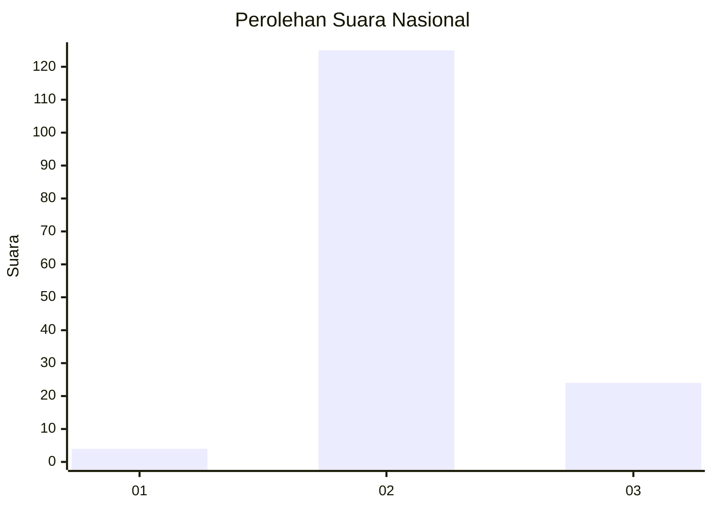
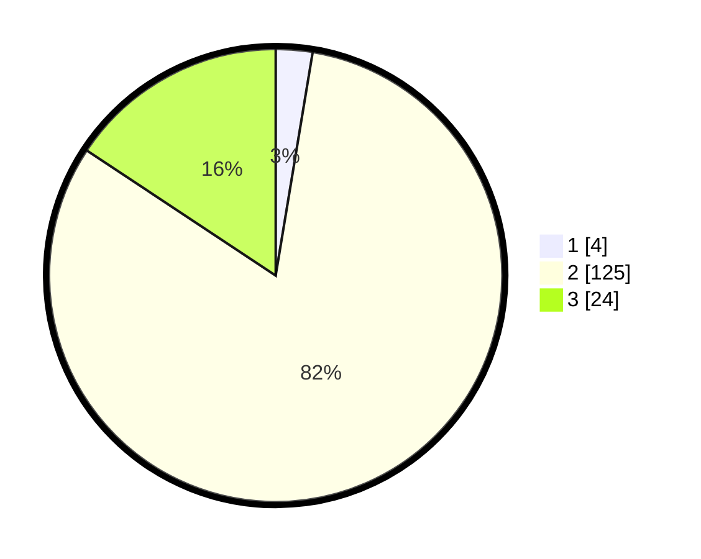

# Hasil

## Grafik

## Tabel

| No. | Nama Paslon    | Suara | Suara (raw) | Persentase |
|:--- |:-------------- | -----:| -----------:| ----------:|
| 1   | ANIES MUHAIMIN | 4     | [4][p-1]    | 2,61       |
| 2   | PRABOWO GIBRAN | 125   | [125][p-2]  | 81,70      |
| 3   | GANJAR MAHFUD  | 24    | [24][p-3]   | 15,69      |

[p-1]: https://github.com/gigit-pemilu/pemilu-2024/blob/main/pilpres/hitung-suara/sub/61-kalimantan-barat/sub/05-sintang/sub/05-ketungau-tengah/sub/2025-padung-kumang/sub/002-tps/sub/paslon-1.txt
[p-2]: https://github.com/gigit-pemilu/pemilu-2024/blob/main/pilpres/hitung-suara/sub/61-kalimantan-barat/sub/05-sintang/sub/05-ketungau-tengah/sub/2025-padung-kumang/sub/002-tps/sub/paslon-2.txt
[p-3]: https://github.com/gigit-pemilu/pemilu-2024/blob/main/pilpres/hitung-suara/sub/61-kalimantan-barat/sub/05-sintang/sub/05-ketungau-tengah/sub/2025-padung-kumang/sub/002-tps/sub/paslon-3.txt

## Foto C Plano

https://sirekap-obj-formc.kpu.go.id/5b70/pemilu/ppwp/61/05/05/20/25/6105052025002-20240220-192926--b862adf7-d614-4ba2-bf03-7dda5a94ffb5.jpg

https://sirekap-obj-formc.kpu.go.id/5b70/pemilu/ppwp/61/05/05/20/25/6105052025002-20240220-192831--0637a7f6-a7ec-40ad-a38e-09cf653e9026.jpg

https://sirekap-obj-formc.kpu.go.id/5b70/pemilu/ppwp/61/05/05/20/25/6105052025002-20240220-193019--8abe1fc5-ab16-4efd-95c6-d4ea9988d9fd.jpg

## Metadata

| Key        | Value               |
| ---------- | ------------------- |
| Time Stamp | 2024-02-22 18:00:00 |

