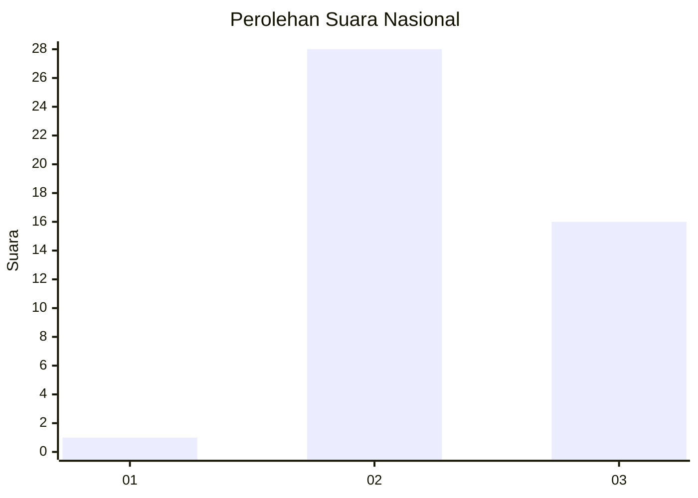
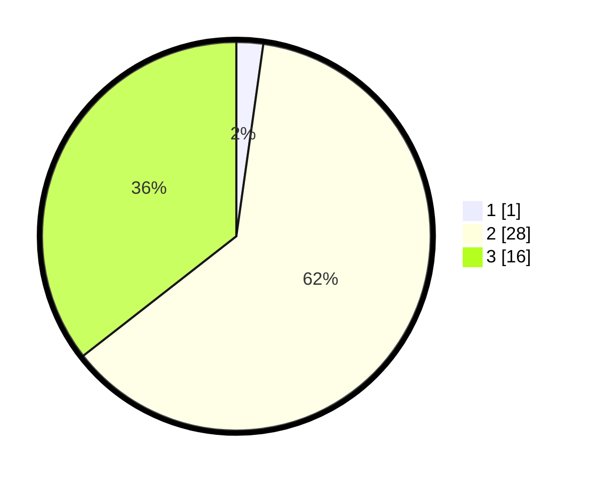

# Hasil

## Grafik

## Tabel

| No. | Nama Paslon    | Suara | Suara (raw) | Persentase |
|:--- |:-------------- | -----:| -----------:| ----------:|
| 1   | ANIES MUHAIMIN | 1     | [1][p-1]    | 2,22       |
| 2   | PRABOWO GIBRAN | 28    | [28][p-2]   | 62,22      |
| 3   | GANJAR MAHFUD  | 16    | [16][p-3]   | 35,56      |

[p-1]: https://github.com/gigit-pemilu/pemilu-2024/blob/main/pilpres/hitung-suara/sub/61-kalimantan-barat/sub/05-sintang/sub/09-kayan-hulu/sub/2001-nanga-tebidah/sub/003-tps/sub/paslon-1.txt
[p-2]: https://github.com/gigit-pemilu/pemilu-2024/blob/main/pilpres/hitung-suara/sub/61-kalimantan-barat/sub/05-sintang/sub/09-kayan-hulu/sub/2001-nanga-tebidah/sub/003-tps/sub/paslon-2.txt
[p-3]: https://github.com/gigit-pemilu/pemilu-2024/blob/main/pilpres/hitung-suara/sub/61-kalimantan-barat/sub/05-sintang/sub/09-kayan-hulu/sub/2001-nanga-tebidah/sub/003-tps/sub/paslon-3.txt

## Foto C Plano

https://sirekap-obj-formc.kpu.go.id/26d0/pemilu/ppwp/61/05/09/20/01/6105092001003-20240216-133745--a2762b08-cb77-4d05-a825-7f75cab8437f.jpg

https://sirekap-obj-formc.kpu.go.id/26d0/pemilu/ppwp/61/05/09/20/01/6105092001003-20240216-133747--69096f5c-f447-4446-829e-47acf92b7fc9.jpg

https://sirekap-obj-formc.kpu.go.id/26d0/pemilu/ppwp/61/05/09/20/01/6105092001003-20240216-133746--1d0f56ab-60ed-4979-b596-09c68783749c.jpg

## Metadata

| Key        | Value               |
| ---------- | ------------------- |
| Time Stamp | 2024-02-16 14:30:33 |

## DATA PEMILIH TETAP

Jumlah pemilih dalam DPT: **43**.
 * L: **21**.
 * P: **22**.

## DATA PENGGUNA HAK PILIH

Jumlah pengguna hak pilih dalam DPT: **43**.
 * L: **21**.
 * P: **22**.

Jumlah pengguna hak pilih dalam DPTb: **0**.
 * L: **0**.
 * P: **0**.

Jumlah pengguna hak pilih dalam DPK: **2**.
 * L: **2**.
 * P: **0**.

Jumlah pengguna hak pilih: **45**.
 * L: **23**.
 * P: **22**.

## JUMLAH SUARA SAH DAN TIDAK SAH

JUMLAH SELURUH SUARA SAH: **45**.

JUMLAH SUARA TIDAK SAH: **0**.

JUMLAH SELURUH SUARA SAH DAN SUARA TIDAK SAH: **45**.

