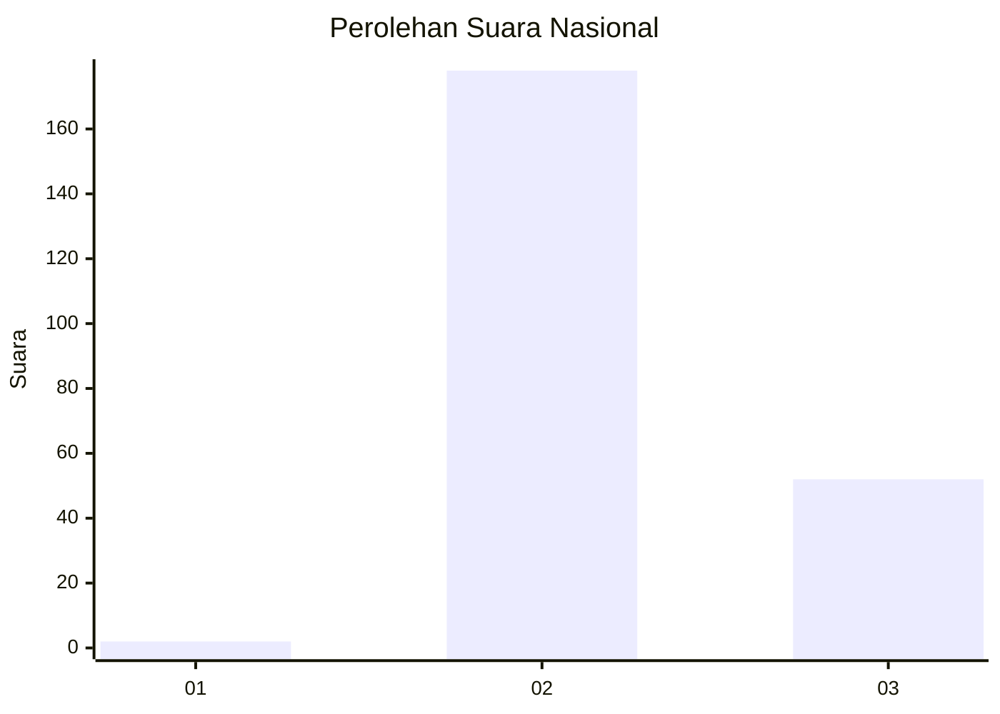
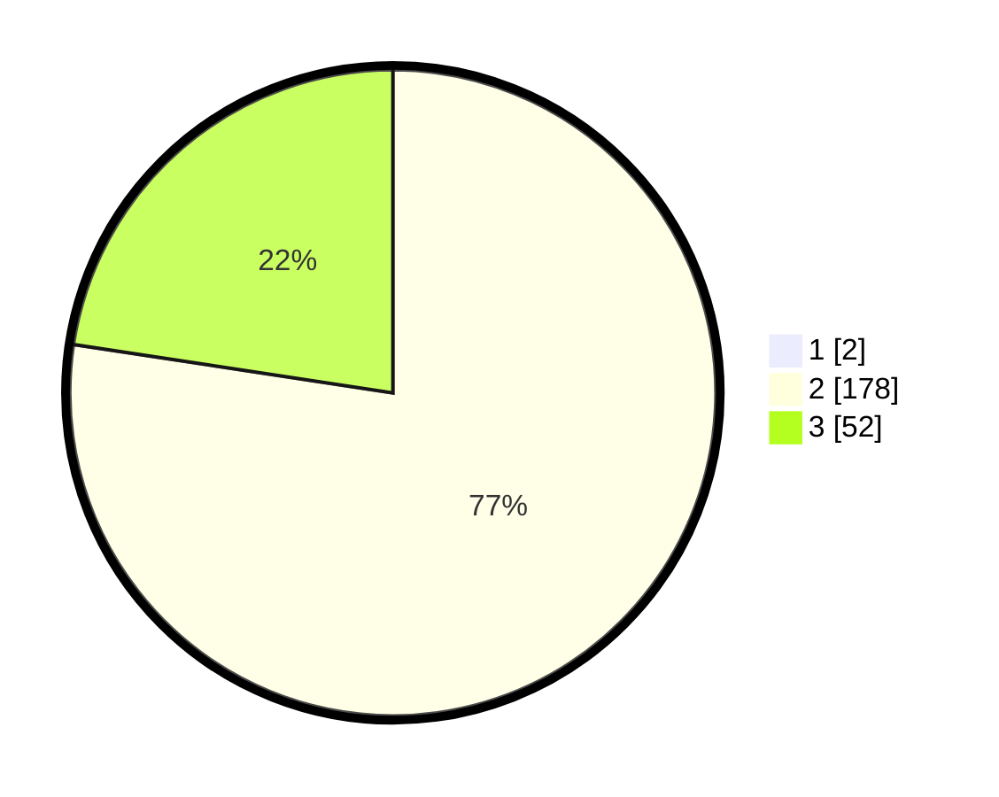

# Hasil

## Grafik

## Tabel

| No. | Nama Paslon    | Suara | Suara (raw) | Persentase |
|:--- |:-------------- | -----:| -----------:| ----------:|
| 1   | ANIES MUHAIMIN | 2     | [2][p-1]    | 0,86       |
| 2   | PRABOWO GIBRAN | 178   | [178][p-2]  | 76,72      |
| 3   | GANJAR MAHFUD  | 52    | [52][p-3]   | 22,41      |

[p-1]: https://github.com/gigit-pemilu/pemilu-2024/blob/main/pilpres/hitung-suara/sub/61-kalimantan-barat/sub/05-sintang/sub/09-kayan-hulu/sub/2003-tanjung-bunga/sub/001-tps/sub/paslon-1.txt
[p-2]: https://github.com/gigit-pemilu/pemilu-2024/blob/main/pilpres/hitung-suara/sub/61-kalimantan-barat/sub/05-sintang/sub/09-kayan-hulu/sub/2003-tanjung-bunga/sub/001-tps/sub/paslon-2.txt
[p-3]: https://github.com/gigit-pemilu/pemilu-2024/blob/main/pilpres/hitung-suara/sub/61-kalimantan-barat/sub/05-sintang/sub/09-kayan-hulu/sub/2003-tanjung-bunga/sub/001-tps/sub/paslon-3.txt

## Foto C Plano

https://sirekap-obj-formc.kpu.go.id/1afa/pemilu/ppwp/61/05/09/20/03/6105092003001-20240215-095955--a5958886-8f5b-4e5b-94bd-1bee9ddd11f6.jpg

https://sirekap-obj-formc.kpu.go.id/1afa/pemilu/ppwp/61/05/09/20/03/6105092003001-20240215-095744--d734e1c3-4f96-4cde-b354-047cbda934d6.jpg

https://sirekap-obj-formc.kpu.go.id/1afa/pemilu/ppwp/61/05/09/20/03/6105092003001-20240215-100018--2e04094b-6098-45e5-93a9-afa50a47a124.jpg

## Metadata

| Key        | Value               |
| ---------- | ------------------- |
| Time Stamp | 2024-02-15 15:30:25 |

