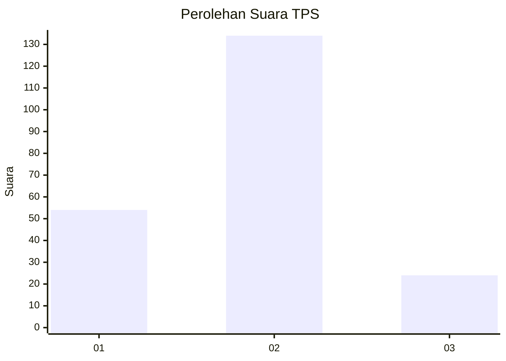
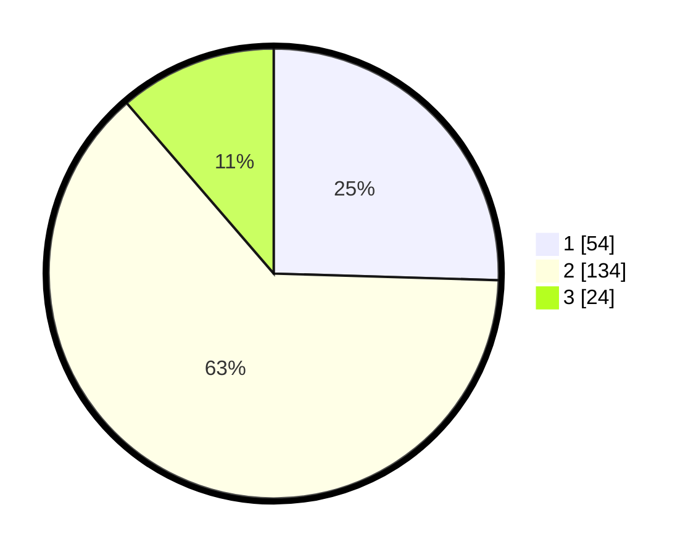

# Hasil

## Grafik

## Tabel

| No. | Nama Paslon    | Suara | Suara (raw) | Persentase |
|:--- |:-------------- | -----:| -----------:| ----------:|
| 1   | ANIES MUHAIMIN | 54    | [54][p-1]   | 25,47      |
| 2   | PRABOWO GIBRAN | 134   | [134][p-2]  | 63,21      |
| 3   | GANJAR MAHFUD  | 24    | [24][p-3]   | 11,32      |

[p-1]: https://github.com/gigit-pemilu/pemilu-2024-61-kalimantan-barat/blob/main/pilpres/hitung-suara/sub/61-kalimantan-barat/sub/05-sintang/sub/14-serawai/sub/2001-nanga-serawai/sub/004-tps/sub/paslon-1.txt
[p-2]: https://github.com/gigit-pemilu/pemilu-2024-61-kalimantan-barat/blob/main/pilpres/hitung-suara/sub/61-kalimantan-barat/sub/05-sintang/sub/14-serawai/sub/2001-nanga-serawai/sub/004-tps/sub/paslon-2.txt
[p-3]: https://github.com/gigit-pemilu/pemilu-2024-61-kalimantan-barat/blob/main/pilpres/hitung-suara/sub/61-kalimantan-barat/sub/05-sintang/sub/14-serawai/sub/2001-nanga-serawai/sub/004-tps/sub/paslon-3.txt

## Foto C Plano

https://sirekap-obj-formc.kpu.go.id/ab74/pemilu/ppwp/61/05/14/20/01/6105142001004-20240215-095157--305598e2-827c-4cf6-8877-72373e45afaf.jpg

https://sirekap-obj-formc.kpu.go.id/ab74/pemilu/ppwp/61/05/14/20/01/6105142001004-20240215-095952--7c7959e7-ba02-44f9-ba70-b2b22e1bb8c3.jpg

https://sirekap-obj-formc.kpu.go.id/ab74/pemilu/ppwp/61/05/14/20/01/6105142001004-20240215-095534--ae72fee8-dc14-4f53-b660-ebf7641d26af.jpg

## Metadata

| Key        | Value               |
| ---------- | ------------------- |
| Time Stamp | 2024-02-15 21:30:27 |

