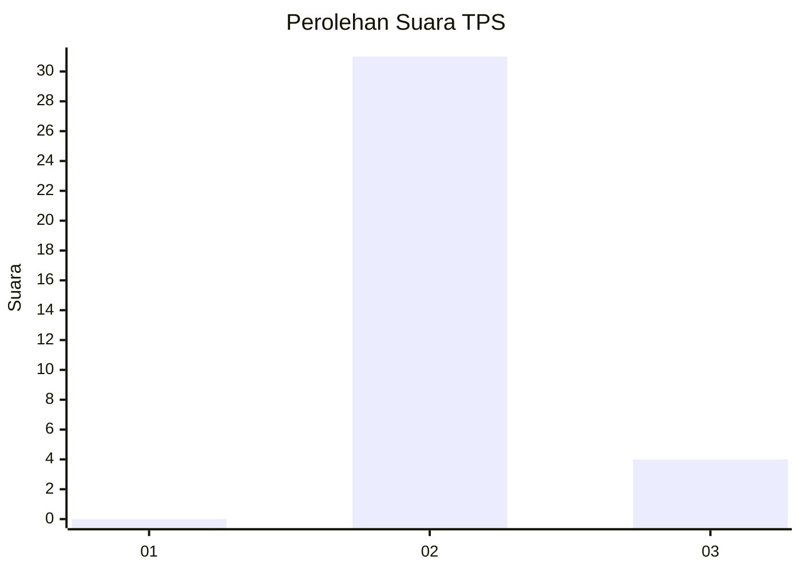
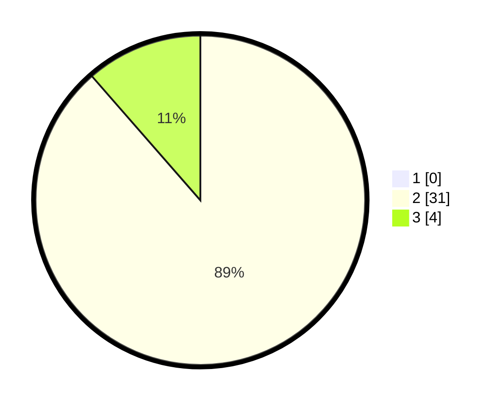

# Hasil

## Grafik

## Tabel

| No. | Nama Paslon    | Suara | Suara (raw) | Persentase |
|:--- |:-------------- | -----:| -----------:| ----------:|
| 1   | ANIES MUHAIMIN | 0     | [0][p-1]    | 0,00       |
| 2   | PRABOWO GIBRAN | 31    | [31][p-2]   | 88,57      |
| 3   | GANJAR MAHFUD  | 4     | [4][p-3]    | 11,43      |

[p-1]: https://github.com/gigit-pemilu/pemilu-2024-61-kalimantan-barat/blob/main/pilpres/hitung-suara/sub/61-kalimantan-barat/sub/05-sintang/sub/15-ambalau/sub/2032-deme/sub/001-tps/sub/paslon-1.txt
[p-2]: https://github.com/gigit-pemilu/pemilu-2024-61-kalimantan-barat/blob/main/pilpres/hitung-suara/sub/61-kalimantan-barat/sub/05-sintang/sub/15-ambalau/sub/2032-deme/sub/001-tps/sub/paslon-2.txt
[p-3]: https://github.com/gigit-pemilu/pemilu-2024-61-kalimantan-barat/blob/main/pilpres/hitung-suara/sub/61-kalimantan-barat/sub/05-sintang/sub/15-ambalau/sub/2032-deme/sub/001-tps/sub/paslon-3.txt

## Foto C Plano

https://sirekap-obj-formc.kpu.go.id/d148/pemilu/ppwp/61/05/15/20/32/6105152032001-20240219-215805--cd97f488-7c9c-4bb9-9d93-1fb13fa1bda3.jpg

https://sirekap-obj-formc.kpu.go.id/d148/pemilu/ppwp/61/05/15/20/32/6105152032001-20240219-215806--82c7a2a4-0755-46a7-9266-e18833e486df.jpg

https://sirekap-obj-formc.kpu.go.id/d148/pemilu/ppwp/61/05/15/20/32/6105152032001-20240219-215805--3c77c845-0d2a-4418-a0a8-6f10155a7634.jpg

## Metadata

| Key        | Value               |
| ---------- | ------------------- |
| Time Stamp | 2024-02-22 10:00:00 |

## DATA PEMILIH TETAP

Jumlah pemilih dalam DPT: **38**.
 * L: **22**.
 * P: **16**.

## DATA PENGGUNA HAK PILIH

Jumlah pengguna hak pilih dalam DPT: **33**.
 * L: **20**.
 * P: **13**.

Jumlah pengguna hak pilih dalam DPTb: **0**.
 * L: **0**.
 * P: **0**.

Jumlah pengguna hak pilih dalam DPK: **3**.
 * L: **2**.
 * P: **1**.

Jumlah pengguna hak pilih: **36**.
 * L: **22**.
 * P: **14**.

## JUMLAH SUARA SAH DAN TIDAK SAH

JUMLAH SELURUH SUARA SAH: **35**.

JUMLAH SUARA TIDAK SAH: **1**.

JUMLAH SELURUH SUARA SAH DAN SUARA TIDAK SAH: **36**.

