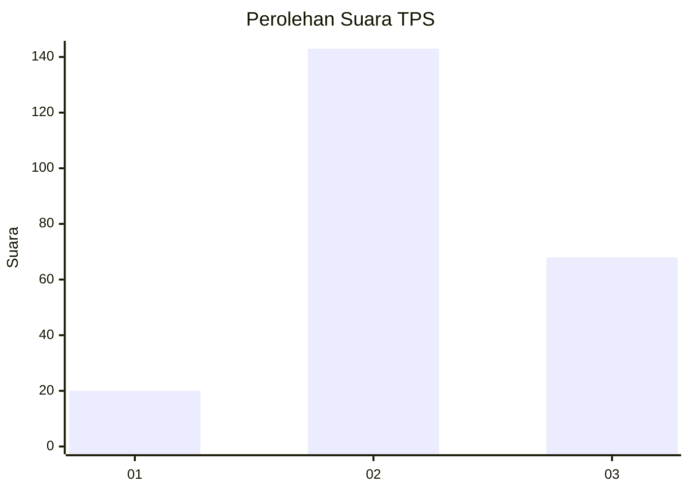
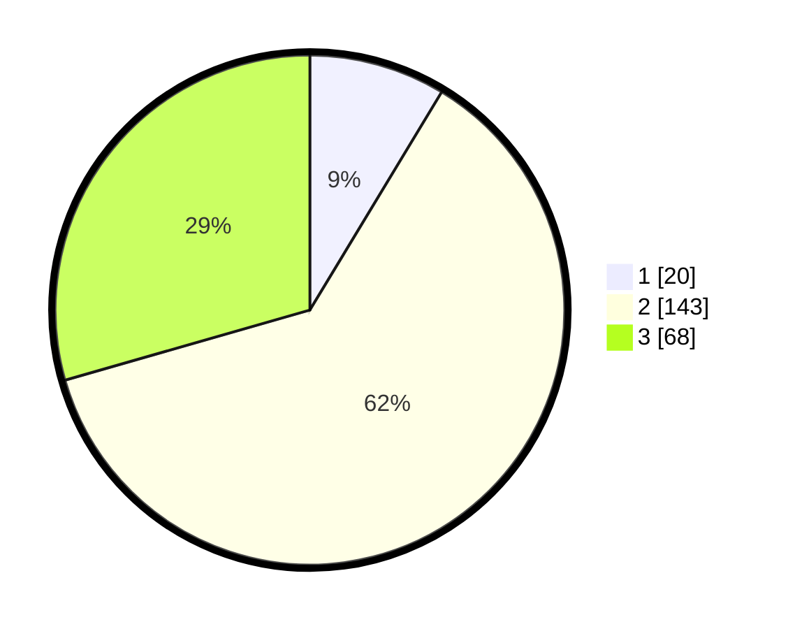

# Hasil

## Grafik

## Tabel

| No. | Nama Paslon    | Suara | Suara (raw) | Persentase |
|:--- |:-------------- | -----:| -----------:| ----------:|
| 1   | ANIES MUHAIMIN | 20    | [20][p-1]   | 8,66       |
| 2   | PRABOWO GIBRAN | 143   | [143][p-2]  | 61,90      |
| 3   | GANJAR MAHFUD  | 68    | [68][p-3]   | 29,44      |

[p-1]: https://github.com/gigit-pemilu/pemilu-2024-61-kalimantan-barat/blob/main/pilpres/hitung-suara/sub/61-kalimantan-barat/sub/05-sintang/sub/20-sungai-tebelian/sub/2002-sungai-ukoi/sub/001-tps/sub/paslon-1.txt
[p-2]: https://github.com/gigit-pemilu/pemilu-2024-61-kalimantan-barat/blob/main/pilpres/hitung-suara/sub/61-kalimantan-barat/sub/05-sintang/sub/20-sungai-tebelian/sub/2002-sungai-ukoi/sub/001-tps/sub/paslon-2.txt
[p-3]: https://github.com/gigit-pemilu/pemilu-2024-61-kalimantan-barat/blob/main/pilpres/hitung-suara/sub/61-kalimantan-barat/sub/05-sintang/sub/20-sungai-tebelian/sub/2002-sungai-ukoi/sub/001-tps/sub/paslon-3.txt

## Foto C Plano

https://sirekap-obj-formc.kpu.go.id/a35a/pemilu/ppwp/61/05/20/20/02/6105202002001-20240215-013527--ab3e7a1c-3982-4f3f-82b4-3feff77209e8.jpg

https://sirekap-obj-formc.kpu.go.id/a35a/pemilu/ppwp/61/05/20/20/02/6105202002001-20240215-013628--3db8e409-64ae-4e47-8fa5-700a5242b632.jpg

https://sirekap-obj-formc.kpu.go.id/a35a/pemilu/ppwp/61/05/20/20/02/6105202002001-20240215-013730--6cc7895c-f592-4624-87aa-fb75206eda58.jpg

## Metadata

| Key        | Value               |
| ---------- | ------------------- |
| Time Stamp | 2024-02-15 15:00:29 |

