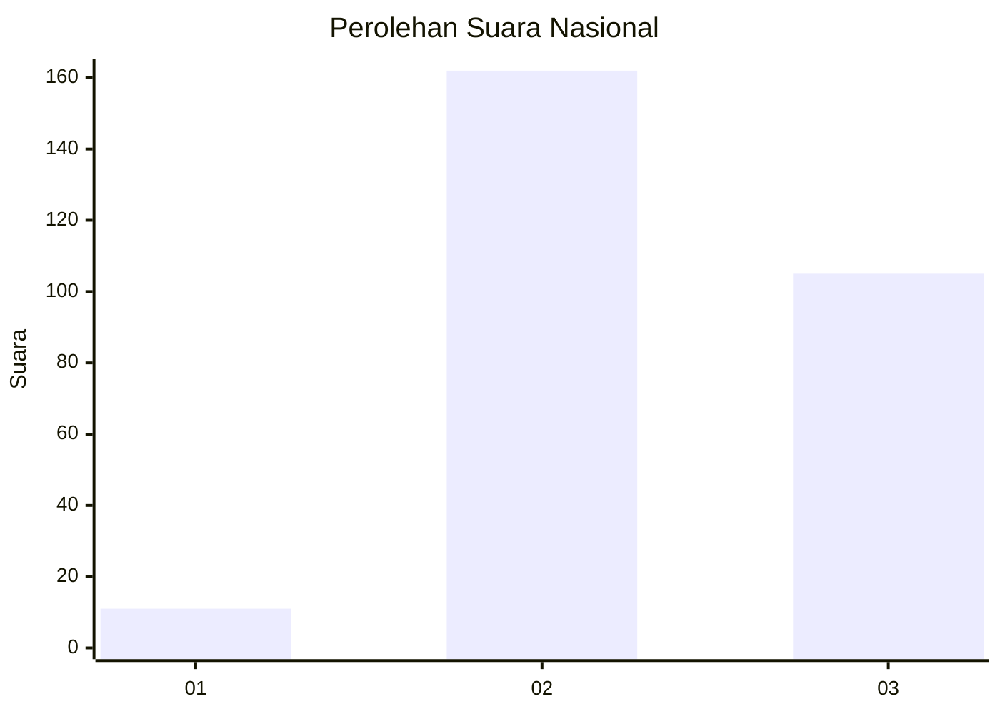
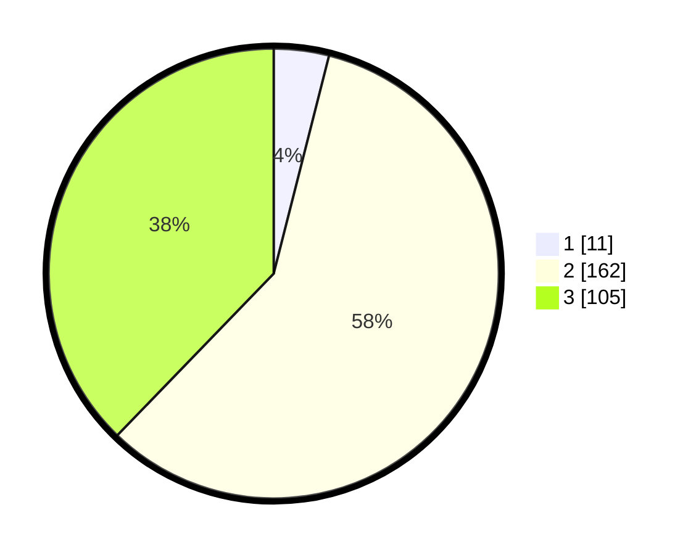

# Hasil

## Grafik

## Tabel

| No. | Nama Paslon    | Suara | Suara (raw) | Persentase |
|:--- |:-------------- | -----:| -----------:| ----------:|
| 1   | ANIES MUHAIMIN | 11    | [11][p-1]   | 3,96       |
| 2   | PRABOWO GIBRAN | 162   | [162][p-2]  | 58,27      |
| 3   | GANJAR MAHFUD  | 105   | [105][p-3]  | 37,77      |

[p-1]: https://github.com/gigit-pemilu/pemilu-2024/blob/main/pilpres/hitung-suara/sub/61-kalimantan-barat/sub/05-sintang/sub/20-sungai-tebelian/sub/2002-sungai-ukoi/sub/002-tps/sub/paslon-1.txt
[p-2]: https://github.com/gigit-pemilu/pemilu-2024/blob/main/pilpres/hitung-suara/sub/61-kalimantan-barat/sub/05-sintang/sub/20-sungai-tebelian/sub/2002-sungai-ukoi/sub/002-tps/sub/paslon-2.txt
[p-3]: https://github.com/gigit-pemilu/pemilu-2024/blob/main/pilpres/hitung-suara/sub/61-kalimantan-barat/sub/05-sintang/sub/20-sungai-tebelian/sub/2002-sungai-ukoi/sub/002-tps/sub/paslon-3.txt

## Foto C Plano

https://sirekap-obj-formc.kpu.go.id/c8e7/pemilu/ppwp/61/05/20/20/02/6105202002002-20240223-082536--3c1179de-15f7-467c-a90d-1a574dd71055.jpg

https://sirekap-obj-formc.kpu.go.id/c8e7/pemilu/ppwp/61/05/20/20/02/6105202002002-20240223-082538--6350d0b4-4e2c-4fd8-9114-e35a6ab07dcd.jpg

https://sirekap-obj-formc.kpu.go.id/c8e7/pemilu/ppwp/61/05/20/20/02/6105202002002-20240223-082537--0a38b6cf-78e0-48f1-8a09-d03033b4d71d.jpg

## Metadata

| Key        | Value               |
| ---------- | ------------------- |
| Time Stamp | 2024-02-24 22:31:28 |

## DATA PEMILIH TETAP

Jumlah pemilih dalam DPT: **275**.
 * L: **148**.
 * P: **127**.

## DATA PENGGUNA HAK PILIH

Jumlah pengguna hak pilih dalam DPT: **250**.
 * L: **138**.
 * P: **112**.

Jumlah pengguna hak pilih dalam DPTb: **17**.
 * L: **11**.
 * P: **6**.

Jumlah pengguna hak pilih dalam DPK: **12**.
 * L: **7**.
 * P: **5**.

Jumlah pengguna hak pilih: **279**.
 * L: **156**.
 * P: **123**.

## JUMLAH SUARA SAH DAN TIDAK SAH

JUMLAH SELURUH SUARA SAH: **0**.

JUMLAH SUARA TIDAK SAH: **0**.

JUMLAH SELURUH SUARA SAH DAN SUARA TIDAK SAH: **0**.

