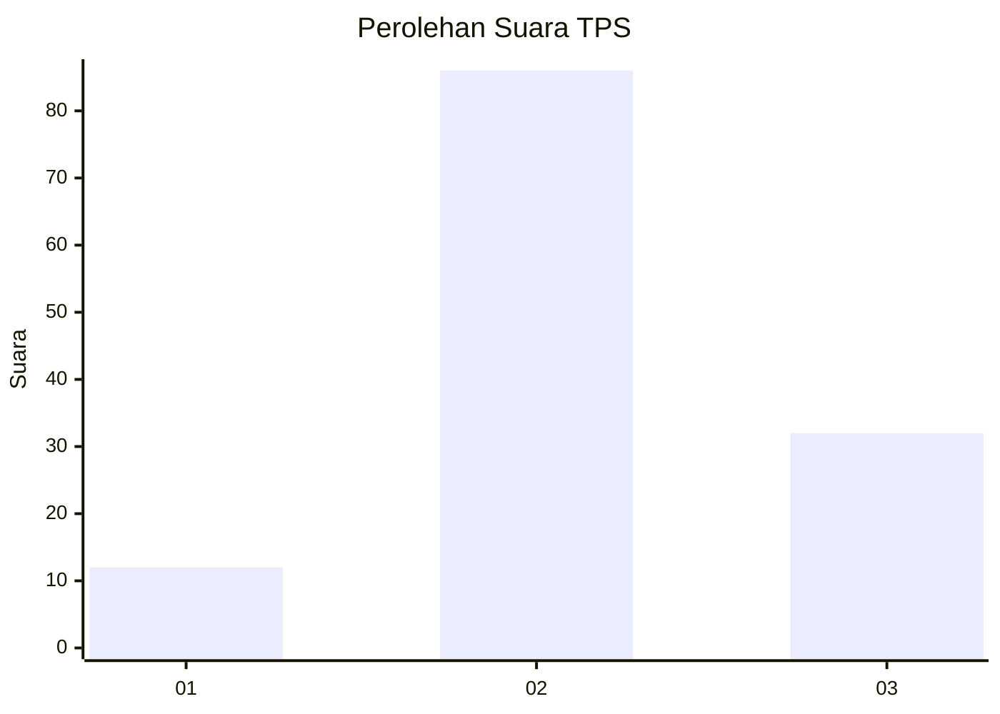
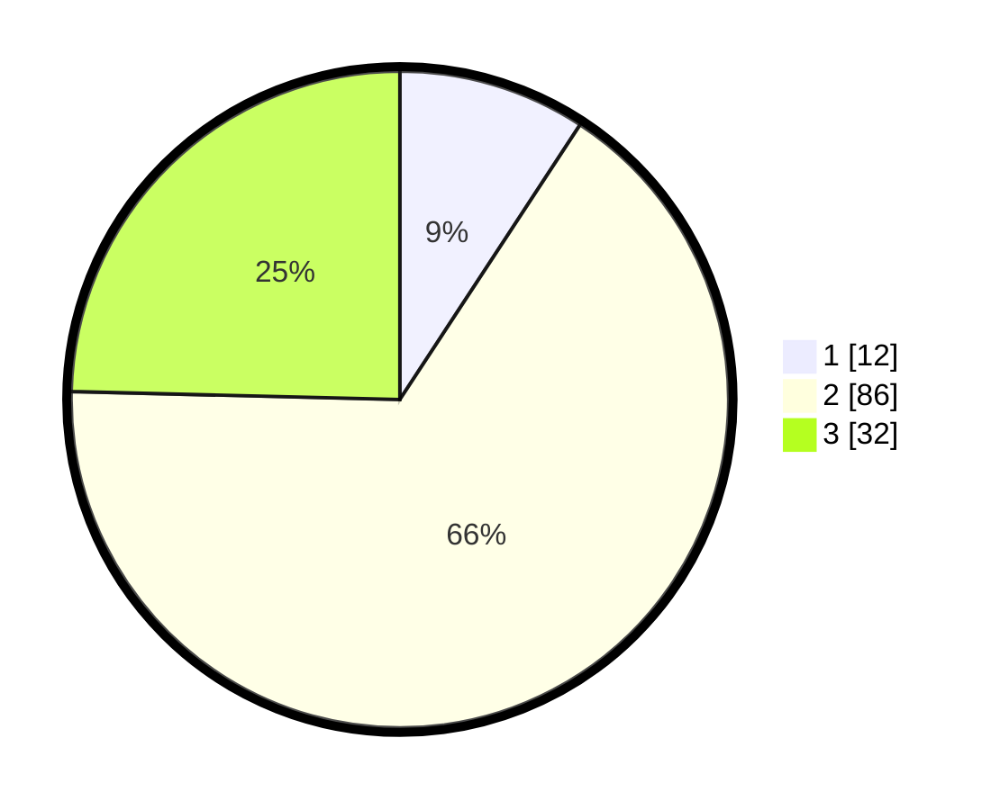

# Hasil

## Grafik

## Tabel

| No. | Nama Paslon    | Suara | Suara (raw) | Persentase |
|:--- |:-------------- | -----:| -----------:| ----------:|
| 1   | ANIES MUHAIMIN | 12    | [12][p-1]   | 9,23       |
| 2   | PRABOWO GIBRAN | 86    | [86][p-2]   | 66,15      |
| 3   | GANJAR MAHFUD  | 32    | [32][p-3]   | 24,62      |

[p-1]: https://github.com/gigit-pemilu/pemilu-2024-61-kalimantan-barat/blob/main/pilpres/hitung-suara/sub/61-kalimantan-barat/sub/06-kapuas-hulu/sub/01-putussibau-utara/sub/1001-putussibau-kota/sub/004-tps/sub/paslon-1.txt
[p-2]: https://github.com/gigit-pemilu/pemilu-2024-61-kalimantan-barat/blob/main/pilpres/hitung-suara/sub/61-kalimantan-barat/sub/06-kapuas-hulu/sub/01-putussibau-utara/sub/1001-putussibau-kota/sub/004-tps/sub/paslon-2.txt
[p-3]: https://github.com/gigit-pemilu/pemilu-2024-61-kalimantan-barat/blob/main/pilpres/hitung-suara/sub/61-kalimantan-barat/sub/06-kapuas-hulu/sub/01-putussibau-utara/sub/1001-putussibau-kota/sub/004-tps/sub/paslon-3.txt

## Foto C Plano

https://sirekap-obj-formc.kpu.go.id/31aa/pemilu/ppwp/61/06/01/10/01/6106011001004-20240215-014348--e2174994-ea67-499f-a3e9-ac7eb8cc2979.jpg

https://sirekap-obj-formc.kpu.go.id/31aa/pemilu/ppwp/61/06/01/10/01/6106011001004-20240215-014620--4a04db9f-c473-44bf-8e30-83734b50cb3b.jpg

https://sirekap-obj-formc.kpu.go.id/31aa/pemilu/ppwp/61/06/01/10/01/6106011001004-20240215-014727--3b662419-09d9-4656-820e-4285caa07854.jpg

## Metadata

| Key        | Value               |
| ---------- | ------------------- |
| Time Stamp | 2024-02-15 15:00:29 |

