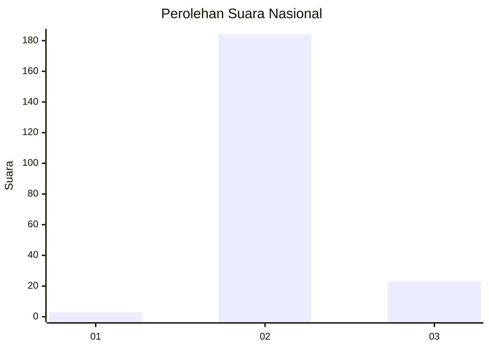
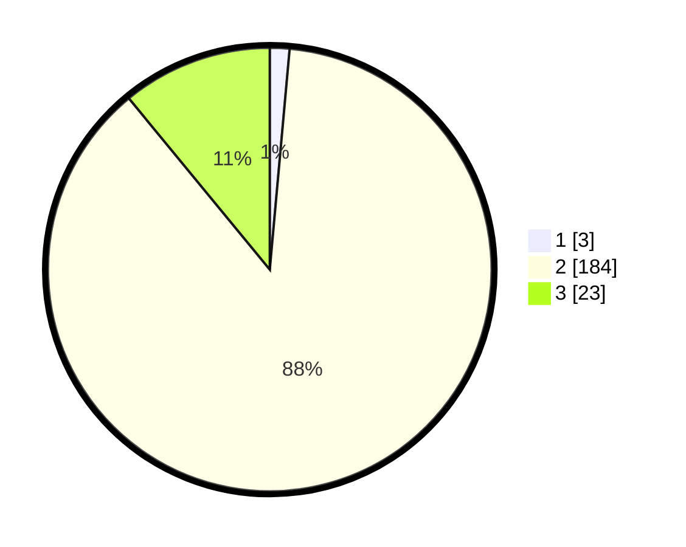

# Hasil

## Grafik

## Tabel

| No. | Nama Paslon    | Suara | Suara (raw) | Persentase |
|:--- |:-------------- | -----:| -----------:| ----------:|
| 1   | ANIES MUHAIMIN | 3     | [3][p-1]    | 1,43       |
| 2   | PRABOWO GIBRAN | 184   | [184][p-2]  | 87,62      |
| 3   | GANJAR MAHFUD  | 23    | [23][p-3]   | 10,95      |

[p-1]: https://github.com/gigit-pemilu/pemilu-2024/blob/main/pilpres/hitung-suara/sub/61-kalimantan-barat/sub/06-kapuas-hulu/sub/02-bika/sub/2001-teluk-sindur/sub/001-tps/sub/paslon-1.txt
[p-2]: https://github.com/gigit-pemilu/pemilu-2024/blob/main/pilpres/hitung-suara/sub/61-kalimantan-barat/sub/06-kapuas-hulu/sub/02-bika/sub/2001-teluk-sindur/sub/001-tps/sub/paslon-2.txt
[p-3]: https://github.com/gigit-pemilu/pemilu-2024/blob/main/pilpres/hitung-suara/sub/61-kalimantan-barat/sub/06-kapuas-hulu/sub/02-bika/sub/2001-teluk-sindur/sub/001-tps/sub/paslon-3.txt

## Foto C Plano

https://sirekap-obj-formc.kpu.go.id/5018/pemilu/ppwp/61/06/02/20/01/6106022001001-20240215-150543--e4cc5748-6806-4d05-a332-b5e93a7353b3.jpg

https://sirekap-obj-formc.kpu.go.id/5018/pemilu/ppwp/61/06/02/20/01/6106022001001-20240215-145403--a16897b3-40f1-4116-8f62-463c75a54758.jpg

https://sirekap-obj-formc.kpu.go.id/5018/pemilu/ppwp/61/06/02/20/01/6106022001001-20240215-142757--517c6650-a1dd-47af-93e6-37c650931ad8.jpg

## Metadata

| Key        | Value               |
| ---------- | ------------------- |
| Time Stamp | 2024-02-15 18:00:26 |

