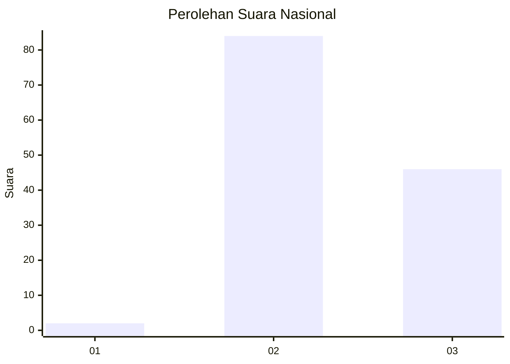
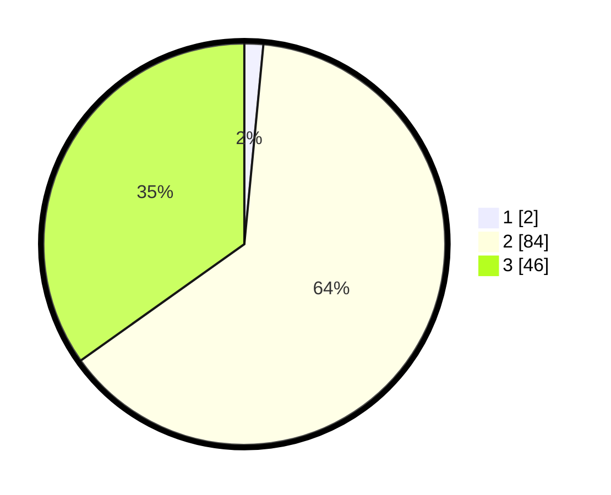

# Hasil

## Grafik

## Tabel

| No. | Nama Paslon    | Suara | Suara (raw) | Persentase |
|:--- |:-------------- | -----:| -----------:| ----------:|
| 1   | ANIES MUHAIMIN | 2     | [2][p-1]    | 1,52       |
| 2   | PRABOWO GIBRAN | 84    | [84][p-2]   | 63,64      |
| 3   | GANJAR MAHFUD  | 46    | [46][p-3]   | 34,85      |

[p-1]: https://github.com/gigit-pemilu/pemilu-2024/blob/main/pilpres/hitung-suara/sub/61-kalimantan-barat/sub/06-kapuas-hulu/sub/02-bika/sub/2008-bika-hulu/sub/002-tps/sub/paslon-1.txt
[p-2]: https://github.com/gigit-pemilu/pemilu-2024/blob/main/pilpres/hitung-suara/sub/61-kalimantan-barat/sub/06-kapuas-hulu/sub/02-bika/sub/2008-bika-hulu/sub/002-tps/sub/paslon-2.txt
[p-3]: https://github.com/gigit-pemilu/pemilu-2024/blob/main/pilpres/hitung-suara/sub/61-kalimantan-barat/sub/06-kapuas-hulu/sub/02-bika/sub/2008-bika-hulu/sub/002-tps/sub/paslon-3.txt

## Foto C Plano

https://sirekap-obj-formc.kpu.go.id/52c7/pemilu/ppwp/61/06/02/20/08/6106022008002-20240214-213408--9a6253ba-a469-4202-8835-c13103573c45.jpg

https://sirekap-obj-formc.kpu.go.id/52c7/pemilu/ppwp/61/06/02/20/08/6106022008002-20240214-214750--78eb1228-79f5-4154-b517-0200ce6bc526.jpg

https://sirekap-obj-formc.kpu.go.id/52c7/pemilu/ppwp/61/06/02/20/08/6106022008002-20240214-214829--5ffe4cce-99f6-418b-a896-2309c0e54596.jpg

## Metadata

| Key        | Value               |
| ---------- | ------------------- |
| Time Stamp | 2024-02-15 15:00:29 |

