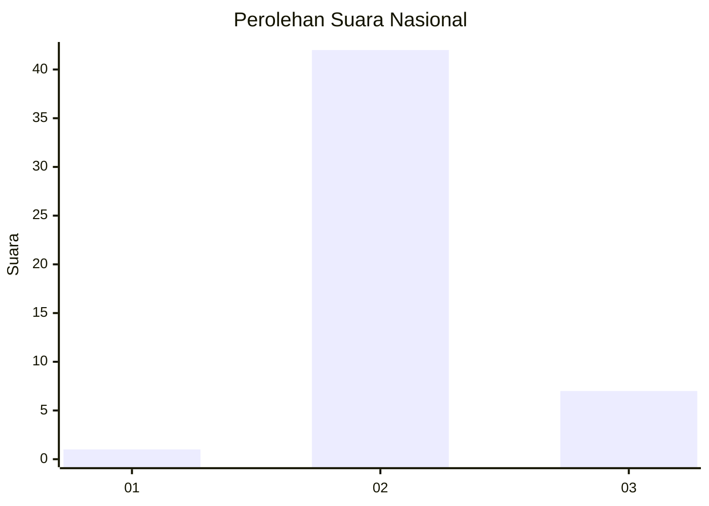
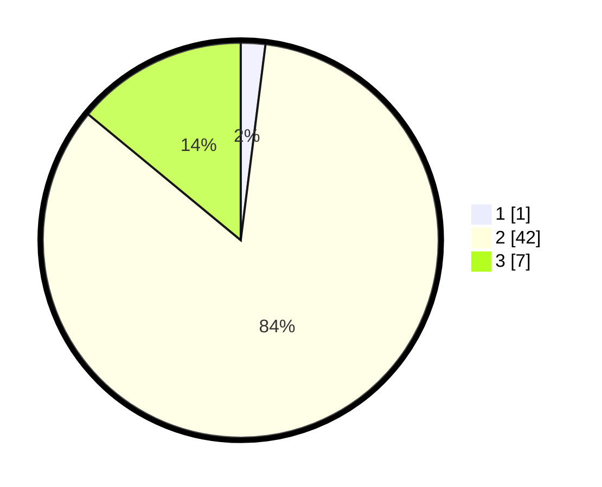

# Hasil

## Grafik

## Tabel

| No. | Nama Paslon    | Suara | Suara (raw) | Persentase |
|:--- |:-------------- | -----:| -----------:| ----------:|
| 1   | ANIES MUHAIMIN | 1     | [1][p-1]    | 2,00       |
| 2   | PRABOWO GIBRAN | 42    | [42][p-2]   | 84,00      |
| 3   | GANJAR MAHFUD  | 7     | [7][p-3]    | 14,00      |

[p-1]: https://github.com/gigit-pemilu/pemilu-2024/blob/main/pilpres/hitung-suara/sub/61-kalimantan-barat/sub/06-kapuas-hulu/sub/04-embaloh-hulu/sub/2002-menua-sadap/sub/002-tps/sub/paslon-1.txt
[p-2]: https://github.com/gigit-pemilu/pemilu-2024/blob/main/pilpres/hitung-suara/sub/61-kalimantan-barat/sub/06-kapuas-hulu/sub/04-embaloh-hulu/sub/2002-menua-sadap/sub/002-tps/sub/paslon-2.txt
[p-3]: https://github.com/gigit-pemilu/pemilu-2024/blob/main/pilpres/hitung-suara/sub/61-kalimantan-barat/sub/06-kapuas-hulu/sub/04-embaloh-hulu/sub/2002-menua-sadap/sub/002-tps/sub/paslon-3.txt

## Foto C Plano

https://sirekap-obj-formc.kpu.go.id/e57b/pemilu/ppwp/61/06/04/20/02/6106042002002-20240217-163944--42b64b50-bb5a-4670-a29e-43d788a19f11.jpg

https://sirekap-obj-formc.kpu.go.id/e57b/pemilu/ppwp/61/06/04/20/02/6106042002002-20240217-163945--dd26c225-5e2c-4374-9974-d8cce9e6344e.jpg

https://sirekap-obj-formc.kpu.go.id/e57b/pemilu/ppwp/61/06/04/20/02/6106042002002-20240217-163945--7ef1c5b8-96fe-4bf1-a61e-cb30a4270fac.jpg

## Metadata

| Key        | Value               |
| ---------- | ------------------- |
| Time Stamp | 2024-02-21 22:00:00 |

## DATA PEMILIH TETAP

Jumlah pemilih dalam DPT: **80**.
 * L: **43**.
 * P: **37**.

## DATA PENGGUNA HAK PILIH

Jumlah pengguna hak pilih dalam DPT: **48**.
 * L: **27**.
 * P: **21**.

Jumlah pengguna hak pilih dalam DPTb: **2**.
 * L: **2**.
 * P: **0**.

Jumlah pengguna hak pilih dalam DPK: **0**.
 * L: **0**.
 * P: **0**.

Jumlah pengguna hak pilih: **50**.
 * L: **29**.
 * P: **21**.

## JUMLAH SUARA SAH DAN TIDAK SAH

JUMLAH SELURUH SUARA SAH: **0**.

JUMLAH SUARA TIDAK SAH: **0**.

JUMLAH SELURUH SUARA SAH DAN SUARA TIDAK SAH: **0**.

